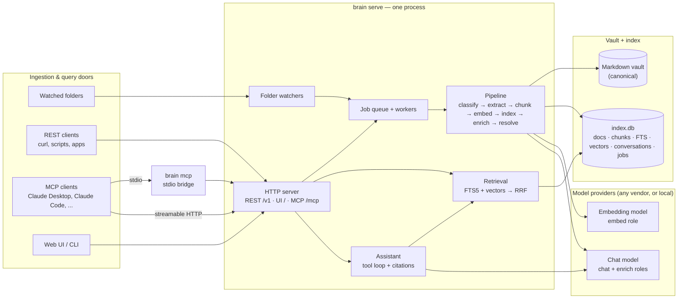

# SecondBrain — Product & Technical Specification

| | |
|---|---|
| **Status** | Draft v0.3 — for review |
| **Date** | 2026-10-08 |
| **Owner** | Justin Leahy |
| **Repo** | `secondbrain` |

---

## 0. TL;DR

SecondBrain is a local-first personal knowledge system. Knowledge goes in through three doors — **watched folders**, a **REST API**, and **MCP tools** — and every door feeds the same pipeline into one Markdown vault plus a rebuildable search index. Knowledge comes out through a **chat assistant** that answers from your own material with clickable citations, and through search endpoints and MCP tools that other agents can call. Every item carries a **content type** such as note, email, transcript, or calendar event, with structured fields, so questions about who, when, and which kind are answered by query rather than by similarity.

It runs as one background process on your machine, keeps your notes as plain files, and calls a chat model for reasoning and an embedding model for semantic search. Which providers and models it uses is your choice: any supported hosted vendor, any OpenAI-compatible endpoint, or fully local models, mixed per role and changed with one line of configuration.

### Decisions baked into this draft

Every one of these is changeable; they are listed so the rest of the document can be concrete.

| # | Decision | Default | Why |
|---|---|---|---|
| D1 | Users | Single user per instance | Removes tenancy and permission complexity. API keys identify *clients* (scripts, agents), not people. |
| D2 | Deployment shape | One long-running local process (the daemon) + CLI + web UI | Simplest thing that can host watchers, REST, MCP, and a UI at once. |
| D3 | Canonical store | Plain Markdown files in a vault folder; the SQLite index is derived and rebuildable | Portability, Obsidian-compatibility, trivial backup, zero lock-in. |
| D4 | Database | SQLite (WAL mode) + FTS5 + sqlite-vec, in one file | Zero ops; comfortably handles 100k documents on a laptop. |
| D5 | Models | No built-in default. Four roles (`chat`, `enrich`, `embed`, `rerank`) each bind to any provider and model in config, chosen during `brain init` | No vendor lock-in. Users mix providers per role, swap models as better ones ship, or run fully local. |
| D6 | Provider integration | Capability-declaring adapters behind one interface; an OpenAI-compatible adapter covers most hosted and local servers | One integration surface. A new provider is a small adapter, never a core change. |
| D7 | Retrieval | Hybrid BM25 + vector search fused with Reciprocal Rank Fusion; the assistant searches agentically | Hybrid is robust for both exact terms and fuzzy questions; agentic search handles multi-step questions. |
| D8 | Language | TypeScript end-to-end (Node 22+) | One language for API, MCP, watcher, and UI; first-class MCP SDK and SDKs from every major model vendor. Python alternative in §18. |
| D9 | Network posture | Binds to `127.0.0.1`; API key always required; non-loopback binding is an explicit config change | Safe by default. Expose via Tailscale or a reverse proxy on purpose, not by accident. |
| D10 | Writes by the assistant | Previewed and approved in the UI by default; MCP and REST writes are direct | Chat writes are inferred from conversation and deserve a confirmation; API/MCP calls are explicit by construction. |
| D11 | Content model | One Document table with a registry-backed `type`, schema-validated `properties`, and `occurred_at` on every record. Entities (people, organizations, projects) are resolved across types in a later phase. | Who, when, and which-type questions need fields, not similarity. One table keeps one search index and one pipeline. |

---

## 1. Goals and non-goals

### Goals

1. **Capture with near-zero friction.** Drop a file in a folder, POST to an endpoint, or have any MCP client (Claude Desktop, Claude Code, Cursor, custom agents) call `brain_remember`.
2. **Find anything.** Keyword, semantic, and structured search (by type, person, and time) across everything ingested, returning in well under a second.
3. **Ask anything.** A chat assistant that answers from the vault with inline citations, says "not in your brain" when the vault has nothing, and can write new notes back.
4. **Own everything.** Plain files, a local database, and a full export at any time. The index can be rebuilt from the files alone.
5. **Be a good citizen in the agent ecosystem.** A well-described MCP server so other agents can read from and write to the brain without custom integration.
6. **Never lock the user in.** Any chat, embedding, or rerank provider, hosted or local, sits behind one interface and can be changed in configuration without touching data or code.

### Non-goals for v1

- Multi-user accounts, sharing, or permissions between people
- Real-time collaborative editing
- Replacing a full note editor (Obsidian or similar remains the editor; SecondBrain is the memory and the oracle)
- Autonomous web crawling
- Native mobile apps (the web UI must work well in a phone browser instead)

---

## 2. Guiding principles

1. **One pipeline, many doors.** Folders, REST, MCP, and the UI all produce the same `Document` and run through the same extract → chunk → embed → index → enrich pipeline. A feature added to the pipeline benefits every door.
2. **Files over app.** Anything the system authors is written as Markdown with YAML frontmatter into the vault. The database is a cache of the files, never the other way round.
3. **Grounded or silent.** The assistant cites what it used and says when nothing relevant exists. It never presents model recall as "your notes".
4. **Ingested content is data, not instructions.** Text from files, APIs, and MCP clients has no authority over the assistant's behavior.
5. **Idempotent and resumable.** Ingestion is keyed by content hash. Crashing mid-import and restarting produces the same end state.
6. **Local-first; cloud calls are explicit and enumerated.** §15 lists exactly what leaves the machine, and configuration can forbid it.
7. **Boring infrastructure.** One process, one SQLite file, no message broker, no container required.
8. **Models are configuration, not architecture.** Nothing outside the provider layer knows which vendor is in use. A feature that depends on a provider capability degrades gracefully when the capability is absent.
9. **Types earn their place.** A content type is added only when a door produces it. The generic fallback stays good enough that a misclassified item is still findable, and reclassifying never destroys anything.

---

## 3. Users and use cases

**Primary user:** a single technical person who reads, writes, codes, and talks to AI agents all day and wants one place where all of it accumulates and stays queryable.

| ID | Story | Door |
|---|---|---|
| U1 | I drag a PDF into `~/SecondBrain/inbox` and within 30 seconds I can ask questions about it. | Folder |
| U2 | My existing Markdown vault is indexed in place; editing a note updates the index within seconds. | Folder |
| U3 | A nightly script `curl`s meeting transcripts into the brain with tags. | REST |
| U4 | While coding in Claude Code I say "remember that we chose sqlite-vec because X" and it is saved as a note with provenance. | MCP |
| U5 | In Claude Desktop I ask "what did I decide about auth last month?" and it answers from my notes. | MCP |
| U6 | In the web UI I ask "summarize everything I've read about retrieval evaluation" and get an answer with footnotes I can click to the exact passage. | Chat |
| U7 | I ask "what have I been working on this week?" and get a recency-aware summary. | Chat |
| U8 | I paste text into the chat and say "save this under #woodworking" and it becomes a note. | Chat |
| U9 | I rename or move a folder of documents and nothing is re-embedded. | Folder |
| U10 | I delete the index and rebuild it from the vault with one command. | CLI |
| U11 | I open the sources page and see which files failed to ingest and why, and retry them. | UI |
| U12 | I can run the whole thing with local models only, accepting lower quality, and nothing leaves my machine. | Config |
| U13 | I move the chat role to a different provider by editing one config line; existing conversations and the index keep working. | Config |
| U14 | I drop a mailbox export into the inbox and ask "what did Sarah email me about the contract?" and get the thread, not a similar-sounding note. | Folder |
| U15 | I ask "what meetings did I have last week?" and get the list from calendar events ordered by time, not by similarity. | Chat |
| U16 | I import a meeting transcript and ask what a specific person said about pricing; the answer cites their turns with timestamps. | Chat |
| U17 | *(phase 2)* I open a person's page and see every email, meeting, transcript, and note involving them. | UI |

---

## 4. System overview



### Components

| Component | Responsibility |
|---|---|
| **Daemon** (`brain serve`) | Hosts everything in one process: HTTP server (REST, web UI, MCP Streamable HTTP), folder watchers, the job worker pool, and a scheduler for rescans, retries, and garbage collection. |
| **Engine library** (`core`) | Domain model, storage, pipeline, retrieval, assistant. Used by the daemon and, for offline commands, directly by the CLI. |
| **CLI** (`brain`) | Management and power-user commands. Talks to the daemon over HTTP when it is running; opens the engine directly for offline commands such as `reindex`, `export`, and `doctor`. |
| **MCP stdio bridge** (`brain mcp`) | Thin process speaking MCP over stdio to a local client and forwarding to the daemon's REST API. Keeps exactly one process writing to the database. |
| **Web UI** | Single-page app served by the daemon at the configured host and port. |

**Single-writer rule:** only the daemon writes to `index.db` while it is running. The CLI's offline commands refuse to run if the daemon holds the lock, and vice versa.

---

## 5. Domain model

| Entity | Description | Key fields |
|---|---|---|
| **Source** | An origin that produces documents: a watched folder, the REST API, an MCP client, the UI, or (later) a URL clipper. | `id`, `kind`, `name`, `config`, `status`, `last_sync_at` |
| **Document** | One unit of ingested content of any type: a note, an article, an email, a transcript, a calendar event, a contact, or a generic file. | `id` (ULID), `source_id`, `type` (registry key), `properties` (typed fields), `occurred_at`, `natural_key`, `thread_id`, `parent_id`, `path`, `uri`, `title`, `mime`, `content_hash`, `text` (extracted Markdown), `summary`, `status`, `type_origin`, `type_confidence`, timestamps |
| **Content type** | A registry entry that gives a type its meaning: a JSON Schema for `properties`, an extractor and chunker strategy, the fields to index, and a UI renderer. Entries live in code and config, not in the database. | `key`, `schema`, `extractor`, `chunker`, `indexed_fields`, `renderer` |
| **Chunk** | A retrieval-sized slice of a document's text, with its heading context and position. | `id`, `document_id`, `ordinal`, `heading_path`, `text`, `token_count`, `content_hash`, `page`, offsets |
| **Embedding** | A vector for a chunk, keyed by chunk content hash and model so unchanged text is never re-embedded. | `content_hash`, `model`, `vector` |
| **Tag** | A label on a document, with its origin (user, frontmatter, or LLM). | `name`, `origin` |
| **Link** | A directed relation between documents: parsed wikilink, Markdown link, "derived from", "related", "cites". | `from`, `to`, `kind`, `origin` |
| **Entity** *(phase 2)* | A real-world thing that recurs across documents: a person, organization, project, or place. Resolved from typed fields (senders, attendees, speakers) and from mentions. | `id`, `kind`, `canonical_name`, `aliases`, `keys` (email addresses, handles), `merged_into` |
| **Document–entity link** *(phase 2)* | How an entity relates to a document. | `document_id`, `entity_id`, `role` (`sender` / `recipient` / `attendee` / `speaker` / `author` / `mentioned`), `origin`, `confidence` |
| **Conversation / Message** | Chat history. Messages are stored in the engine's provider-neutral format, including tool calls and citations, so a conversation can be resumed exactly on any provider. | `conversation_id`, `role`, `content`, `usage` |
| **Job** | A unit of background work with retry state: ingest, reindex, embed, enrich, sync, gc. | `kind`, `payload`, `status`, `attempts`, `run_after`, `error` |
| **API key** | A client credential with scopes. | `name`, `key_hash`, `scopes`, `last_used_at` |

**Identity rules**

- A Document is unique per `(source_id, path)`. Vault-managed notes also carry their `id` in frontmatter, so identity survives moves.
- For external files, a move is detected when a known `content_hash` appears at a new path while the old path disappears in the same scan. The document keeps its id, chunks, and embeddings.
- Chunk embeddings are keyed by `(content_hash, model)`, so re-chunking an edited document only embeds the chunks whose text actually changed.
- Types with natural keys dedupe on them before the content hash: an email's `Message-ID`, a calendar event's iCal `UID` plus recurrence id, a contact's `UID`. Re-importing an export is a no-op.

### 5.1 Content types

The registry is open: unknown types fall back to `file` behavior, and custom types can be declared in config. Each built-in type exists because a door produces it.

| Type | Produced by | Key properties | Chunking |
|---|---|---|---|
| `note` | Chat, REST, MCP, Markdown in watched folders | `tags`, `aliases`, `created` | Structure-aware by heading |
| `article` | Web clips, saved HTML, PDFs of articles | `author`, `published_at`, `url`, `site` | Structure-aware by heading |
| `email` | `.eml`, `.mbox` exports; mail connectors later | `message_id`, `thread_id`, `from`, `to`, `cc`, `subject`, `sent_at`, `in_reply_to`, `has_attachments` | One chunk per message with quoted replies and signatures stripped; attachments become child documents |
| `transcript` | `.vtt`, `.srt`, meeting-tool exports; audio transcription later | `participants`, `started_at`, `duration`, `event_id`, `recording_url` | By speaker turn, merged into windows of about 400 tokens; speaker and timestamp kept on every chunk |
| `calendar_event` | `.ics` imports; calendar connectors later | `uid`, `starts_at`, `ends_at`, `attendees`, `organizer`, `location`, `recurrence` | Single chunk of title, description, and attendees; never split |
| `contact` | vCard imports, manual entry | `emails`, `phones`, `organization`, `role` | Single chunk |
| `task` | Chat, Markdown checklists, task exports | `status`, `due_at`, `completed_at`, `project` | Single chunk |
| `file` | Anything else | `mime`, `size` | Generic structure-aware |

Every type shares the base fields, and every type sets `occurred_at`: `sent_at` for email, `starts_at` for events, `started_at` for transcripts, `published_at` for articles, `created` for notes. That one field answers every "what happened last week" question and drives the timeline view.

A custom type is declared in config with a key, a JSON Schema, a built-in type to inherit chunking from, and the properties to index.

### 5.2 Entities (phase 2)

Entities are the people, organizations, projects, and places that recur across documents. They are **resolved**, not merely extracted: the sender of an email, an attendee of an event, and a speaker in a transcript become one person.

- **Strong keys** resolve automatically: an email address, a calendar attendee id, a handle.
- **Names** are fuzzy-matched against canonical names and aliases. A match below the confidence threshold is proposed in the UI, never applied.
- **Mentions** in free text come from the enrichment stage and link with role `mentioned` at lower confidence.
- **Merges are reversible.** Merging records `merged_into`; splitting restores the original links.
- An entity page aggregates every document by role and time, and is exposed as `GET /entities/{id}` and the `brain_entity` MCP tool.

Full schema sketch in Appendix A.

---

## 6. Vault layout

```
~/SecondBrain/                      # vault root (configurable)
├── inbox/                          # drop zone: ingested, then filed into sources/
├── notes/                          # notes authored via chat, REST, or MCP
│   └── 2026/10/why-sqlite-vec.md
├── sources/                        # originals imported from inbox/, REST, or MCP uploads
│   ├── 2026/10/attention-is-all-you-need.pdf
│   └── 2026/10/mail-export.mbox      # container: one document per message inside
├── clips/                          # web clips (v2)
└── .brain/
    ├── config.yaml                 # see Appendix B
    ├── secrets                     # API keys, mode 0600, never synced
    ├── index.db                    # SQLite: documents, chunks, FTS, vectors, conversations, jobs
    ├── cache/                      # extracted text keyed by content hash
    └── logs/
```

External folders (an existing Obsidian vault, `~/Documents/Papers`) are **indexed in place** and never modified unless frontmatter write-back is explicitly enabled for that source.

**Note file format** (everything the system writes):

```markdown
---
id: 01K70Q3V8X2M4N6P8R0T2V4X6Y
title: Why sqlite-vec
type: note
created: 2026-10-08T15:04:05Z
updated: 2026-10-08T15:04:05Z
tags: [secondbrain, decision]
source: mcp:claude-code            # provenance: folder:<id> | api:<key name> | mcp:<client> | ui | url
source_url:
aliases: []
---

We chose sqlite-vec because ...
```

Path template for new notes is configurable (`notes.path_template`, default `notes/{yyyy}/{mm}/{slug}.md`) with a numeric suffix on collision. Wikilinks (`[[Title]]`) resolve against titles, aliases, and filenames across the whole index; unresolved links are recorded as dangling and surfaced in the UI.

Typed properties live in the same frontmatter, so a vault stays readable by Obsidian and rebuildable into the index. An imported email keeps its original `.eml` (or the containing `.mbox`) under `sources/`; its extracted Markdown, cached and rebuildable, carries the typed fields in the same frontmatter shape:

```markdown
---
id: 01K70RA2Q7W9X1Y3Z5B7D9F1H3
type: email
title: "Re: Contract draft v3"
message_id: "<CAF+2k9...@mail.example.com>"
thread_id: 01K70R9ZT4V6X8Z0B2D4F6H8J0
from: sarah@example.com
to: [justin@example.com]
sent_at: 2026-10-02T16:41:00Z
occurred_at: 2026-10-02T16:41:00Z
source: folder:mail-exports
---
```

---

## 7. Ingestion

### 7.1 Common contract (all doors)

| ID | Requirement |
|---|---|
| ING-1 | Every door produces a `Document` with `source_id`, provenance, and original bytes or text, then enqueues the pipeline (§8). No door has its own parsing or indexing logic. |
| ING-2 | Ingestion is idempotent on `content_hash`. Re-submitting identical content to the same source returns the existing document and does no work. |
| ING-3 | Every document carries provenance (`source` in frontmatter and `source_id` in the DB) so the assistant and the UI can always answer "where did this come from?" |
| ING-4 | Small text submissions (REST JSON, MCP `brain_remember`, UI capture) are indexed synchronously with a target of under 1 second so they are immediately searchable. If the embedding provider is unavailable, the document is keyword-indexed immediately and the embedding is queued; the response says so. |
| ING-5 | Files and bulk work are asynchronous: the caller gets a document id and a job id and can poll or wait. |
| ING-6 | Failures are recorded per document with a reason, visible in the UI, `brain jobs --failed`, and `GET /v1/jobs`. Retries are automatic (3 attempts, exponential backoff) and manual. |
| ING-7 | Size and type limits are enforced before any expensive work: default 50 MB per file, configurable. Oversized or unsupported files are recorded as metadata-only documents (findable by name) with status `skipped`. |
| ING-8 | Every door may declare `type` and `properties`. Type assignment runs in order of confidence: the door's declaration, then file signature (`.eml`, `.mbox`, `.ics`, vCard, WebVTT), then LLM classification with the `enrich` role when enabled, else `file`. Origin and confidence are stored; a user override wins and is never overwritten by reclassification. |
| ING-9 | Container files (`.mbox`, multi-event `.ics`, chat exports) expand into one document per record, addressed as `container path#natural key`. Re-importing a container updates changed records and adds new ones; nothing is duplicated. |

### 7.2 Folders

| ID | Requirement |
|---|---|
| FLD-1 | Any number of folder sources, each with: `path`, `include` and `exclude` globs, `recursive`, `mode` (`index` = index in place; `import` = move into `vault/sources/` after success), and `enrich` on/off. |
| FLD-2 | Change detection uses filesystem events (FSEvents on macOS, inotify on Linux) **plus** a periodic full rescan (default every 10 minutes and at startup), because event delivery is not guaranteed. |
| FLD-3 | Per-path debounce (default 1.5 s) so an editor's save sequence triggers one ingestion. Temporary, hidden, and lock files are ignored by default. A `.brainignore` file (gitignore syntax) is honored at any level. |
| FLD-4 | A file is reprocessed only if `(size, mtime)` changed **and** its `content_hash` changed. Touching a file without editing it costs one hash computation and nothing else. |
| FLD-5 | Renames and moves preserve document identity (§5). Directory moves are handled as a batch. |
| FLD-6 | Deletion marks the document `deleted` and removes it from the search index. Content is retained as a tombstone for `ingest.tombstone_days` (default 30) then purged by the gc job; `on_delete: purge` deletes immediately. |
| FLD-7 | Supported formats at v1: `.md` `.markdown` `.txt` `.pdf` `.html` `.htm` `.docx`, plus typed imports `.eml`, `.mbox`, `.ics`, `.vcf`, `.vtt`, `.srt`, and JSON exports from meeting and chat tools. Also indexed as plain text: `.csv` `.json` `.yaml` up to 1 MB. Later: images (OCR + captioning), audio (transcription), `.epub`, `.pptx`, `.xlsx`. |
| FLD-8 | Markdown frontmatter is parsed for `title`, `tags`, `aliases`, `created`, `updated`, `id`. Wikilinks and Markdown links become `links` rows. |
| FLD-9 | `inbox/` is a built-in `import`-mode source with enrichment on: anything dropped there is processed, moved to `sources/YYYY/MM/`, and the empty inbox signals "everything is in". Failed files stay in the inbox and show up in the failed-jobs list. |
| FLD-10 | Initial import of a large folder (10k+ files) runs as a `sync` job that fans out per-document jobs with bounded concurrency, shows progress in the UI and CLI, and survives restarts. |
| FLD-11 | A folder source may set `default_type` (a folder of meeting notes becomes `transcript`, a clippings folder becomes `article`) and a `type_map` from glob to type. Signature detection still wins for unambiguous formats. |

### 7.3 REST API

Base URL `http://127.0.0.1:7171/v1`. All requests require `Authorization: Bearer <api key>`. A root key is generated at `brain init` and stored in `.brain/secrets`; additional scoped keys are created with `brain keys create`.

**Conventions**

- JSON bodies and responses; file uploads as `multipart/form-data`.
- ULID identifiers; ISO-8601 UTC timestamps.
- Cursor pagination: `?cursor=&limit=` with `next_cursor` in responses.
- Errors are RFC 9457 `application/problem+json` with `type`, `title`, `status`, `detail`, and `instance`.
- `Idempotency-Key` header honored on `POST /documents` for 24 hours.
- Request body limit 100 MB. `429` is reserved for provider back-pressure, not enforced for a single user.
- `GET /v1/openapi.json` serves the OpenAPI 3.1 document generated from the same schemas that validate requests.

**Endpoints**

| Method | Path | Purpose |
|---|---|---|
| `POST` | `/documents` | Create from JSON `{title?, content, type?, properties?, tags?, source_url?}` or multipart `file` + `metadata`. `properties` are validated against the type's schema. Returns `201 {document, job}`; `?wait=1` blocks until indexed (max 30 s). |
| `GET` | `/documents` | List and filter: `q` (title/path contains), `type`, `tag`, `source`, `status`, `occurred_after`, `occurred_before`, `person`, `thread`, `since`, `sort` (`occurred_at` or `updated_at`), `cursor`, `limit`. This is the structured query path; no embeddings are involved. |
| `GET` | `/documents/{id}` | Metadata; `?include=text,chunks,links` adds extracted text, chunks, and links. |
| `PATCH` | `/documents/{id}` | Update `title`, `tags`, `type`, `properties`, or `content` (content changes re-run the pipeline; a `type` change re-chunks and sets `type_origin: user`). Supports `If-Match` on `updated_at` for optimistic concurrency. |
| `DELETE` | `/documents/{id}` | Soft delete; `?purge=1` deletes immediately. |
| `GET` | `/documents/{id}/file` | Original bytes with the stored MIME type. |
| `GET` | `/documents/{id}/related` | Linked documents plus nearest neighbors by embedding. |
| `POST` | `/search` | `{query, mode?, filters?, limit?, rerank?}` → ranked chunks with document metadata, snippets, and scores (§9). |
| `POST` | `/ask` | `{question, filters?, deep?}` → one-shot grounded answer with citations; no conversation state. |
| `POST` | `/chat` | `{conversation_id?, message, stream?}` → Server-Sent Events stream (default) or a complete message. |
| `GET` `DELETE` | `/conversations`, `/conversations/{id}` | List, fetch with messages, delete. |
| `GET` `POST` | `/sources` | List sources; add a folder source at runtime. |
| `GET` `PATCH` `DELETE` | `/sources/{id}` | Inspect, change globs/mode, remove (optionally purging its documents). |
| `POST` | `/sources/{id}/sync` | Force a full rescan. |
| `GET` | `/jobs`, `/jobs/{id}` | Queue inspection with `status` filter. |
| `POST` | `/jobs/{id}/retry` | Re-queue a failed job. |
| `POST` | `/reindex` | `{scope: "all" \| "source" \| "document", id?, embeddings?: bool}`. |
| `GET` | `/tags` | Tag vocabulary with counts. |
| `GET` | `/types` | The content type registry: keys, schemas, indexed fields, document counts. |
| `GET` | `/timeline` | Documents of any type ordered by `occurred_at` within `from`/`to`, grouped by day, filterable by `type` and `person`. |
| `GET` | `/entities`, `/entities/{id}` | *(phase 2)* Search entities by `kind` and `q`; fetch one with its documents grouped by role. |
| `POST` | `/entities/{id}/merge`, `/entities/{id}/split` | *(phase 2)* Merge another entity into this one; split reverses a merge. |
| `GET` | `/health`, `/stats` | Liveness; counts, index size, queue depth, last sync, embedding model, token usage today. |
| `POST` | `/webhooks` | *(v2)* Register a URL to receive `document.indexed`, `document.failed`, `source.synced` events. |

**Chat SSE events** (`POST /chat` with `stream: true`):

`message.start` · `text.delta` · `thinking.delta` (summary only, optional) · `tool.call` · `tool.result` · `citation` · `message.end` (includes token usage and conversation id) · `error`

Examples in Appendix C.

### 7.4 MCP server

SecondBrain is an MCP **server**. Any MCP client can push knowledge in and pull knowledge out.

**Transports**

| Transport | How | Auth |
|---|---|---|
| stdio | `brain mcp` (bridge to the daemon's REST API) | Inherits local trust; uses the root key from `.brain/secrets` |
| Streamable HTTP | `POST /mcp` on the daemon | `Authorization: Bearer <api key>`; `Origin` header validated against an allowlist to block DNS-rebinding; loopback only unless configured |

The deprecated HTTP+SSE transport is not supported.

**Tools**

| Tool | Purpose | Annotations |
|---|---|---|
| `brain_search` | Hybrid search; returns ranked excerpts with document ids, titles, types, paths, heading context, and scores. Supports `mode`, `type`, `tags`, `person`, `occurred_after`, `occurred_before`, `path_prefix`, `limit`. | read-only, idempotent |
| `brain_ask` | A synthesized, cited answer. Single retrieval pass by default; `deep: true` allows a bounded multi-search loop (max 5 tool calls). For clients with weak tool use or when one call should do the whole job. | read-only |
| `brain_query` | Structured records query with no semantic search: `type`, `person`, `thread`, `occurred_after`, `occurred_before`, `properties` filters, `sort`, `limit`. For who, when, and which-type questions: "meetings last week", "emails from Sarah in September", "open tasks". | read-only, idempotent |
| `brain_get` | Full text of a document by id or vault path, with optional `offset` and `length` for large documents. | read-only, idempotent |
| `brain_remember` | Save content as a new document: a Markdown body with optional `title`, `type` (default `note`), `properties`, `tags`, `source_url`, `related_to`. A client can store a transcript or a task, not only a note. Records provenance as `mcp:<client name>` from the MCP `initialize` handshake. Returns id and path. | write, non-destructive |
| `brain_update` | Append to or replace a note's body. Requires the `updated_at` the client last saw and rejects stale writes. Refuses to modify files in `index`-mode external sources unless `allow_external_writes` is on. | write |
| `brain_list_recent` | Recently added or updated documents, filterable by `type` and `tag`. | read-only |
| `brain_tags` | Tag vocabulary with counts, so clients reuse existing tags. | read-only |
| `brain_entity` | *(phase 2)* Everything about a person, organization, or project: resolved identity, aliases, and documents grouped by role and time. | read-only |
| `brain_ingest_url` | *(v2)* Fetch a URL, extract readable content, ingest as a `web` document. | write |

Design rules for the tool surface:

- Names are prefixed `brain_` to avoid collisions when a client has many servers connected.
- Descriptions say **when** to use each tool, not only what it does. They are the documentation the client's model reads. Full definitions in Appendix D.
- Results are truncated explicitly (`"truncated": true`, `next_cursor`) never silently. Default result sizes are small enough to be pasted into a model context many times per conversation.
- Tool annotations (`readOnlyHint`, `destructiveHint`, `idempotentHint`, `openWorldHint`) are set accurately so clients can apply their own approval policies.
- Input schemas are strict (`additionalProperties: false`) and validated with the same schemas as the REST API.

**Resources**

- `brain://document/{id}` and `brain://note/{path}` — `text/markdown`, the extracted text with frontmatter.
- `resources/list` returns the most recently updated documents (paginated) so clients can browse without searching.

**Prompts**

- `brain_daily_review` — summarize what was added in the last day and suggest links and tags.
- `brain_topic_brief` (`topic`) — assemble a briefing on a topic from the vault with citations.

**Future: MCP client mode.** SecondBrain could also *consume* other MCP servers as sources (pull pages from a Notion server, messages from a Slack server). This is out of scope for v1 and listed in the roadmap.

---

## 8. Processing pipeline

```
admit → classify → extract → normalize → chunk → embed → index → enrich → link → resolve
```

| Stage | What happens | Notes |
|---|---|---|
| **Admit** | Create or update the `Document` row, compute SHA-256 of the original bytes, apply dedupe and move detection. | Synchronous; cheap. |
| **Classify** | Assign the content type by door declaration, then file signature, then optional LLM classification, else `file` (ING-8). Expand container files into per-record documents (ING-9). | Door and signature cover almost everything; the LLM path is the exception, not the rule. |
| **Extract** | Convert bytes to Markdown text plus typed `properties` using the extractor for the content type, falling back to the MIME type. Output cached at `.brain/cache/<hash>.md`. | Markdown: frontmatter and links. PDF: text layer with `<!-- page: N -->` markers; scanned PDFs flagged `needs_ocr`. HTML: readability extraction then Markdown conversion. DOCX: structure-preserving conversion. Email: headers to properties, threading by `Message-ID` and `References`, quoted replies and signatures stripped, attachments linked as child documents. Transcript: speaker turns with timestamps. Calendar: one record per event, recurrences expanded for a bounded window. vCard: fields to properties. |
| **Normalize** | Unicode NFC, line endings, whitespace collapse, zero-width character removal, language detection. | Language is stored for future tokenizer choices. |
| **Chunk** | Strategy chosen by content type (§5.1). The default is structure-aware: split on headings into sections, then on paragraphs to a target of 512 tokens (max 1024, overlap 64), never inside a fenced code block or table when avoidable. Transcripts chunk by speaker turn into windows that keep speaker and timestamp; emails are one chunk per message; events, contacts, and tasks are a single chunk. Each chunk's indexed text is prefixed with `title > heading path` (or `speaker @ timestamp`) so it carries its own context. | Token counts use a fast local approximation; exact counts are not needed for chunking. |
| **Embed** | Batch chunks (64 per request), look up `(content_hash, model)` in the cache first, retry with backoff, respect provider rate limits. | Only changed chunks cost anything. |
| **Index** | In one transaction: replace the document's chunks, FTS rows, and vectors; set `status = indexed`. | A crash leaves the previous version searchable. |
| **Enrich** | *(async, optional)* LLM produces a 1–2 sentence `summary`, up to 5 `tags` (preferring the existing vocabulary), entity `mentions` (people, organizations, projects, places), and `suggested_links`. Stored in the DB. Frontmatter write-back only for vault-managed files and only when enabled. | Default on for `inbox/` and `notes/`, off for large external sources. Backfills use the provider's batch endpoint when the adapter supports one. |
| **Link** | Resolve wikilinks and Markdown links to documents; store `links`. "Related" by embedding similarity is computed at query time, not stored. | Dangling links are kept for later resolution. |
| **Resolve** *(phase 2)* | Map typed fields (sender, attendees, speakers) and enrichment mentions to entity records: strong key first, then fuzzy name match above a confidence threshold; below it, propose in the UI. | Never merges automatically on a name alone. |

**Concurrency:** worker pool of `ingest.concurrency` (default 4). Embedding requests are batched across documents. CPU-heavy extraction (large PDFs) runs in a worker thread so the HTTP server stays responsive.

**Extractors are pluggable.** Each is a module that declares the MIME types it handles and returns `{text, metadata}`. OCR and transcription will be added as extractors that shell out to external tools or call a vision or audio model, without touching the pipeline.

---

## 9. Retrieval

```
topical questions
query ─┬─ FTS5 (BM25) top 50 ─────────┐
       │                              ├─ RRF (k=60) → per-doc cap → optional rerank → top k → neighbor expansion → context pack
       └─ embed → vector top 50 ──────┘

who / when / which-type questions
query ── structured filters (type, person, occurred_at, thread, properties) ── SQL ── records ordered by occurred_at
```

| ID | Requirement |
|---|---|
| RET-1 | Modes: `hybrid` (default), `keyword`, `semantic`. Keyword uses FTS5 BM25 with phrase and prefix support and query sanitization. Semantic uses cosine similarity over chunk vectors. |
| RET-2 | Hybrid fuses the two candidate lists with Reciprocal Rank Fusion (k = 60), then applies a per-document cap (default 3 chunks) so one long document cannot crowd out others. |
| RET-3 | Filters are pushed down to SQL, not applied after ranking: `type`, `tags`, `source`, `path_prefix`, `person`, `thread`, `occurred_after`/`occurred_before`, `since`/`until`, `mime`, and indexed `properties`. |
| RET-4 | Optional reranking stage: `none` (default), `llm` (the `enrich` role model scores the top 20), or `provider` (a dedicated rerank model). Measured on the eval set before being turned on by default. |
| RET-5 | Optional recency boost when the caller asks for it or the assistant infers it from the question ("this week", "recently"): score × (1 + 0.1 · e^(−age in days / 30)). |
| RET-6 | Neighbor expansion: when the token budget allows, include the chunks immediately before and after a selected chunk so answers are not cut mid-argument. |
| RET-7 | Every result carries `chunk_id`, `document_id`, `title`, `path`, `heading_path`, `page` (if any), `snippet` with highlights, `score`, `updated_at`, `tags`. |
| RET-8 | Retrieval traces (query, candidates from each leg, fused ranking, final selection, timings) can be recorded for the last 200 queries when `logging.retrieval_trace` is on, for debugging and eval. |
| RET-9 | Hybrid search p95 under 300 ms at 1M chunks, excluding the query-embedding round trip. |
| RET-10 | Structured record queries (`GET /documents`, `brain_query`, the assistant's `query_records` tool) run entirely in SQL over indexed fields, ordered by `occurred_at` by default, with p95 under 50 ms. No embedding call is made. |
| RET-11 | Temporal language resolves against `occurred_at`, never `updated_at`: "last week's meetings" means events that happened last week, not records edited last week. |
| RET-12 | Structured and semantic retrieval compose: a structured filter narrows the candidate set and semantic ranking orders it ("emails from Sarah about pricing"). |

**Why the assistant searches agentically (D7).** Instead of stuffing top-k chunks into every prompt, the assistant has a `search` tool and decides when and what to search. This handles multi-part questions ("compare what I wrote about X with Y"), lets it refine a query after a miss, and avoids paying for retrieval on turns that do not need it. `POST /ask` and `brain_ask` use a cheaper single-pass retrieval by default for predictable cost.

---

## 10. Chat assistant

### 10.1 Behavior requirements

| ID | Requirement |
|---|---|
| CHAT-1 | Answers about the user's material come from retrieval. Every claim drawn from a document carries a citation that resolves to the document, chunk, and (for PDFs) page. |
| CHAT-2 | When nothing relevant is found the assistant says so plainly and may offer general knowledge **clearly labeled** as not from the vault. |
| CHAT-3 | When the user states new information worth keeping, the assistant offers to save it (or saves it directly if `assistant.auto_approve_writes` is on). |
| CHAT-4 | Document content is treated as data. Instructions found inside retrieved content are never followed; the system prompt says so and tool results are wrapped as untrusted content. |
| CHAT-5 | The assistant's tools are limited to the brain: `search`, `query_records`, `read_document`, `list_recent`, `get_related`, `get_entity` *(phase 2)*, `create_document`, `update_document`, `tag_document`, `link_documents`. No shell, no network. |
| CHAT-6 | Write tools in the UI produce a preview card (title, body, tags, target path) with Approve / Edit / Discard before anything is written. |
| CHAT-7 | At most `assistant.max_tool_calls_per_turn` (default 8) tool calls per turn; the assistant then answers with what it has. |
| CHAT-8 | Conversations persist and resume exactly (messages are stored in the engine's own format). Long conversations are compacted (engine-side summarization, or the provider's native compaction when the adapter offers it) rather than silently dropping history. |
| CHAT-9 | Streaming: text, tool activity, and citations are streamed as they happen so the UI can show "searching for …" and partial answers. |
| CHAT-10 | Recency-aware: questions like "what have I been working on" use `list_recent` and the recency boost rather than pure similarity. |
| CHAT-11 | Who, when, and which-type questions go to `query_records` first ("meetings last week", "emails from Sarah"); semantic search is added only when the question also has a topic. The system prompt carries the type registry and this routing rule. |

### 10.2 Mechanics

- **Harness:** the engine owns a provider-neutral tool-call loop (request → tool calls → execute → results → repeat). Adapters translate the engine's message and tool format to each provider's API. Tool inputs are validated against their schemas before execution.
- **Model settings:** the `chat` role model from config. Reasoning depth is one engine-level knob (`reasoning: low | medium | high`) that each adapter maps to its provider's equivalent or ignores. Streaming is always on; the output cap is configurable.
- **Citations:** retrieved passages are numbered and carry stable ids; the engine parses `[n]` markers in the answer into citation objects. When an adapter reports the `native_citations` capability, the engine passes passages as citation-enabled content and uses the provider's span-level citations instead. Both paths yield the same citation objects, so the UI never knows which was used.
- **Prompt caching:** the system prompt and tool definitions always form a stable prefix, and nothing volatile (timestamps, counts) is placed before conversation history. Adapters for providers with explicit cache controls add a breakpoint after that prefix; providers with automatic caching benefit from the same ordering. Cache hit rate is reported when the provider exposes it.
- **Failures:** provider errors and refusals map to one error type. An optional `fallback` model for the `chat` role (any provider) is tried once for a failed turn, then the error is surfaced to the user.
- **Context assembly per turn:** static system prompt → optional user profile note → conversation history (compacted when long) → the current message → tool results.
- **System prompt contents:** identity and purpose; the grounded-or-silent rule; citation rule; the "offer to save" rule; the untrusted-content rule; the content type registry and the routing rule for structured questions (CHAT-11); tone (concise, uses the user's own vocabulary); today's date and vault stats passed as a trailing, uncached block.
- **Cost controls:** per-day token budget with a soft warning and a hard stop; usage logged per request (`usage` table) and shown in `/stats` and the UI.

### 10.3 Slash commands (UI and CLI chat)

`/save` save the last answer as a note · `/new` new conversation · `/search <q>` raw search · `/recent` recent documents · `/sources` ingestion status

---

## 11. Web UI

Served by the daemon. Keyboard-first, responsive to phone width, dark mode, no login screen on loopback (the API key is injected by the daemon for the local origin; remote access goes through the reverse proxy's auth plus the API key).

| Screen | Contents |
|---|---|
| **Chat** | Conversation list; message stream with inline citation chips; a right-hand citations panel showing the cited passages with "open document"; tool activity shown as collapsible steps; write-preview cards; quick-capture box that creates a note without the LLM. |
| **Search** | Query box with mode toggle and filters (type, tags, source, person, date range); type facets with counts; results with highlighted snippets; open in viewer. |
| **Document viewer** | A renderer per content type: Markdown or embedded PDF with the cited chunk highlighted; email as a thread with collapsed quotes; transcript with speakers and clickable timestamps; event and contact as cards. Properties, tags, links, related documents, provenance, raw text toggle, and a type override control. |
| **Note editor** | Markdown editor with frontmatter form, tag autocomplete, wikilink autocomplete, save writes the file and re-indexes. |
| **Sources** | Each source with document counts, last sync, errors; job queue with failed jobs and a retry button; add/remove folder sources. |
| **Settings** | Models and providers, API keys (create, revoke, scopes), budgets, privacy mode, chunking parameters (applied on next reindex). |
| **Timeline** | Everything with an `occurred_at`, grouped by day, filterable by type and person. The answer to "what happened last week". |
| **Entity pages** *(phase 2)* | A person, organization, or project with its aliases and every document grouped by role and time; merge and split controls. |
| **Graph** *(v3)* | Link, entity, and similarity graph. |

---

## 12. CLI

```
brain init [vault]                      create vault, config, root key; guided provider setup
brain serve [--host --port]             run the daemon
brain mcp                               MCP stdio bridge (point any MCP client's config at this)
brain add <path|url|-> [--type --tags]  ingest a file, URL (v2), or stdin as a typed document
brain search <query> [--mode --type --tag --person --json]
brain query --type <t> [--since --until --person --sort]   structured records, no embeddings
brain ask <question> [--deep]
brain chat [conversation-id]            interactive chat in the terminal
brain sources add <path> [--mode --include --exclude --enrich]
brain sources list|sync|remove <id>
brain jobs [--failed] [--retry]
brain reindex [--source <id>] [--embeddings]
brain export [--to <dir>]               vault + conversations as Markdown
brain backup [--to <file>]              consistent snapshot of index.db
brain keys create|list|revoke
brain providers list|test [name]        list models each configured provider serves; check every role binding
brain types list                        content type registry with schemas and counts
brain entities list|merge|split         (phase 2) manage resolved people, organizations, projects
brain eval retrieval [--set eval/questions.jsonl]
brain stats
brain doctor                            check config, providers, DB integrity, extractors
```

`--json` on every read command for scripting. Exit codes: 0 ok, 1 error, 2 usage, 3 daemon unreachable.

---

## 13. Model provider layer

No vendor is built into the architecture. The engine talks to **roles**; configuration binds each role to a **provider adapter** and a model id.

### 13.1 Roles

| Role | Used by | Typical choice |
|---|---|---|
| `chat` | Assistant turns, `POST /ask`, `brain_ask` | The strongest model the user is willing to pay for |
| `enrich` | Summaries, tags, entities, link suggestions, LLM rerank | A fast, cheap model; may be the same as `chat` |
| `embed` | Chunk and query embeddings | Any text-embedding model, hosted or local |
| `embed_local` *(optional)* | Embeddings for `no_cloud` sources (§15) | A local embedding model; without it those sources are keyword-only |
| `rerank` | Optional second-stage ranking | A dedicated rerank model, or unset |

Each role may use a different provider. `chat` may also name a `fallback` model, used once when the primary fails.

### 13.2 Interfaces

```
ChatProvider       stream(messages, tools, options) → async event stream   (text, tool calls, citations, usage)
EmbeddingProvider  embed(texts[]) → vectors[]; dimensions; model id
RerankProvider     rerank(query, candidates[]) → scored candidates
ProviderAdapter    capabilities(); listModels(); healthcheck(); isLocal()
```

The engine's message format (system, user, assistant, tool call, tool result, document passage) and tool schema (JSON Schema) are its own. Adapters translate in both directions and are the **only** code that imports a vendor SDK.

### 13.3 Capabilities

Adapters declare what they support; the engine picks a strategy per capability, never per vendor.

| Capability | Engine behavior when present | When absent |
|---|---|---|
| `streaming` | Tokens streamed to the UI | Response delivered when complete |
| `tools` | Native tool calling | Model cannot serve the `chat` role; `brain doctor` says so |
| `native_citations` | Passages passed as citation-enabled content; span-level citations from the provider | Numbered passages and `[n]` markers (§10.2) |
| `reasoning_control` | The `reasoning` knob mapped to the provider's parameter | Knob ignored |
| `prompt_caching` | Cache breakpoint after the stable prefix; hit rate reported | Stable ordering kept anyway |
| `batch` | Enrichment backfills submitted as batch jobs | Backfills run through the normal queue under concurrency limits |
| `json_output` | Enrichment requests structured output | Enrichment prompt asks for JSON; the parser is tolerant |
| `vision` | Images captioned by this model (later) | Image extractor falls back to OCR only |

### 13.4 Adapters at v1

| Adapter | Covers |
|---|---|
| OpenAI-compatible | Any server speaking the OpenAI chat and embeddings API: Ollama, LM Studio, vLLM, LiteLLM, OpenRouter, and most hosted vendors. One adapter, broad coverage. |
| Anthropic | Claude models; native citations, prompt caching, batch |
| OpenAI | GPT models and OpenAI embeddings; batch |
| Google | Gemini models and Google embeddings |
| Voyage, Cohere | Hosted embeddings and rerank |
| In-process embeddings | A local embedding model loaded inside the daemon for zero-dependency offline search |

Adding an adapter means implementing the interfaces, declaring capabilities truthfully, and passing the shared adapter contract test suite. Adapters live in their own package so the core never depends on a vendor SDK.

### 13.5 Rules

- **No default vendor.** `brain init` asks which providers to use and offers two presets as starting points: a hosted preset (pick a vendor, paste a key) and a local preset (an OpenAI-compatible local server plus in-process embeddings). Presets are examples, not defaults.
- **Discoverable models.** `brain providers list` queries each configured provider's model listing; `brain doctor` checks every role binding against its provider and reports missing capabilities.
- **Switching is safe.** Changing the `chat` or `enrich` model takes effect on the next request. Changing the `embed` model or dimensions (recorded in `meta`) triggers a full re-embed job; old vectors are kept until the new set is complete so search never goes dark.
- **Conversations survive switches.** History is stored in the engine's format, so a conversation started on one provider continues on another; provider-specific blocks (reasoning traces, cache markers) are dropped at the switch.
- **One client discipline.** Provider calls go through one client with retries, timeouts, rate-limit handling, and usage accounting. Errors are typed (retryable vs. not).
- **Neutrality is tested.** The assistant scenario suite and the retrieval eval run in CI against at least two chat providers and two embedding providers, one of each local.
- **Nothing is truncated silently.** If a document exceeds the `enrich` model's context, the summary is computed from the first and last sections and the record says so.

---

## 14. Configuration

Config lives in `vault/.brain/config.yaml` (Appendix B). Secrets (provider API keys, the root API key) come from environment variables or `vault/.brain/secrets`; the config file may reference them as `${VAR}` but never contains them.

Precedence: CLI flags → environment variables → config file → defaults. The daemon reloads source definitions, type definitions, and budgets without a restart; model and chunking changes take effect on the next request or reindex.

---

## 15. Security and privacy

### What leaves the machine

| Data | Sent to | When | Off switch |
|---|---|---|---|
| Chunk text | `embed` role provider | At index time, and the query text at search time | Bind `embed` to a local provider |
| Retrieved passages + conversation | `chat` role provider | On every assistant turn | Bind `chat` to a local provider |
| Document text (bounded) | `enrich` role provider | When enrichment is enabled for the source | Bind `enrich` to a local provider, `enrichment.enabled: false`, or per-source `enrich: false` |

`privacy.local_only: true` refuses to start if any role is bound to a provider that is not on this machine (an endpoint counts as local when its host is loopback or a private address; in-process adapters are always local). Per-source `no_cloud: true` is in v1 because email and calendars are far more sensitive than papers. Documents from such a source are never sent to a non-local provider: they are embedded with the optional `embed_local` role into a separate vector index (keyword-only if none is configured), queries are embedded with each model in use and the results fused, and when the `chat` role is not local the assistant withholds those passages and says that results were withheld.

### Controls

| ID | Requirement |
|---|---|
| SEC-1 | HTTP binds to `127.0.0.1` by default. Binding to any other address requires `server.host` to be set explicitly and logs a warning at startup. |
| SEC-2 | Every HTTP request, including from the UI and MCP over HTTP, carries an API key. Keys are stored hashed; scopes are `read`, `write`, `admin`. Revocation is immediate. |
| SEC-3 | MCP over HTTP validates the `Origin` header against `server.cors_origins` and rejects others, which blocks DNS-rebinding attacks on a local server. |
| SEC-4 | Folder sources resolve symlinks and reject paths that escape the configured root. The REST `path` parameters are vault-relative only. |
| SEC-5 | Ingested content has no instruction authority (CHAT-4). The assistant's tools cannot reach the shell or the network. Every tool call is logged with its inputs. |
| SEC-6 | Secrets are never written into the vault or the database. `brain export` and `brain backup` exclude `.brain/secrets`. |
| SEC-7 | Remote exposure is documented as: Tailscale (recommended), or a reverse proxy with TLS and its own auth in front of the daemon. The daemon does not terminate TLS itself in v1. |
| SEC-8 | Deleting a document removes it from the index immediately; tombstoned text is purged on schedule; `?purge=1` and `on_delete: purge` remove it at once, including cached extractions. |

---

## 16. Operations and observability

- **Logs:** structured JSON lines in `.brain/logs/`, rotated; level configurable. Every job, provider call, and tool call gets a line with ids for correlation.
- **Health:** `GET /health` (liveness, DB open, providers reachable in the last 5 minutes). `GET /stats` for counts, queue depth, index size, last sync per source, embedding model, cache hit rate, tokens and estimated cost today.
- **Jobs:** inspectable and retryable via UI, CLI, and REST. Stuck jobs (running longer than `ingest.job_timeout_min`) are reaped and retried.
- **Backups:** the vault is plain files (the user's existing backup tool covers it). `brain backup` uses SQLite's online backup for a consistent `index.db` snapshot, which matters because conversations live there. `brain export` writes conversations as Markdown alongside the vault for a fully file-based copy.
- **Running as a service:** a `launchd` plist for macOS and a `systemd` unit for Linux are shipped; `brain doctor` validates the setup. A Docker image is provided for home-server use with the vault mounted as a volume.
- **Migrations:** schema version in `meta`; forward-only migrations run on startup with a backup taken first.

---

## 17. Non-functional requirements

| Area | Target |
|---|---|
| Scale | 100k documents / 1M chunks on a laptop with 16 GB RAM; 500k documents when email and calendar are in scope, where most records are one small chunk |
| Search latency | Hybrid p95 < 300 ms at 1M chunks, excluding the query-embedding call |
| Structured query latency | p95 < 50 ms over indexed fields at 500k documents |
| Chat latency | First streamed token < 2 s after retrieval; brain tool round trip < 500 ms |
| Ingestion throughput | ≥ 100 Markdown files/min; ≥ 20 PDFs/min; bounded by provider rate limits, not by the pipeline |
| Edit-to-searchable | < 10 s for a single Markdown edit in a watched folder |
| Small capture | REST or MCP text capture searchable in < 1 s |
| Durability | A crash at any point leaves the DB consistent and the previous version of every document searchable |
| Rebuildability | `brain reindex` reproduces the index from the vault; embeddings come from cache when the model is unchanged |
| Memory | Daemon idle < 300 MB RSS; bounded growth under bulk import |
| Startup | Serving within 2 s; rescans run in the background |
| Portability | macOS and Linux first; Windows best-effort |

---

## 18. Reference implementation stack

Recommended (D8): **TypeScript end-to-end**, Node 22+, pnpm workspace.

| Package | Role | Key libraries |
|---|---|---|
| `packages/core` | Domain, storage, pipeline, retrieval, assistant | `better-sqlite3` (or Node's built-in SQLite), `sqlite-vec`, `unified`/`remark` (Markdown AST for chunking), `gray-matter`, `unpdf` or `pdfjs-dist`, `mammoth` (DOCX), `@mozilla/readability` + `turndown` (HTML), `mailparser` plus an mbox splitter (email), `ical.js` (calendar), WebVTT/SRT parsers (transcripts), `zod` |
| `packages/providers` | Adapters from §13.4, one module each; the only place vendor SDKs appear | Official vendor SDKs where they exist; `fetch` for OpenAI-compatible servers; `@huggingface/transformers` for in-process embeddings |
| `packages/server` | Daemon: REST, SSE, MCP, static UI, watchers, workers | `hono` + `@hono/zod-openapi`, `@modelcontextprotocol/sdk`, `chokidar`, worker threads |
| `packages/cli` | `brain` command | `commander` |
| `packages/web` | SPA | React, Vite, Tailwind, TanStack Query, CodeMirror, `react-markdown` |
| `packages/mcp-stdio` | `brain mcp` bridge | `@modelcontextprotocol/sdk` stdio transport |

Shared Zod schemas generate the OpenAPI document, validate REST bodies, and define MCP tool input schemas, so the three doors cannot drift apart.

**Alternative: Python backend** (FastAPI, the official `mcp` SDK, `sqlite-vec`, `pymupdf`, `watchdog`, the `mailbox` and `email` standard libraries, `icalendar`, vendor SDKs or `httpx` for adapters) with the same React UI. Choose this instead if OCR, audio transcription, or local embedding models are early priorities, since Python's document-processing ecosystem is deeper. The spec is otherwise language-neutral.

---

## 19. Roadmap

| Milestone | Scope | Done when |
|---|---|---|
| **M0 — Skeleton** (week 1) | Repo layout, config loading, SQLite schema and migrations, `Document`/`Chunk` model with `type`, `properties`, and `occurred_at`, the type registry with `note`, `article`, and `file`, provider interfaces and capability model with the OpenAI-compatible adapter, `brain init` / `serve` / `doctor`, `/health` | `brain init && brain serve` runs; `/v1/health` is green; `brain doctor` validates the configured providers |
| **M1 — Ingest and search** (weeks 2–3) | Folder watcher for `.md` `.txt` `.pdf` `.html`; extractors; chunker; type assignment by door and signature; embeddings through the provider layer with cache, one hosted and one local adapter; FTS5 + sqlite-vec; hybrid search with structured filters; `POST /documents` with `type` and `properties`, `GET /documents` as the structured query path, `POST /search`; `brain add` / `search` / `query` | U1, U2, U9, U10 pass; retrieval eval recall@8 ≥ 0.85 on the seed set |
| **M2 — Ask and MCP** (weeks 4–5) | Assistant loop with brain tools, `query_records` routing (CHAT-11), and citations (marker-based, native where the adapter supports it); fallback model; `POST /chat` (SSE), `POST /ask`; conversation persistence; MCP server over stdio and Streamable HTTP with `search` / `query` / `ask` / `get` / `remember` / `update` / `list_recent` / `tags`; `brain ask` / `chat` / `mcp` | U4 and U5 pass from Claude Desktop and Claude Code |
| **M3 — Web UI** (weeks 6–7) | Chat with citations panel, search with type facets, document viewer with highlight and per-type renderers, timeline, note editor, sources and jobs page, settings | U6, U7, U8, U11 pass in a browser |
| **M4 — Typed imports and enrichment** (weeks 8–10) | `email`, `calendar_event`, `transcript`, `contact`, and `task` types with container imports (`.mbox`, `.eml`, `.ics`, `.vcf`, `.vtt`, `.srt`, JSON exports); per-source `no_cloud` with `embed_local`; LLM classification with confidence and override; enrichment through the `enrich` role with batch backfill where supported; remaining v1 adapters and the adapter contract tests; links and related documents; frontmatter write-back option; token budgets and usage stats; `backup` / `export`; launchd/systemd units; Docker image; DOCX | U14, U15, U16 pass; a mailbox export of 50k messages imports unattended and a re-import is a no-op |
| **M5 — Entities** (weeks 11–12) | Entity resolution from typed fields and mentions; person, organization, and project pages; `GET /entities`, `brain_entity`, `get_entity`; merge and split tooling; entity facets in search and timeline | U17 passes; resolution precision ≥ 0.95 on the labeled set with no automatic merges on name alone |
| **Later** | Live mail and calendar connectors (IMAP, CalDAV) as doors; OCR and image captioning; audio transcription into `transcript`; URL clipper and bookmarklet; graph view; scheduled digests ("weekly review"); conversations as searchable documents; MCP client mode; answer-quality evals with an LLM judge; multi-device via a synced vault | — |

---

## 20. Testing and evaluation

| Layer | Approach |
|---|---|
| Chunker | Golden-file tests: Markdown and PDF inputs with expected chunk boundaries, heading paths, and page numbers. |
| Extractors | One fixture per MIME type and per content type; regression tests on tricky cases (frontmatter edge cases, nested lists, multi-column PDFs, HTML boilerplate, emails with nested quoted replies and HTML bodies, recurring calendar events with exceptions, overlapping transcript speakers). |
| Classification | A labeled set of a few hundred items across types. Door and signature assignment must be exact; LLM classification is measured for accuracy and never applied below the configured confidence. |
| Structured queries | Filter correctness over `type`, `occurred_at`, `person`, `thread`, and properties, including time-zone handling at day boundaries. |
| Entity resolution *(phase 2)* | Precision and recall on a labeled set; no automatic merge on a name alone; merge and split are exact inverses. |
| Ingestion | Integration tests on a temporary vault: create, edit, rename, move directory, delete, restore; assert index state and that embeddings are reused. |
| Retrieval | `eval/questions.jsonl` with `{question, expected_document_ids}` (30–50 to start, grown from real use). `brain eval retrieval` reports recall@5, recall@8, and MRR per mode. A change to chunking, fusion, or the embedding model must not reduce recall@8 without a stated reason. |
| Assistant | Scenario tests with a recorded provider: cites when it should, says "not found" when the vault is empty, refuses instructions embedded in a document, proposes a save when told a fact. Later: an LLM-judge eval for answer quality. |
| API | Contract tests generated from the OpenAPI document; problem+json shapes; idempotency; auth and scope enforcement. |
| MCP | Conformance via the MCP Inspector; a smoke test that connects Claude Code to `brain mcp` and round-trips `brain_remember` → `brain_search`. |
| Provider adapters | A shared contract suite every adapter must pass: streaming, tool calls, error mapping, usage reporting, and truthful capability declarations. CI runs the assistant scenarios and the retrieval eval against two chat and two embedding providers, one of each local. |
| Performance | A synthetic 1M-chunk index for latency targets (RET-9); a 10k-file import for throughput and memory. |

---

## 21. Risks and mitigations

| Risk | Mitigation |
|---|---|
| Embedding model lock-in or deprecation | Model id and dimensions recorded; re-embed job; embedding cache keyed by model; keep old vectors until the new set is complete. |
| Cost spike on first big import | Enrichment off by default for large external sources; batch backfills where the provider supports them; daily token budget with hard stop; `brain stats` shows spend. |
| Provider API drift breaks an adapter | Adapters are isolated behind the interface and covered by the contract suite; a broken adapter fails `brain doctor`, not the daemon; the OpenAI-compatible adapter sticks to the widely implemented subset. |
| Lowest-common-denominator features | Capabilities (§13.3) let a feature light up on providers that support it without forking the core or hard-coding a vendor. |
| Taxonomy sprawl | Types are added only when a door produces them (principle 9); custom types inherit a built-in strategy; `file` remains the honest fallback. |
| Misclassification | Door and signature assignment cover almost everything; LLM classification stores confidence and is overridable; the base document is searchable regardless of type. |
| Email changes the scale by an order of magnitude | Small single-chunk records; natural-key dedupe; container imports as resumable sync jobs; the 500k-document target in §17. |
| Wrong entity merges | Only strong keys resolve automatically; name matches are proposed, not applied; merges are reversible. |
| Scope creep into a full personal information manager | The brain indexes and answers; it does not send mail or manage calendars. Live connectors stay read-only. |
| Brute-force vector search slows down past ~1M chunks | Measure first. Then int8 quantization, partitioning by recency, or swapping the vector store (LanceDB, pgvector) behind the storage interface. |
| PDF extraction quality (scans, columns, math) | Extraction cached by hash; `needs_ocr` flag; extractor is pluggable so a better one can re-run on existing files. |
| Filesystem event loss | Periodic full rescan plus hash comparison (FLD-2, FLD-4). |
| Prompt injection through ingested content | CHAT-4, SEC-5; no shell or network tools; write previews in the UI; tool-call logging. |
| Two processes writing SQLite | Single-writer rule (§4); the stdio bridge goes through HTTP; offline CLI commands take the lock. |
| Vault edited by two tools at once (editor + assistant) | `brain_update` and `PATCH` require the last-seen `updated_at`; the watcher wins on conflict and the assistant's write is retried against the new content. |

---

## 22. Open questions

These change the defaults above; everything else can proceed meanwhile.

1. **Stack:** TypeScript end-to-end (assumed) or Python backend + React UI? Lean Python if OCR, transcription, or local embedding models are early priorities.
2. **Existing notes:** Is there an Obsidian or other Markdown vault to index in place from day one? If yes, should enrichment ever write tags or summaries back into those files?
3. **Where it runs:** laptop only, or also a home server or NAS reachable from a phone? That decides how early Docker, remote auth, and the mobile layout matter.
4. **Adapters at v1:** beyond the OpenAI-compatible adapter, which first-party adapters are must-haves for the first release (§13.4 lists candidates)? Should `brain init` offer presets, or only a blank form?
5. **First usable version:** CLI + MCP first with the web UI in M3 (assumed), or UI first?
6. **Assistant writes:** always preview in the UI (assumed), or auto-save with an undo?
7. **Must-have formats** beyond Markdown, text, PDF, HTML, DOCX: email, Apple Notes export, Kindle highlights, browser bookmarks, chat exports?
8. **Deleted content:** keep searchable tombstones for a while (assumed 30 days) or purge immediately?
9. **Conversations as knowledge:** should chat history itself be searchable (risk: answers citing earlier answers)?
10. **Types in scope first:** which of `email`, `calendar_event`, `transcript`, `contact`, and `task` matter for the first release, and which exports do you actually have (mailbox dumps, `.ics` files, meeting-tool transcripts)?
11. **Email scale:** is a full mailbox in scope for v1, or only selected exports? A full mailbox sets the sizing case in §17.
12. **Connectors:** are file exports enough at first, or are live IMAP and CalDAV connectors a must-have?
13. **Write-back of typed fields:** should the system add `type` and properties to existing vault notes it classifies, or keep them only in the index?

---

## Appendix A — SQLite schema sketch

```sql
PRAGMA journal_mode = WAL;
PRAGMA foreign_keys = ON;

CREATE TABLE meta (key TEXT PRIMARY KEY, value TEXT NOT NULL);
-- schema_version, vault_id, embedding_model, embedding_dimensions

CREATE TABLE sources (
  id            TEXT PRIMARY KEY,                 -- config id or ULID
  kind          TEXT NOT NULL,                    -- folder | api | mcp | ui | url
  name          TEXT NOT NULL,
  config_json   TEXT NOT NULL DEFAULT '{}',
  status        TEXT NOT NULL DEFAULT 'active',
  last_sync_at  TEXT,
  created_at    TEXT NOT NULL
);

CREATE TABLE documents (
  id               TEXT PRIMARY KEY,              -- ULID
  source_id        TEXT NOT NULL REFERENCES sources(id),
  type             TEXT NOT NULL DEFAULT 'file',  -- registry key: note | article | email | transcript | calendar_event | contact | task | file | custom
  type_origin      TEXT NOT NULL DEFAULT 'door',  -- door | signature | llm | user
  type_confidence  REAL,                          -- for llm-assigned types
  properties_json  TEXT NOT NULL DEFAULT '{}',    -- validated against the type's schema
  occurred_at      TEXT,                          -- when the thing happened: sent_at, starts_at, published_at, created
  natural_key      TEXT,                          -- Message-ID, iCal UID+recurrence, vCard UID; dedupe before hash
  thread_id        TEXT,                          -- email thread or conversation grouping
  parent_id        TEXT REFERENCES documents(id), -- attachments and other child documents
  path             TEXT,                          -- absolute (index mode), vault-relative (managed), or container#key
  uri              TEXT,                          -- original URL for web/API items
  title            TEXT NOT NULL,
  mime             TEXT,
  content_hash     TEXT NOT NULL,                 -- sha256 of original bytes
  size_bytes       INTEGER,
  file_mtime       TEXT,
  text             TEXT,                          -- extracted Markdown; NULL for metadata-only
  frontmatter_json TEXT NOT NULL DEFAULT '{}',
  summary          TEXT,
  language         TEXT,
  status           TEXT NOT NULL,                 -- pending | indexed | failed | skipped | deleted
  error            TEXT,
  created_at       TEXT NOT NULL,
  updated_at       TEXT NOT NULL,
  indexed_at       TEXT,
  deleted_at       TEXT,
  UNIQUE (source_id, path)
);
CREATE INDEX documents_hash    ON documents(content_hash);
CREATE INDEX documents_updated ON documents(updated_at);
CREATE INDEX documents_status  ON documents(status);
CREATE INDEX documents_type_occurred ON documents(type, occurred_at);
CREATE INDEX documents_thread ON documents(thread_id);
CREATE UNIQUE INDEX documents_natural_key ON documents(source_id, natural_key) WHERE natural_key IS NOT NULL;

-- Hot typed fields mirrored for filtering without JSON extraction.
CREATE TABLE document_people (
  document_id TEXT NOT NULL REFERENCES documents(id) ON DELETE CASCADE,
  role        TEXT NOT NULL,                      -- sender | recipient | attendee | speaker | author | organizer
  identifier  TEXT NOT NULL,                      -- email address, handle, or display name as given
  entity_id   TEXT,                               -- filled by resolution (phase 2)
  PRIMARY KEY (document_id, role, identifier)
);
CREATE INDEX document_people_identifier ON document_people(identifier);

CREATE TABLE chunks (
  rowid         INTEGER PRIMARY KEY,              -- shared with chunks_fts and chunk_vectors
  id            TEXT NOT NULL UNIQUE,             -- ULID
  document_id   TEXT NOT NULL REFERENCES documents(id) ON DELETE CASCADE,
  ordinal       INTEGER NOT NULL,
  heading_path  TEXT,                             -- "Title > H1 > H2"
  text          TEXT NOT NULL,
  token_count   INTEGER NOT NULL,
  content_hash  TEXT NOT NULL,                    -- sha256(heading_path + text)
  start_offset  INTEGER,
  end_offset    INTEGER,
  page          INTEGER,
  UNIQUE (document_id, ordinal)
);

-- Keyword index. Contentless table keyed by chunks.rowid; populated by the indexer.
CREATE VIRTUAL TABLE chunks_fts USING fts5(
  text, heading_path, title,
  content = '',
  tokenize = 'unicode61 remove_diacritics 2'
);

-- Vector index (sqlite-vec). Dimension comes from meta.embedding_dimensions.
CREATE VIRTUAL TABLE chunk_vectors USING vec0(
  embedding FLOAT[1024]
);

CREATE TABLE embedding_cache (
  content_hash  TEXT NOT NULL,
  model         TEXT NOT NULL,
  embedding     BLOB NOT NULL,
  created_at    TEXT NOT NULL,
  PRIMARY KEY (content_hash, model)
);

CREATE TABLE tags (id INTEGER PRIMARY KEY, name TEXT NOT NULL UNIQUE);
CREATE TABLE document_tags (
  document_id TEXT NOT NULL REFERENCES documents(id) ON DELETE CASCADE,
  tag_id      INTEGER NOT NULL REFERENCES tags(id),
  origin      TEXT NOT NULL,                      -- user | frontmatter | llm
  PRIMARY KEY (document_id, tag_id)
);

CREATE TABLE links (
  from_document_id TEXT NOT NULL REFERENCES documents(id) ON DELETE CASCADE,
  to_document_id   TEXT REFERENCES documents(id) ON DELETE CASCADE,   -- NULL while dangling
  target_text      TEXT,                          -- raw link target, for dangling links
  kind             TEXT NOT NULL,                 -- wikilink | markdown | derived_from | related | cites
  origin           TEXT NOT NULL,                 -- parsed | user | llm
  PRIMARY KEY (from_document_id, kind, target_text)
);

-- Phase 2: resolved entities.
CREATE TABLE entities (
  id             TEXT PRIMARY KEY,
  kind           TEXT NOT NULL,                   -- person | organization | project | place
  canonical_name TEXT NOT NULL,
  aliases_json   TEXT NOT NULL DEFAULT '[]',
  keys_json      TEXT NOT NULL DEFAULT '[]',      -- email addresses, handles, ids
  merged_into    TEXT REFERENCES entities(id),
  created_at     TEXT NOT NULL,
  updated_at     TEXT NOT NULL
);
CREATE TABLE document_entities (
  document_id TEXT NOT NULL REFERENCES documents(id) ON DELETE CASCADE,
  entity_id   TEXT NOT NULL REFERENCES entities(id) ON DELETE CASCADE,
  role        TEXT NOT NULL,                      -- sender | recipient | attendee | speaker | author | mentioned
  origin      TEXT NOT NULL,                      -- key | fuzzy | llm | user
  confidence  REAL,
  PRIMARY KEY (document_id, entity_id, role)
);

CREATE TABLE conversations (
  id TEXT PRIMARY KEY, title TEXT, pinned INTEGER NOT NULL DEFAULT 0,
  created_at TEXT NOT NULL, updated_at TEXT NOT NULL
);
CREATE TABLE messages (
  id              TEXT PRIMARY KEY,
  conversation_id TEXT NOT NULL REFERENCES conversations(id) ON DELETE CASCADE,
  role            TEXT NOT NULL,                  -- user | assistant
  content_json    TEXT NOT NULL,                  -- engine-format content blocks incl. tool calls, results, citations
  usage_json      TEXT,
  created_at      TEXT NOT NULL
);

CREATE TABLE jobs (
  id           TEXT PRIMARY KEY,
  kind         TEXT NOT NULL,                     -- ingest | reindex | embed | enrich | sync | gc
  payload_json TEXT NOT NULL,
  status       TEXT NOT NULL,                     -- queued | running | done | failed | cancelled
  attempts     INTEGER NOT NULL DEFAULT 0,
  run_after    TEXT,
  error        TEXT,
  created_at   TEXT NOT NULL,
  updated_at   TEXT NOT NULL
);
CREATE INDEX jobs_status ON jobs(status, run_after);

CREATE TABLE api_keys (
  id TEXT PRIMARY KEY, name TEXT NOT NULL, key_hash TEXT NOT NULL,
  scopes TEXT NOT NULL,                           -- comma list: read,write,admin
  created_at TEXT NOT NULL, last_used_at TEXT, revoked_at TEXT
);

CREATE TABLE usage (
  id INTEGER PRIMARY KEY, at TEXT NOT NULL, provider TEXT, model TEXT, purpose TEXT,
  input_tokens INTEGER, output_tokens INTEGER, cache_read_tokens INTEGER, cost_usd REAL
);
```

---

## Appendix B — Example `config.yaml`

```yaml
vault: ~/SecondBrain

server:
  host: 127.0.0.1
  port: 7171
  cors_origins: []            # Origins allowed for the UI and MCP over HTTP

auth:
  require_api_key: true       # always true; keys live in .brain/secrets

sources:
  - id: inbox                 # built-in, shown for clarity
    kind: folder
    path: ~/SecondBrain/inbox
    mode: import              # move into vault/sources after success
    enrich: true
  - id: obsidian
    kind: folder
    path: ~/Notes
    mode: index               # index in place, never modify
    include: ["**/*.md"]
    exclude: ["**/.obsidian/**", "**/templates/**"]
    enrich: false
  - id: papers
    kind: folder
    path: ~/Documents/Papers
    mode: index
    include: ["**/*.pdf"]
    enrich: true
  - id: mail-exports
    kind: folder
    path: ~/Mail/exports        # drop .mbox / .eml files here
    mode: import
    default_type: email
    no_cloud: true              # never sent to a non-local provider (§15)
  - id: meetings
    kind: folder
    path: ~/Meetings
    mode: index
    default_type: transcript
    type_map: { "**/*.ics": calendar_event }

ingest:
  concurrency: 4
  max_file_mb: 50
  rescan_interval_min: 10
  debounce_ms: 1500
  on_delete: tombstone        # tombstone | purge
  tombstone_days: 30
  job_timeout_min: 15

notes:
  path_template: "notes/{yyyy}/{mm}/{slug}.md"

chunking:
  target_tokens: 512
  max_tokens: 1024
  overlap_tokens: 64

classification:
  llm: true                   # use the enrich role for ambiguous text; door and signature always win
  min_confidence: 0.8         # below this the type stays file and the guess is shown as a suggestion

types:                        # custom types; built-ins: note, article, email, transcript, calendar_event, contact, task, file
  recipe:
    extends: note
    schema: { type: object, properties: { servings: { type: integer }, cuisine: { type: string } } }
    index: [cuisine]

# Providers are named connections: any number, any vendor. Keys come from env vars.
providers:
  hosted-a:
    adapter: anthropic        # anthropic | openai | google | openai_compatible | voyage | cohere | local_embeddings
    api_key: ${HOSTED_A_API_KEY}
  hosted-b:
    adapter: openai
    api_key: ${HOSTED_B_API_KEY}
  local:
    adapter: openai_compatible
    base_url: http://127.0.0.1:11434/v1    # e.g. Ollama, LM Studio, vLLM
  local-embed:
    adapter: local_embeddings              # in-process model, no server needed

# Roles bind to a provider and a model id. Values are examples; any model the provider serves works.
models:
  chat:
    provider: hosted-a
    model: <chat model id>
    reasoning: medium         # low | medium | high; ignored if the provider has no such control
    fallback: { provider: local, model: <local chat model id> }
  enrich:
    provider: hosted-b
    model: <small fast model id>
    reasoning: low
  embed:
    provider: hosted-b
    model: <embedding model id>
    dimensions: 1024
  embed_local:                # optional: used for no_cloud sources; keyword-only without it
    provider: local-embed
    model: <local embedding model id>
    dimensions: 768
  rerank: null                # or { provider: ..., model: ... }

budgets:
  daily_tokens: 2000000

retrieval:
  mode: hybrid
  candidates_per_leg: 50
  top_k: 8
  max_chunks_per_doc: 3
  rerank: none                # none | llm | provider
  neighbor_expansion: true

assistant:
  auto_approve_writes: false
  max_tool_calls_per_turn: 8
  allow_external_writes: false

enrichment:
  enabled: true
  write_back_frontmatter: false
  batch_backfill: true        # used when the enrich provider supports batch

privacy:
  local_only: false

logging:
  level: info
  retrieval_trace: false
```

Fully local variant of the provider section (everything else unchanged):

```yaml
providers:
  local:
    adapter: openai_compatible
    base_url: http://127.0.0.1:11434/v1
  local-embed:
    adapter: local_embeddings # in-process model, no server needed

models:
  chat:   { provider: local, model: <local chat model id>, reasoning: medium }
  enrich: { provider: local, model: <local small model id> }
  embed:  { provider: local-embed, model: <local embedding model id>, dimensions: 768 }

privacy:
  local_only: true
```

---

## Appendix C — REST examples

Save a text note:

```bash
curl -s -X POST http://127.0.0.1:7171/v1/documents \
  -H "Authorization: Bearer $BRAIN_KEY" \
  -H "Content-Type: application/json" \
  -d '{"title":"Why sqlite-vec","content":"We chose sqlite-vec because ...","tags":["secondbrain","decision"]}'
```

```json
{
  "document": {
    "id": "01K70Q3V8X2M4N6P8R0T2V4X6Y",
    "type": "note",
    "occurred_at": "2026-10-08T15:04:05Z",
    "title": "Why sqlite-vec",
    "path": "notes/2026/10/why-sqlite-vec.md",
    "status": "indexed",
    "tags": ["secondbrain", "decision"],
    "created_at": "2026-10-08T15:04:05Z"
  },
  "job": null
}
```

Upload a file and wait for indexing:

```bash
curl -s -X POST "http://127.0.0.1:7171/v1/documents?wait=1" \
  -H "Authorization: Bearer $BRAIN_KEY" \
  -F "file=@paper.pdf" \
  -F 'metadata={"tags":["papers"]}'
```

Search:

```bash
curl -s -X POST http://127.0.0.1:7171/v1/search \
  -H "Authorization: Bearer $BRAIN_KEY" \
  -H "Content-Type: application/json" \
  -d '{"query":"retrieval evaluation recall","mode":"hybrid","filters":{"tags":["papers"]},"limit":5}'
```

```json
{
  "mode": "hybrid",
  "took_ms": 84,
  "results": [
    {
      "chunk_id": "01K70QD1...",
      "document_id": "01K70Q9Z...",
      "title": "Evaluating Retrieval Systems",
      "path": "/Users/justin/Documents/Papers/eval-retrieval.pdf",
      "heading_path": "Evaluating Retrieval Systems > 4. Metrics > Recall@k",
      "page": 7,
      "snippet": "... <b>recall</b> at k measures the fraction of relevant passages ...",
      "score": 0.0321,
      "updated_at": "2026-09-30T11:20:00Z",
      "tags": ["papers"]
    }
  ]
}
```

Chat with streaming:

```bash
curl -N -X POST http://127.0.0.1:7171/v1/chat \
  -H "Authorization: Bearer $BRAIN_KEY" \
  -H "Content-Type: application/json" \
  -d '{"message":"What did I decide about auth?","stream":true}'
```

```
event: message.start
data: {"conversation_id":"01K70R...","message_id":"01K70R..."}

event: tool.call
data: {"id":"toolu_01","name":"search","input":{"query":"auth decision","since":"2026-09-01"}}

event: tool.result
data: {"id":"toolu_01","summary":"3 results"}

event: text.delta
data: {"text":"You decided on API keys per client rather than user accounts"}

event: citation
data: {"document_id":"01K70Q3V...","chunk_id":"01K70QD2...","cited_text":"API keys identify clients, not people","start":64,"end":101}

event: message.end
data: {"usage":{"input_tokens":4210,"output_tokens":188,"cached_input_tokens":3900}}
```

Error shape:

```json
{
  "type": "https://secondbrain.dev/problems/not-found",
  "title": "Document not found",
  "status": 404,
  "detail": "No document with id 01K70X...",
  "instance": "/v1/documents/01K70X..."
}
```

---

## Appendix D — MCP tool definitions (excerpt)

```json
{
  "name": "brain_search",
  "description": "Search the user's personal knowledge base: notes, documents, papers, saved decisions, and things they asked to remember. Returns ranked excerpts with document ids. Use this before answering any question about the user's own notes, projects, decisions, or reading. For a single synthesized answer with citations, use brain_ask instead.",
  "inputSchema": {
    "type": "object",
    "properties": {
      "query": { "type": "string", "description": "Natural-language query or keywords." },
      "mode": { "type": "string", "enum": ["hybrid", "keyword", "semantic"], "default": "hybrid" },
      "type": { "type": "string", "description": "Content type: note, article, email, transcript, calendar_event, contact, task, file, or a custom type." },
      "tags": { "type": "array", "items": { "type": "string" } },
      "person": { "type": "string", "description": "Email address or name; matches sender, recipient, attendee, speaker, or author." },
      "occurred_after": { "type": "string", "description": "ISO date; only items that happened after this." },
      "occurred_before": { "type": "string", "description": "ISO date; only items that happened before this." },
      "path_prefix": { "type": "string", "description": "Restrict to a vault folder, e.g. notes/2026." },
      "limit": { "type": "integer", "minimum": 1, "maximum": 50, "default": 10 }
    },
    "required": ["query"],
    "additionalProperties": false
  },
  "annotations": { "readOnlyHint": true, "idempotentHint": true, "openWorldHint": false }
}
```

```json
{
  "name": "brain_remember",
  "description": "Save a piece of knowledge to the user's second brain as a typed document, a note by default. Use when the user says to remember, save, or note something, or when a decision, fact, or summary from this conversation is worth keeping. Write the content so it makes sense months later: include the context and the reasoning, not just the conclusion. Returns the note id and path. Do not use for transient conversation state.",
  "inputSchema": {
    "type": "object",
    "properties": {
      "content": { "type": "string", "description": "Markdown body." },
      "title": { "type": "string", "description": "Short title. Defaults to the first heading or line." },
      "type": { "type": "string", "default": "note", "description": "Content type. Use transcript for meeting notes with speakers, task for to-dos, note otherwise." },
      "properties": { "type": "object", "description": "Typed fields for the chosen type, e.g. participants and started_at for a transcript. Validated against the type's schema." },
      "tags": { "type": "array", "items": { "type": "string" }, "description": "Lowercase tags without #. Prefer existing tags from brain_tags." },
      "source_url": { "type": "string", "description": "Where this came from, if anywhere." },
      "related_to": { "type": "array", "items": { "type": "string" }, "description": "Document ids this note relates to." }
    },
    "required": ["content"],
    "additionalProperties": false
  },
  "annotations": { "readOnlyHint": false, "destructiveHint": false, "idempotentHint": false, "openWorldHint": false }
}
```

```json
{
  "name": "brain_ask",
  "description": "Ask the user's second brain a question and get an answer grounded in their notes and documents, with citations. Use when one call should do the whole job. Set deep=true for questions that need several searches (comparisons, timelines, 'everything about X'). Returns {answer, citations[]}; answer says explicitly when nothing relevant was found.",
  "inputSchema": {
    "type": "object",
    "properties": {
      "question": { "type": "string" },
      "deep": { "type": "boolean", "default": false },
      "tags": { "type": "array", "items": { "type": "string" } },
      "since": { "type": "string" }
    },
    "required": ["question"],
    "additionalProperties": false
  },
  "annotations": { "readOnlyHint": true, "idempotentHint": false, "openWorldHint": false }
}
```

```json
{
  "name": "brain_query",
  "description": "Query the user's records by structure, with no semantic search: filter by content type, person, thread, time window, and typed properties, sorted by when things happened. Use for who, when, and which-type questions such as 'meetings last week', 'emails from Sarah in September', or 'open tasks'. For topical questions use brain_search; for a synthesized answer use brain_ask.",
  "inputSchema": {
    "type": "object",
    "properties": {
      "type": { "type": "string", "description": "Content type to query. Omit for all types." },
      "person": { "type": "string", "description": "Email address or name; matches any role." },
      "thread": { "type": "string", "description": "Thread id, to list a whole email thread." },
      "occurred_after": { "type": "string", "description": "ISO date-time." },
      "occurred_before": { "type": "string", "description": "ISO date-time." },
      "properties": { "type": "object", "description": "Equality filters on typed fields, e.g. {\"status\": \"open\"}." },
      "sort": { "type": "string", "enum": ["occurred_at", "updated_at"], "default": "occurred_at" },
      "limit": { "type": "integer", "minimum": 1, "maximum": 200, "default": 50 }
    },
    "additionalProperties": false
  },
  "annotations": { "readOnlyHint": true, "idempotentHint": true, "openWorldHint": false }
}
```

MCP client configuration (Claude Desktop, Claude Code, Cursor, and others use this shape):

```json
{
  "mcpServers": {
    "secondbrain": { "command": "brain", "args": ["mcp"] }
  }
}
```

---

## Appendix E — Glossary

| Term | Meaning |
|---|---|
| **Vault** | The root folder holding all Markdown, imported originals, and the `.brain/` state directory. |
| **Door** | An ingestion or query entry point: folder, REST, MCP, UI, CLI. |
| **Document** | One ingested item, regardless of door. |
| **Chunk** | A retrieval-sized slice of a document with its heading context. |
| **Hybrid search** | Keyword (BM25) and vector results merged by rank. |
| **RRF** | Reciprocal Rank Fusion: score = Σ 1 / (k + rank) across result lists; k = 60. |
| **Enrichment** | LLM-generated summary, tags, entities, and link suggestions for a document. |
| **Grounded** | An answer whose claims about the user's material are backed by cited passages. |
| **Tombstone** | A deleted document whose content is retained for a period before purge. |
| **Provenance** | Which door, source, and client a document came from. |
| **Role** | A job the engine needs a model for: `chat`, `enrich`, `embed`, `rerank`. Bound to a provider and model in config. |
| **Provider adapter** | The only code that talks to one vendor's API. Declares its capabilities and passes the shared contract tests. |
| **Capability** | A feature an adapter declares (streaming, tools, native citations, caching, batch) that the engine uses to choose a strategy. |
| **Content type** | The registry key that gives a document its meaning and schema: note, article, email, transcript, calendar event, contact, task, file, or custom. |
| **Properties** | The typed fields of a document, validated against its type's schema, stored in frontmatter and mirrored in the index. |
| **Natural key** | A type's own identifier, used for dedupe before content hashing: an email `Message-ID`, an iCal `UID`, a vCard `UID`. |
| **`occurred_at`** | When the thing a document describes happened, as opposed to when it was ingested or edited. Drives temporal queries and the timeline. |
| **Entity** | A resolved real-world thing that recurs across documents: a person, organization, project, or place. Distinct from a content type. |
| **MCP** | Model Context Protocol: the standard by which AI clients discover and call tools and resources on servers like this one. |
