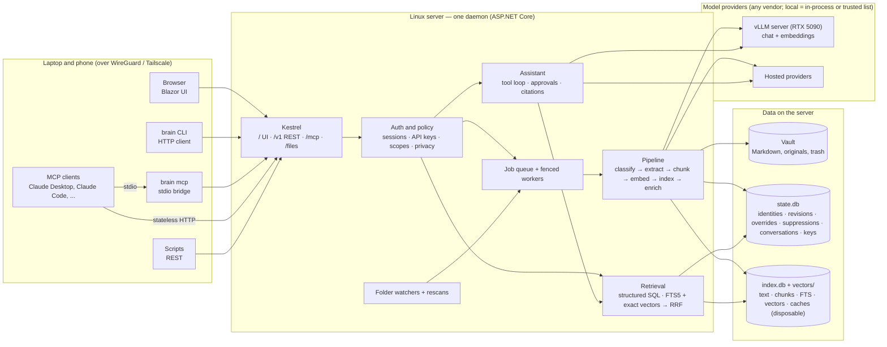

# SecondBrain — Product & Technical Specification

| | |
|---|---|
| **Status** | Draft v0.4 — decisions applied, review findings resolved, ready for M0 |
| **Date** | 2026-10-08 |
| **Owner** | Justin Leahy |
| **Repo** | `secondbrain` |
| **Supersedes** | v0.3, archived at `docs/archive/spec-v0.3.md`; reviewed in `reviews/2026-10-08-astra-ultra-spec-review.md` |
| **Stack research** | `docs/stack-research-dotnet-blazor.md` |

---

## 0. TL;DR

SecondBrain is a personal knowledge system that runs as one daemon on your own Linux server and is reached over a WireGuard-based private network from a laptop or a phone. Knowledge goes in through three doors — **watched folders** on the server, a **REST API**, and **MCP tools** — and every door feeds the same pipeline into a Markdown **vault**, a small durable **state store**, and a disposable **search index**. Knowledge comes out through a **chat assistant** that answers from your own material with verifiable citations, and through search endpoints and MCP tools that other agents can call.

Every item carries a **content type** with structured fields, so questions about who, when, and which kind are answered by query rather than by similarity. No model vendor is built in: four roles bind to any provider, including the vLLM server on your network, and an instance-wide switch can forbid anything that is not local.

### What changed since v0.3

- **Decisions applied:** C# / .NET 10 with Blazor Server; three stores with a disposable index; v1 content scope of note, article, file, transcript, and calendar event; an instance-wide privacy switch with a strict definition of local; a server deployment reached over a private network; suppress-and-trash deletion; a fresh vault; reference hardware of a Linux server plus a vLLM server with an RTX 5090.
- **Review criticals resolved:** authored state now lives in a durable state store and the rebuild promise is "vault plus state" (§5); privacy is enforced centrally before every provider call with an explicit trusted-service list (§15); original files are served as downloads from a separate path under a strict content policy (§15); UI access uses a login and a session, never an injected key (§11, §15).
- **Review majors folded in:** document revisions and fenced jobs; suppression records; namespaced natural keys; versioned cache keys and named embedding spaces; a single type-precedence matrix; nullable occurrence time with basis and precision; calendar coverage windows; transcript segments; role-qualified person filters; one structured query contract with cursors; SQL prefilter plus exact vector scoring; an external-content text index with declared cosine distance; capabilities per model binding; a portable transcript with switches only between turns; turn and tool execution ids so retries never repeat writes; a citation contract with revisions and excerpts; approvals bound to exact arguments; scoped credentials for the stdio bridge; secrets outside the vault; redacted logs; resource bounds; qualified performance targets; a re-cut roadmap.
- **MCP transport** updated for the stateless 2026-07-28 protocol revision.
- **Deferred beyond v1** with their designs preserved in Appendix F: email, contact, task, entities, per-source privacy, container imports beyond calendar files, live connectors.

### Decisions

| # | Decision | Choice | Why |
|---|---|---|---|
| D1 | Users | Single user per instance | Removes tenancy complexity. Credentials identify *clients* (browser session, CLI, scripts, agents), not people. |
| D2 | Deployment | One daemon on a Linux server, reached over a WireGuard-based private network; Docker or systemd | Always on, reachable from laptop and phone, one place for watched folders and data. |
| D3 | Stores | Vault files (authored content) + durable state store (authored non-file state) + disposable index | Files stay portable, decisions survive, and the index can always be deleted and rebuilt. |
| D4 | Database | SQLite in WAL mode for both state and index; FTS5 for keywords; vectors in memory-mapped files scored in process | Zero operations; FTS5 ships in the .NET SQLite bundle; exact scoring avoids an alpha native extension. |
| D5 | Models | No built-in default. Roles `chat`, `enrich`, `embed`, `rerank` bind to any provider and model in config | No vendor lock-in; mix providers; run fully local on the vLLM server. |
| D6 | Provider integration | `Microsoft.Extensions.AI` abstractions as the adapter contract, with capabilities resolved per model binding | The provider-neutral layer exists and is GA; capabilities are layered on it. |
| D7 | Retrieval | Structured SQL queries for who, when, and which-type; hybrid keyword plus vector for topics, with filters applied before scoring | Each question type gets the mechanism that answers it correctly. |
| D8 | Language | C# on .NET 10; Blazor Web App with Interactive Server rendering | One language for daemon, API, MCP, CLI, and UI; first-class MCP and AI abstractions. |
| D9 | Network posture | Binds only to the private-network interface; every request authenticated; no TLS termination in v1 | The VPN is the transport boundary; the daemon never faces the public internet. |
| D10 | Assistant writes | Proposed as pending operations, approved with exact arguments against a document revision | Approval is an execution contract, not a UI gesture. |
| D11 | Content model | One document table with a registry-backed `type`, schema-validated `properties`, nullable `occurred_at` with basis and precision | Structured questions need fields; one table keeps one index and one pipeline. |
| D12 | Privacy | Instance-wide `local_only` switch; local means in-process or on an explicit trusted-service list; enforced before every provider call | A guarantee that can actually be kept. Per-source restrictions come with email. |
| D13 | Deletion | Suppress and trash: external files never touched, managed notes trashed for 30 days, purge removes derived data | Deletions cannot resurrect, and the app never destroys a file it does not own. |

---

## 1. Goals and non-goals

### Goals

1. **Capture with near-zero friction.** Drop a file into the synced inbox, POST to an endpoint, or have any MCP client call `brain_remember`.
2. **Find anything.** Keyword, semantic, and structured search by type, person, and time across everything ingested, in well under a second.
3. **Ask anything.** An assistant that answers from the vault with citations that resolve to a document revision and an excerpt, says plainly when nothing relevant exists, and distinguishes "nothing found" from "retrieval was degraded".
4. **Own everything.** Plain files plus one small state file are the whole truth; the index is disposable; export is complete.
5. **Be a good citizen in the agent ecosystem.** A well-described MCP server so other agents can read and write the brain.
6. **Never lock the user in.** Any chat, embedding, or rerank provider, hosted or local, behind one interface, changed in configuration.
7. **Keep promises that can be enforced.** Privacy, authorization, and deletion are enforced by the daemon, not by prompts or conventions.

### Non-goals for v1

- Multi-user accounts, sharing, or permissions between people
- Real-time collaborative editing
- Replacing a full note editor
- Email, contacts, tasks, and resolved entities (Appendix F)
- Per-source privacy tiers and a second embedding space (Appendix F)
- Live mail or calendar connectors (file exports only)
- TLS termination or public exposure (the private network is the boundary)
- Native mobile apps (the web UI must work well in a phone browser)

---

## 2. Guiding principles

1. **One pipeline, many doors.** Folders, REST, MCP, and the UI produce the same `Document` and run through the same stages.
2. **Files first, state small, index disposable.** Authored content is Markdown in the vault. Authored decisions live in a small state store. Everything derived can be deleted and rebuilt.
3. **Grounded or silent, and honest when degraded.** Every claim about the user's material carries a citation. "Nothing relevant" and "retrieval was partial" are different answers.
4. **Ingested content is data, not instructions.** Authority boundaries (scopes, allowed tools, approvals) are enforced outside the model; prompts are a mitigation, not the guarantee.
5. **Idempotent, revisioned, resumable.** Every document has a revision; every job is fenced on the revision it was created for; retries never repeat side effects.
6. **Cloud calls are explicit and policy-checked.** The privacy policy runs before every provider request, not only at startup.
7. **Boring infrastructure.** One process, two SQLite files, a directory of vectors, no broker.
8. **Models are configuration, not architecture.** Nothing outside the provider layer knows the vendor; missing capabilities degrade gracefully.
9. **Types earn their place.** A content type is added only when a door produces it; `file` stays an honest fallback; reclassifying never destroys anything.
10. **Nothing fails silently.** Degraded, partial, truncated, withheld, and out-of-coverage states are explicit in every API and in the UI.

---

## 3. Users and use cases

**Primary user:** one technical person with a home server who reads, writes, codes, and talks to AI agents all day and wants one place where all of it accumulates and stays queryable from any device on their private network.

| ID | Story | Door |
|---|---|---|
| U1 | I drop a PDF into the inbox folder synced to the server and within 30 seconds I can ask questions about it. | Folder |
| U2 | A Markdown folder on the server is indexed in place; an edit shows up in search within seconds. | Folder |
| U3 | A nightly script POSTs meeting transcripts with their participants and start times. | REST |
| U4 | While coding in Claude Code I say "remember that we chose exact vector scoring because X" and it is saved with provenance from the bridge's credential. | MCP |
| U5 | In Claude Desktop I ask "what did I decide about auth last month?" and it answers from my notes. | MCP |
| U6 | In the web UI I ask for a summary of everything I have read about retrieval evaluation and get an answer with footnotes that open the exact passage. | Chat |
| U7 | I ask "what have I been working on this week?" and get a recency-aware summary. | Chat |
| U8 | I paste text into the chat and say "save this under #woodworking"; the assistant proposes a note, I approve it once, and exactly that note is written. | Chat |
| U9 | I rename or move a folder of documents and nothing is re-embedded. | Folder |
| U10 | I delete the index directory and rebuild it; search results and citations are identical afterwards. | CLI |
| U11 | The sources page shows which files failed and why, and I retry them. | UI |
| U12 | With local-only mode on and the vLLM server as the only trusted service, nothing leaves my network, and the daemon refuses to start if a role points anywhere else. | Config |
| U13 | I move the chat role to a different provider by editing one line; the next conversation turn uses it and older turns still read correctly. | Config |
| U14 | I ask "what meetings did I have last week?" and get calendar events ordered by start time, with a notice if the calendar's materialized window does not cover the question. | Chat |
| U15 | I import a meeting transcript and ask what a specific person said about pricing; the answer cites their segments with timestamps. | Chat |
| U16 | I open the UI on my phone over the VPN, log in once, and it works at phone width. | UI |
| U17 | I delete a document from a synced folder; it never reappears on rescan unless I un-suppress it. | UI |
| U18 | The daemon restarts in the middle of a large import and finishes without duplicates or stale chunks. | Ops |
| U19 | A chat turn fails after the assistant appended to a note; the retry does not append again. | Chat |

---

## 4. System overview



### Components

| Component | Responsibility |
|---|---|
| **Daemon** (`SecondBrain.Server`) | One ASP.NET Core process: the REST API, the Blazor UI, the MCP endpoint, the file download path, folder watchers, the job worker pool, the scheduler, and the policy layer. The only process that opens `state.db` and `index.db`. |
| **Engine** (`SecondBrain.Core`) | Domain model, pipeline, retrieval, assistant, policy. No vendor SDKs. |
| **Storage** (`SecondBrain.Storage`) | The two SQLite stores, the vector files, migrations, the rebuild procedure. |
| **Providers** (`SecondBrain.Providers.*`) | Adapters behind `Microsoft.Extensions.AI`; the only place vendor SDKs appear. |
| **CLI** (`brain`) | An HTTP client that runs anywhere on the private network. `brain init` is the one command that runs on the server before the daemon starts. |
| **MCP stdio bridge** (`brain mcp`) | Runs on the laptop beside the MCP client, speaks stdio to it, and forwards to the daemon over HTTP with its own scoped credential. |
| **Web UI** | Blazor Web App served by the daemon with Interactive Server rendering; login with a session cookie. |

**Process boundaries.** All writes go through the daemon. Maintenance operations (reindex, backup, export, retention) are daemon endpoints so no second process ever opens the stores. Folder watchers run inside the daemon on server-local paths; laptop folders reach the server through a sync tool or a mounted share.

---

## 5. Domain model

### 5.1 The three stores

| Store | Holds | Durability |
|---|---|---|
| **Vault** (files) | Notes the system or the user authored, imported originals, the trash folder | Authoritative. Backed up by the user's file backup. |
| **State store** `state.db` | Sources; document identities, revisions, and occurrences; type, tag, and property overrides; suppression records; calendar coverage; container membership; conversations, turns, tool executions, pending operations; API keys (hashed); usage ledger; processing generations | Authoritative. Small. Backed up with the vault. |
| **Index** `index.db` + `vectors/` | Extracted text, chunks, segments, people projections, FTS table, embedding spaces and vectors, extraction and embedding caches, retrieval traces | Disposable. Rebuilt from vault plus state with `POST /v1/maintenance/rebuild`. |

The daemon opens one connection with the index attached to the state store, so reads may join across them. Writes to the state store are transactional per request. Writes to the index are fenced on document revision (§8). A rebuild preserves every identity, override, suppression, conversation, and citation because none of those live in the index.

### 5.2 Entities

| Entity | Store | Description | Key fields |
|---|---|---|---|
| **Source** | state | An origin that produces documents: a folder on the server, the REST API, an MCP credential, the UI. | `id`, `kind`, `name`, `config`, `status`, `last_scan_at`, `last_full_scan_at` |
| **Document** | state (identity) + index (projection) | One logical item of any content type. | `id` (ULID), `source_id`, `type`, `type_origin`, `type_confidence`, `properties`, `occurred_at`, `occurred_basis`, `occurred_precision`, `natural_key`, `revision`, `title`, `mime`, `content_hash`, `status`, `error`, timestamps |
| **Occurrence** | state | Where a document's bytes live: a path in a source, optionally a member of a container file. A document has one occurrence in v1 except calendar members, which have a container plus a natural key. | `document_id`, `source_id`, `path`, `container_document_id`, `member_key`, `file_mtime`, `size_bytes` |
| **Revision** | state | Monotonic per-document counter incremented on any change to bytes, properties, type, or tags. Jobs, citations, approvals, and preconditions reference it. | `document_id`, `revision`, `cause`, `created_at` |
| **Override** | state | A user decision that must survive reprocessing: type, tags added or removed, property values. | `document_id`, `kind`, `value`, `created_at` |
| **Suppression** | state | "Never index this again": by occurrence path, by natural key, or by document id. Honored by scans and imports until removed. | `id`, `scope`, `key`, `reason`, `created_at` |
| **Content type** | code + config | Registry entry: schema version, extractor, chunker, indexed fields, renderer. | `key`, `schema_version`, `extends` |
| **Chunk** | index | A retrieval-sized slice with heading or speaker context, offsets into the lossless extracted text, and the exact embedding input. | `rowid`, `document_id`, `revision`, `ordinal`, `context`, `text`, `start`, `end`, `page`, `token_count`, `input_hash` |
| **Segment** | index | A transcript unit: speaker, start and end time, offsets. Chunks map to segment ranges. | `document_id`, `ordinal`, `speaker`, `start_ms`, `end_ms`, `start`, `end` |
| **Embedding space** | index | A named vector space: provider, model revision, dimensions, normalization, input template. One active space per instance in v1. | `id`, `fingerprint`, `dimensions`, `status`, `coverage` |
| **Person reference** | index (projection) + state (user assertions) | A role-qualified reference to a person on a document: author, organizer, attendee, participant, speaker. | `document_id`, `role`, `identifier`, `display_name` |
| **Tag assertion** | state (user) + index (parsed, llm) | Each origin asserts tags independently; the effective set is derived. | `document_id`, `tag`, `origin`, `asserted` |
| **Link** | index (parsed) + state (user) | Directed relation between documents; parsed links keep their raw target text so they survive the target's deletion. | `from`, `to`, `target_text`, `kind`, `origin` |
| **Conversation / Turn / Tool execution** | state | Portable transcript, per-turn execution record, and per-tool-call commit record. | `conversation_id`, `turn_id`, `status`, `execution_id`, `committed_result` |
| **Pending operation** | state | A proposed write with exact arguments and the target revision, awaiting approval. | `id`, `turn_id`, `tool`, `arguments`, `target_revision`, `status` |
| **Job** | state | Fenced background work. | `id`, `kind`, `document_id`, `revision`, `generation`, `status`, `attempts`, `lease_until` |
| **Credential** | state | API key (hashed) with scopes, or a UI session. | `id`, `name`, `kind`, `scopes`, `last_used_at`, `revoked_at` |
| **Usage** | state | Provider usage ledger with reservations and settlements. | `at`, `provider`, `model`, `role`, `reserved`, `settled`, `cost` |

### 5.3 Identity, occurrence, and revision rules

- **Logical identity** is the ULID assigned at admit. Managed notes also carry it in frontmatter; it survives moves and rebuilds.
- **An occurrence** is `(source_id, path)` plus an optional `(container, member_key)`. Two files with identical bytes at different paths are two documents. Content hashes are used only to skip recomputation, never to merge documents.
- **Natural keys** are namespaced, `type:key`, and scoped to a source. In v1 only `calendar_event` uses them: `calendar_event:<UID>` plus the recurrence id for an exception. A natural key that already exists in the source updates that document rather than creating a new one. Two records with the same key in one import keep the later `DTSTAMP`; a tie is reported as an error.
- **Moves.** A document is moved, not deleted and recreated, when its old path disappears and its content hash appears at a new path within one reconciliation window (one rescan interval). If several candidates match, the ambiguity is resolved conservatively as delete plus create, and the UI shows the suspected move for the user to confirm.
- **Revisions.** Any change to bytes, type, properties, or tags increments the revision. Every job records the revision it serves; a job publishes only if that revision is still current. Preconditions on `PATCH`, `brain_update`, and approvals use the revision, never a timestamp.
- **Deletion** creates a suppression and sets the document to `deleted`; identity, revisions, and citations persist (D13, §7.1).

### 5.4 Content types in v1

| Type | Produced by | Properties (normative schemas in Appendix E) | `occurred_at` basis | Chunking |
|---|---|---|---|---|
| `note` | Chat, REST, MCP, Markdown in watched folders | `aliases` | `created` | Structure-aware by heading |
| `article` | Saved HTML, PDFs of articles, REST with `type: article` | `author`, `published_at`, `url`, `site` | `published_at`, else none | Structure-aware by heading |
| `transcript` | `.vtt`, `.srt`, REST or MCP with `type: transcript`; audio transcription later | `participants[]`, `started_at`, `duration_ms`, `event_id`, `recording_url` | `started_at`, else none | By speaker turn into windows of about 400 tokens; speaker and timestamps kept on every chunk; segments recorded |
| `calendar_event` | `.ics` imports (containers) | `uid`, `recurrence_id`, `starts_at`, `ends_at`, `all_day`, `tz`, `attendees[]`, `organizer`, `location`, `status`, `master_id`, `sequence` | `starts_at` | Single chunk unless it exceeds the chunk limit |
| `file` | Anything else | none | none | Generic structure-aware |

Deferred types (`email`, `contact`, `task`) and resolved entities are specified in Appendix F so the registry can grow without redesign.

**Reserved base fields** in frontmatter and the API: `id`, `type`, `title`, `created`, `updated`, `tags`, `aliases`, `source`, `source_url`, `occurred_at`. Type properties live under `props`. Unknown keys are preserved verbatim. Each type schema is versioned; a schema change is a processing generation (§8) and migrates `props` forward with a recorded migration, never by dropping fields.

**Custom types** are declared in config with a key, a JSON Schema, a built-in type to inherit chunking from, and the properties to index. Documents of a type that is later removed from config keep their `type` and `props` and are treated as `file` for processing.

### 5.5 Time

- `occurred_at` is nullable. It is set only from a real source value and carries `occurred_basis` (`created`, `published_at`, `started_at`, `starts_at`) and `occurred_precision` (`datetime`, `date`). Ingestion time is never substituted.
- Values are stored as UTC plus the original offset when known. Date-only values keep `date` precision and are interpreted in the instance time zone.
- The **instance time zone** is configured (`time.zone`, default the server's zone); weeks start on `time.week_start` (default Monday). Relative phrases ("last week", "yesterday") and timeline grouping use it.
- Temporal filters are half-open intervals `[from, to)`. Documents without `occurred_at` are excluded from occurrence queries and included in "recently updated" queries, which use `updated_at`.
- Events overlap a window if `starts_at < to` and `ends_at > from`.

### 5.6 People in v1

A person reference is `(role, identifier, display_name)`. Identifiers are normalized: email addresses lower-cased, names trimmed and case-folded. Roles in v1: `author` (articles), `organizer` and `attendee` (events), `participant` and `speaker` (transcripts). Filters are role-qualified (`attendee: sarah@example.com`) or any-role (`person: sarah`), and match an identifier exactly or a display name case-insensitively. Document-level participation is separate from passage-level speaker attribution, which comes from segments.

### 5.7 Calendar recurrence and coverage

- A recurring event's master and its exceptions are stored as documents with `master_id` links; cancelled occurrences are stored with `status: cancelled`.
- Occurrences are **materialized** into the index for a coverage window of `calendar.past_months` to `calendar.future_months` (default 12 and 12) and advanced by a daily job. Coverage per calendar source is recorded in the state store.
- A query whose window extends beyond coverage returns `coverage: partial` with the covered range, and the assistant says so (principle 10).
- A moved occurrence keeps the identity `(uid, recurrence_id)`; all-day events, floating times, and time zones follow iCalendar semantics with `tz` recorded on the event.
- Re-importing a calendar file reconciles membership only after the whole file parses; members missing from a complete, successful import are marked `removed_from_source` and suppressed, not deleted (§7.1).

### 5.8 Transcript segments

Segments carry `speaker` (nullable for unknown), `start_ms` and `end_ms` relative to the transcript start, and offsets into the lossless text. Chunks record the segment range they cover, so a citation can name the speaker and the time range even when a chunk spans several turns. Absolute times are derived only when `started_at` is known.

---

## 6. Vault, state, and index layout

```
/srv/secondbrain/                   # data root (Docker: a volume mounted here)
├── vault/
│   ├── inbox/                      # synced drop zone: ingested, then filed into sources/
│   ├── notes/2026/10/why-exact-vectors.md
│   ├── sources/2026/10/eval-retrieval.pdf
│   ├── sources/2026/10/calendar-2026.ics          # container: one document per event
│   └── .brain/
│       ├── state.db                # durable, backed up with the vault
│       ├── index.db                # disposable
│       ├── vectors/<space-id>.f32  # disposable, memory-mapped
│       ├── cache/                  # disposable extraction cache
│       ├── trash/                  # managed notes deleted in the last 30 days
│       └── logs/
/etc/secondbrain/
├── config.yaml                     # Appendix B
└── secrets/                        # provider keys, session signing key; 0600; never in the vault
```

Secrets live outside the vault so file sync and backup tools never copy them (review finding 33). Docker deployments mount `/srv/secondbrain` as a volume and pass secrets through Docker secrets or environment variables.

**Note file format**, written by the system for every managed note:

```markdown
---
id: 01K70Q3V8X2M4N6P8R0T2V4X6Y
type: note
title: Why exact vectors
created: 2026-10-08T15:04:05Z
updated: 2026-10-08T15:04:05Z
tags: [secondbrain, decision]
aliases: []
source: mcp:claude-code-bridge      # credential name, not a self-asserted client name
source_url:
occurred_at: 2026-10-08T15:04:05Z
props: {}
---

We score vectors exactly over SQL-filtered candidates because ...
```

A transcript authored through REST or MCP carries its typed fields under `props`:

```markdown
---
id: 01K70RA2Q7W9X1Y3Z5B7D9F1H3
type: transcript
title: "Pricing sync"
occurred_at: 2026-10-07T17:00:00Z
props:
  participants: ["sarah@example.com", "justin@example.com"]
  started_at: 2026-10-07T17:00:00Z
  duration_ms: 1800000
---
```

Path template for new notes is `notes/{yyyy}/{mm}/{slug}.md` (`notes.path_template`), with a numeric suffix on collision. Files are written as temp-then-rename so a crash never leaves a half-written note. Wikilinks resolve against titles, aliases, and filenames; unresolved links are kept with their raw target text.

**Trash.** Deleting a managed note moves it to `.brain/trash/<yyyy-mm-dd>/<original path>` with its revision recorded; `retention.trash_days` (default 30) later purges it. Restore is a UI and CLI action that moves it back and clears the suppression.

---

## 7. Ingestion

### 7.1 Common contract (all doors)

| ID | Requirement |
|---|---|
| ING-1 | Every door produces a `Document` with a source, a credential-derived provenance, and bytes or text, then enqueues the pipeline (§8). No door has its own parsing or indexing logic. |
| ING-2 | **Idempotency has three layers.** Unchanged bytes at an existing occurrence do nothing. A calendar record with an existing natural key updates that document. A REST `Idempotency-Key` returns the original response for 24 hours when the payload hash matches and `422 idempotency-key-reuse` when it does not. |
| ING-3 | **Provenance comes from the credential.** `source` is `<door>:<credential name>` (for example `mcp:claude-code-bridge`, `api:nightly-transcripts`, `folder:inbox`, `ui`). A name an MCP client asserts in its handshake is stored as `claimed_client` metadata and never used for authorization or provenance. |
| ING-4 | **Small text captures are searchable within a deadline.** REST JSON, `brain_remember`, and UI capture write the file, record the identity and revision, and build the keyword projection synchronously (target under 1 s). The embedding is attempted within `ingest.sync_embed_deadline_ms` (default 3000); if it misses or fails, the document is returned as `indexed_partial` with `vector: pending` and the embedding is queued. The response always states which projections are live. |
| ING-5 | Files and bulk work are asynchronous: the caller gets a document id and a job id and can poll or wait (§7.3 lifecycle table). |
| ING-6 | Failures are recorded per document with the failing stage and reason, visible in the UI, the CLI, and `GET /jobs`. Retries are automatic (3 attempts, exponential backoff) and manual. A document that fails permanently stays findable by title and path with status `failed`. |
| ING-7 | **Bounds apply to work, not only to input bytes.** Defaults: 50 MB per input file, 200 MB decoded, 10 levels of nesting, 50,000 members per container, 5,000 chunks per document, 120 s extraction time, 30 s per LLM classification call. Extraction runs in a cancellable worker; exceeding a bound records `skipped` with the bound named. Oversized or unsupported files are kept as metadata-only documents. |
| ING-8 | **One type-precedence matrix**, applied in this order, first match wins: (1) a user override; (2) a `type` declared by the door; (3) a `type` persisted in the file's frontmatter; (4) an unambiguous physical format (`.ics` → `calendar_event` members, `.vtt` and `.srt` → `transcript`); (5) the source's `type_map` glob, then its `default_type`, for ambiguous formats; (6) LLM classification with the `enrich` role when enabled and above `classification.min_confidence`; (7) the format default (`.md` and `.txt` → `note`, `.html` and `.pdf` → `article`, else `file`). Physical format detection also selects the extractor and is independent of the semantic type. The winning rule and confidence are stored as `type_origin` and `type_confidence`. Reclassification never overwrites an override and never discards `props`. |
| ING-9 | **Container files** (v1: `.ics` only) expand into one member document per record, addressed as `<container path>#<member key>`, with membership recorded in the state store. Members are checkpointed individually, so an interrupted import resumes. Removals are reconciled only after a complete, successful parse; a member missing from such an import is marked `removed_from_source` and suppressed, never deleted. A partial parse marks the container `partial` with per-member errors. The REST response for a container is the container document plus a job that reports member counts. |
| ING-10 | **Processing generations.** Extractors, chunkers, type schemas, normalization, and the active embedding space each carry a version. Bumping one schedules background reprocessing of affected documents without changing their revisions, since only derived data changes. |

### 7.2 Folders

| ID | Requirement |
|---|---|
| FLD-1 | Folder sources are paths on the server. Each has `path`, `include` and `exclude` globs, `recursive`, `mode` (`index` in place, or `import` into `vault/sources/`), `enrich`, `default_type`, `type_map`, and `watch` (`events` or `poll`). |
| FLD-2 | Change detection has three tiers: filesystem events when available, a periodic shallow rescan comparing size and mtime (default every 10 minutes and at startup), and a deep rescan that hashes every file (default nightly, and on demand). Mounted or synced folders should use `watch: poll` because events on mounts are unreliable; the deep rescan catches sync tools that change bytes without changing mtime. |
| FLD-3 | Per-path debounce (default 1.5 s). Temporary, hidden, and lock files are ignored; `.brainignore` (gitignore syntax) is honored at any level. |
| FLD-4 | A file is reprocessed when its stat tuple **or** its content hash changed, or when a processing generation it depends on changed. |
| FLD-5 | Moves preserve identity (§5.3). |
| FLD-6 | A file that disappears from a source is marked `missing` for one reconciliation window, then `removed_from_source`: its index projections are dropped, its identity and revisions are kept, and if the same bytes reappear at the same path within `retention.removed_days` the identity is reattached. A document deleted **in the app** from an external source gets a suppression record and the file is never touched (D13). |
| FLD-7 | Formats at v1: `.md` `.markdown` `.txt` `.pdf` `.html` `.htm` `.docx` `.vtt` `.srt` `.ics`. Indexed as plain text up to 1 MB: `.csv` `.json` `.yaml`. Later: images, audio, `.epub`, `.pptx`, `.xlsx`, `.eml`, `.mbox`, `.vcf` (Appendix F). |
| FLD-8 | Frontmatter is parsed for the reserved base fields and `props` before classification (ING-8 step 3), so a rebuild reproduces types. Wikilinks and Markdown links become `links` with their raw target text. |
| FLD-9 | `inbox/` is a built-in `import` source with enrichment on. Import is copy to `sources/`, verify hash, index, then delete the inbox original; a failure at any step leaves the original in place and the copy is cleaned up on startup reconciliation. |
| FLD-10 | A large initial import runs as a resumable `scan` job that fans out fenced per-document jobs with bounded concurrency and shows progress. |
| FLD-11 | `default_type` and `type_map` apply only to ambiguous formats (ING-8 step 5). |

### 7.3 REST API

Base URL `https://<server>/v1` over the private network (plain HTTP inside the VPN in v1). Every request carries either `Authorization: Bearer <api key>` or the UI session cookie plus an antiforgery token. Scopes are defined in §15.

**Conventions**

- JSON bodies and responses; uploads as `multipart/form-data`.
- ULID identifiers; ISO-8601 UTC timestamps with offsets preserved where known.
- Documents carry `ETag: "<revision>"`. `PATCH` and `DELETE` on a document require `If-Match`; a stale value returns `412 revision-mismatch` with the current revision.
- Cursors are opaque, signed, self-contained tokens; results are ordered deterministically with `(sort field, id)` tie-breaking.
- Errors are RFC 9457 `application/problem+json` with a stable `type` per condition.
- `Idempotency-Key` on `POST /documents` and `POST /chat` (ING-2).
- Request body limit 100 MB. `429` is used only for provider back-pressure and login rate limiting.
- `GET /v1/openapi.json` is generated from the same schemas that validate requests and define MCP tools.

**Endpoints**

| Method | Path | Scope | Purpose |
|---|---|---|---|
| `POST` | `/documents` | write | Create from JSON `{title?, content, type?, props?, tags?, source_url?}` or multipart `file` + `metadata`. `props` are validated against the type schema. Returns `201 {document, job}`; `?wait=<seconds, max 30>` returns `200` when indexed, else `202` with the job. A container upload returns the container document and a job with member counts. |
| `GET` | `/documents/{id}` | read | Metadata; `?include=text,chunks,segments,links,people,revisions`. |
| `PATCH` | `/documents/{id}` | write | Update `title`, `tags`, `type`, `props` (merged; `props_mode: replace` to replace), or `content`. Requires `If-Match`. A content change creates a revision and re-runs the pipeline; a type change records an override and re-chunks. Returns the new revision. |
| `DELETE` | `/documents/{id}` | write | Suppress and trash (D13). Requires `If-Match`. `?purge=1` needs `admin` and removes derived data and the trashed file. |
| `POST` | `/documents/{id}/restore` | write | Move back from trash and clear the suppression. |
| `GET` | `/files/{id}` | read | The original bytes as a download (`Content-Disposition: attachment`, `nosniff`, sandboxing policy). Never rendered inline from the UI origin. |
| `GET` | `/documents/{id}/related` | read | Linked documents plus nearest neighbors by embedding. |
| `POST` | `/query` | read | The structured query contract (§9.3): no embeddings, SQL only. |
| `POST` | `/search` | read | Hybrid search `{query, mode?, filters?, limit?, rerank?}` (§9.1). |
| `POST` | `/ask` | read | One-shot grounded answer with citations, run by the read-only executor; `deep: true` allows up to five searches. |
| `POST` | `/chat` | write | `{conversation_id?, message}` → Server-Sent Events. A second `POST` while a turn is running returns `409 turn-in-progress`. |
| `GET` | `/conversations`, `/conversations/{id}` | read | List; fetch the portable transcript. |
| `GET` | `/conversations/{id}/turns/{turn_id}/events?after=<seq>` | read | Replay persisted turn events after a disconnect. |
| `DELETE` | `/conversations/{id}` | write | Delete a conversation. |
| `GET` | `/pending` | read | Pending operations awaiting approval. |
| `POST` | `/pending/{id}/approve`, `/pending/{id}/discard` | write | Approve binds the exact argument hash and target revision; a changed target returns `409 target-changed` with a rebased proposal. |
| `GET` `POST` | `/sources` | sources | List; add a folder source. |
| `GET` `PATCH` `DELETE` | `/sources/{id}` | sources | Inspect, change, remove. Removal marks its documents `removed_from_source`; `?purge=1` (admin) removes them. |
| `POST` | `/sources/{id}/scan` | sources | Shallow rescan; `?deep=1` hashes everything. |
| `GET` | `/jobs`, `/jobs/{id}` | read | Queue inspection with `status` filter. |
| `POST` | `/jobs/{id}/retry` | write | Re-queue a failed job. |
| `GET` `DELETE` | `/suppressions`, `/suppressions/{id}` | write | List and lift suppressions. |
| `POST` | `/maintenance/rebuild`, `/maintenance/reembed`, `/maintenance/backup`, `/maintenance/export`, `/maintenance/retention`, `/maintenance/rotate-keys` | admin | Rebuild the index from vault plus state; create a new embedding space; consistent backup of `state.db`; full export; run retention now; rotate the session signing key. |
| `GET` | `/types`, `/tags`, `/timeline` | read | Registry with counts; tag vocabulary; documents by `occurred_at` in `[from, to)` grouped by day with `coverage`. |
| `GET` | `/health`, `/ready`, `/stats` | none / read | Liveness; readiness per store and per role provider; counts, queue depth, coverage, usage today. |

**Lifecycle outcomes**

| Situation | Response |
|---|---|
| `?wait` elapsed before indexing finished | `202` with `{document, job}`; the document reports which projections are live |
| Same `Idempotency-Key`, same payload | The original response, replayed |
| Same `Idempotency-Key`, different payload | `422 idempotency-key-reuse` |
| Container parsed partially | `201`; container status `partial`; job lists member errors |
| Embedding provider down during capture | `201` with `indexed_partial`, `vector: pending`; job queued |
| `PATCH` with stale `If-Match` | `412 revision-mismatch` with `current_revision` |
| Approval of a pending operation whose target revision changed | `409 target-changed` with a rebased proposal to approve instead |
| Source removed while documents exist | Documents become `removed_from_source`; identities retained for `retention.removed_days` |

**Chat events** (`POST /chat`): `turn.start {turn_id, conversation_id, seq}` · `text.delta` · `thinking.delta` (summaries only) · `tool.call {execution_id, name, input}` · `tool.result {execution_id, status}` · `pending {pending_id}` · `citation` · `turn.end {status: complete | partial | failed, usage, degraded?: [...]}` · `error`. Every event carries a sequence number and is persisted before it is sent, so a client that reconnects replays from `after=<seq>` and the turn keeps running server-side while the client is away.

### 7.4 MCP server

SecondBrain is an MCP **server**. Any MCP client can push knowledge in and pull knowledge out.

**Transports**

| Transport | How | Credential |
|---|---|---|
| stdio | `brain mcp` on the laptop, beside the client; forwards to the daemon over HTTP | Its own API key with `read` and `write` scopes, stored by `brain login`; never the admin key |
| Stateless HTTP | `POST /mcp` on the daemon, per the MCP revision of 2026-07-28 | `Authorization: Bearer <api key>`; `Origin` exact-match when present; `Host` allowlisted |

The 2026-07-28 revision removed protocol-level sessions: there is no session header, no server-to-client stream to resume, and version and capability information travel in each request's `_meta`. Consequences here: pagination cursors are self-contained signed tokens, nothing depends on connection identity, and the stdio bridge forwards requests verbatim. The C# SDK runs `server/discover` first and falls back to the older handshake for down-level clients during the transition. The deprecated HTTP+SSE transport is not supported.

**Tools**

| Tool | Purpose | Annotations |
|---|---|---|
| `brain_search` | Hybrid search: ranked excerpts with document ids, types, titles, paths, context, scores, and `degraded` flags. Filters: `type`, `tags`, `person` or role-qualified people, `occurred_after`, `occurred_before`, `path_prefix`, `limit`, `cursor`. | read-only, idempotent |
| `brain_query` | The structured query contract (§9.3) with `cursor`, `coverage`, and `truncated`. For who, when, and which-type questions. | read-only, idempotent |
| `brain_ask` | A grounded, cited answer from the read-only executor. `deep: true` allows up to five searches. Says explicitly when nothing was found and when retrieval was degraded. | read-only |
| `brain_get` | Full lossless text of a document by id or vault path, with `offset` and `length`, plus `revision`. | read-only, idempotent |
| `brain_remember` | Save content as a new document: body, optional `title`, `type` (v1 types only; default `note`), `props`, `tags`, `source_url`, `related_to`. Returns id, path, revision, and which projections are live. | write, non-destructive |
| `brain_update` | Append to or replace a document's body; requires the `revision` the client last saw and returns `409` with the current revision when stale. Refuses files in `index`-mode sources unless `assistant.allow_external_writes` is on. | write |
| `brain_list_recent` | Recently added or updated documents by `type` and `tag`, with a cursor. | read-only |
| `brain_tags` | Tag vocabulary with counts. | read-only |

Design rules: names are prefixed `brain_`; descriptions say when to use each tool; results are truncated explicitly with `next_cursor`; annotations are accurate; input schemas are strict and generated from the same C# types as the REST schemas. Full definitions in Appendix D.

**Resources:** `brain://document/{id}` and `brain://note/{path}` as `text/markdown`; `resources/list` pages over recently updated documents. **Prompts:** `brain_daily_review`, `brain_topic_brief`.

---

## 8. Processing pipeline

```
admit → classify → extract → normalize → chunk → embed → index → enrich
```

| Stage | What happens | Fencing and caching |
|---|---|---|
| **Admit** | Create or update the identity, occurrence, and revision in the state store; compute the content hash; apply move detection and suppression checks. Enqueue a job for `(document, revision, generation)`. | Synchronous and cheap. A suppressed path or key is skipped and logged. |
| **Classify** | Apply the precedence matrix (ING-8); expand `.ics` containers into member documents (ING-9). | Classification results are stored in the state store with origin and confidence. |
| **Extract** | Produce **lossless** Markdown text plus typed `props` with the extractor chosen by physical format, interpreted by the content type. Markdown: frontmatter and links. PDF: text layer with page markers; scanned PDFs flagged `needs_ocr`. HTML: readability extraction, then Markdown. DOCX: structure-preserving conversion. WebVTT and SRT: segments with speakers and times. iCalendar: masters, exceptions, cancellations, recurrence materialization within coverage. | Cache key `(content_hash, extractor id, extractor version, type, schema version)`. |
| **Normalize** | Derive a **search text** view (NFC, whitespace collapsed outside code blocks and tables, zero-width characters removed) with an offset map back to the lossless text. The lossless text is what `brain_get`, the viewer, and citations use. | Normalization has a version; a bump is a generation. |
| **Chunk** | Strategy by content type (§5.4). Default is structure-aware by heading and paragraph to `chunking.target_tokens` (512), maximum `chunking.max_tokens` (1024), overlap 64, never inside a fenced block or table when avoidable. Transcripts chunk by speaker turns into windows that keep speaker and times; single-record types get one chunk unless the record exceeds the maximum, in which case it is split with the record context repeated on every piece. Each chunk's embedding input is `context + text`, where context is `title > heading path` or `speaker @ time range`. | The exact embedding input is hashed as `input_hash`. Chunk size is validated against the embed model's `embed_max_input_tokens` capability. |
| **Embed** | Batch by the binding's `embed_batch_max` and token limits, with `intent: document`. Look up `(space id, input_hash)` in the cache first. Retry with backoff; respect rate limits. | Cache key includes the embedding space, so a model change never reuses incompatible vectors. |
| **Index** | **One transaction** replaces every projection for the document: metadata, text, chunks, segments, people, FTS rows, and vectors, and records `indexed_revision` and `indexed_generation`. The transaction commits only if the job's revision and generation are still current; otherwise the job ends as `superseded`. | A crash leaves the previous projections intact and searchable. |
| **Enrich** | *(async, optional)* The `enrich` role produces a short `summary`, up to five `tags` (origin `llm`, preferring the existing vocabulary), entity `mentions`, and `suggested_links`, using structured output when the binding supports it and a tolerant parser otherwise. Stored in the index. Frontmatter write-back is off by default and, when on for a managed file, creates a new revision with cause `enrichment`. | Fenced like Index; runs through the privacy policy; uses the batch capability for backfills when present. |

**Durability protocol.** Vault writes are temp-then-rename. Inbox imports copy, verify, index, then delete. Jobs hold leases; a worker that outlives its lease cannot publish. On startup the daemon expires leases, requeues documents whose `revision` is newer than `indexed_revision` or whose generation is stale, and cleans partial imports. CPU-heavy extraction runs in an isolated worker with a timeout and memory ceiling (ING-7).

---

## 9. Retrieval

### 9.1 Topical questions: hybrid search

```
filters (type, tags, source, path, people, occurred, updated, props) → SQL → candidate chunk set C

C → FTS5 BM25 restricted to C, ≤3 chunks per document → top 50
C → exact cosine over C's vectors (memory-mapped, SIMD), ≤3 per document → top 50

→ Reciprocal Rank Fusion (k = 60) → optional rerank of the top 20 → top k (8)
→ neighbor expansion within the token budget → context pack with stable passage ids
```

- **Filters are applied before scoring**, not after, so a filter whose matches fall outside an unfiltered top-k still returns them. The vector leg scores exactly every candidate's vector; there is no approximate index in v1.
- **Document diversity** is enforced inside each leg (a window per document) before fusion, so one long document cannot consume a leg's budget.
- The vector files are per embedding space: `vectors/<space id>.f32`, memory-mapped, indexed by chunk row id, with cosine distance declared and vectors unit-normalized on write.
- When the candidate set exceeds `retrieval.max_exact_candidates` (default 1,000,000 chunks), the query returns `degraded: exact-cap` and scores a bounded sample ordered by recency. The approximate-index upgrade (§21) replaces this cap when measurements require it.

### 9.2 Requirements

| ID | Requirement |
|---|---|
| RET-1 | Modes: `hybrid` (default), `keyword`, `semantic`. Keyword uses FTS5 BM25 over an external-content table with phrase and prefix support and query sanitization; highlights come from FTS5 `snippet()`. Semantic uses exact cosine similarity. |
| RET-2 | Hybrid fuses the two legs with RRF (k = 60) after per-leg document diversity. |
| RET-3 | Every filter is pushed into SQL before scoring: `type`, `tags`, `source`, `path_prefix`, role-qualified `people`, `occurred` and `updated` windows, `mime`, and indexed `props`. |
| RET-4 | Optional reranking: `none` (default), `llm` (the `enrich` role scores the top 20), or `provider` (a rerank model). Rerank failure degrades to the fused order with `degraded: rerank`. |
| RET-5 | Optional recency boost when requested: score × (1 + 0.1 · e^(−age in days / 30)). |
| RET-6 | Neighbor expansion adds adjacent chunks of selected passages within the token budget and never crosses a document boundary or a suppression. |
| RET-7 | Each result carries `chunk_id`, `document_id`, `revision`, `type`, `title`, `path`, `context`, `page`, `segment range` and `speaker` for transcripts, `snippet`, `score`, `occurred_at`, `updated_at`, `tags`. |
| RET-8 | Retrieval traces (candidates per leg, fused order, final selection, timings) for the last 200 queries when `logging.retrieval_trace` is on. |
| RET-9 | Latency targets are in §17 against the reference hardware. |
| RET-10 | Structured queries run entirely in SQL over indexed fields; no embedding call is made. |
| RET-11 | Temporal language resolves against `occurred_at` under the rules in §5.5; "recently updated" is a separate, explicit query on `updated_at`. |
| RET-12 | Structured filters and semantic ranking compose: the filter narrows the candidate set, the ranking orders it. |
| RET-13 | Every response reports `degraded` reasons (`vector-pending`, `embed-unavailable`, `rerank`, `exact-cap`, `coverage-partial`) so callers never mistake a partial result for a complete one. |

### 9.3 Structured query contract

One contract backs `POST /query`, `brain_query`, and the assistant's `query_records` tool:

```json
{
  "type": "calendar_event",
  "predicates": [{ "field": "props.location", "op": "eq", "value": "HQ" }],
  "people": [{ "role": "attendee", "value": "sarah@example.com" }],
  "occurred": { "from": "2026-09-28T00:00:00-04:00", "to": "2026-10-05T00:00:00-04:00" },
  "tags": ["planning"],
  "sort": "occurred_at", "direction": "asc", "limit": 50, "cursor": null
}
```

Rules: predicates may use only indexed fields (`400 unindexed-property` otherwise) with operators `eq`, `neq`, `in`, `lt`, `lte`, `gt`, `gte`, `exists`; `people` entries are role-qualified or any-role; windows are half-open; ordering is deterministic with `(sort, id)`; `limit` is at most 200; the response is `{records, next_cursor, truncated, coverage}` where `coverage` reports the materialized calendar window when the query touches events.

---

## 10. Chat assistant

### 10.1 Behavior requirements

| ID | Requirement |
|---|---|
| CHAT-1 | Answers about the user's material come from retrieval. Every claim drawn from a document carries a citation that resolves to a document revision and an excerpt (§10.2). |
| CHAT-2 | When nothing relevant is found the assistant says so. When retrieval was degraded or coverage was partial it says that instead, and never reports "not in your brain" for a failed search. General knowledge is labeled as not from the vault. |
| CHAT-3 | When the user states new information worth keeping, the assistant proposes a save as a pending operation. |
| CHAT-4 | Document content is treated as data; the system prompt says so and tool results are wrapped as untrusted. The guarantee comes from the executor: allowed tools per caller, approvals for writes, and recorded executions. |
| CHAT-5 | Tools available to the assistant: `search`, `query_records`, `read_document`, `list_recent`, `get_related`, `create_document`, `update_document`, `tag_document`, `link_documents`. The `ask` surfaces run with the read-only subset enforced by the executor. No shell, no network. |
| CHAT-6 | Every write is a pending operation with exact arguments and the target revision. The UI shows Approve, Edit, Discard; the CLI prompts; REST and MCP callers approve through `/pending`. `assistant.auto_approve_writes` applies only to the UI session. |
| CHAT-7 | At most `assistant.max_tool_calls_per_turn` (default 8) tool calls per turn. |
| CHAT-8 | Conversations persist as a portable transcript and resume on any provider between completed turns. Long conversations are compacted into a portable summary turn. |
| CHAT-9 | Text, tool activity, pending operations, and citations stream as they happen; every event is persisted before it is sent. |
| CHAT-10 | Recency questions use `list_recent` and the recency boost; structured questions use `query_records` first (CHAT-11). |
| CHAT-11 | Who, when, and which-type questions go to `query_records`; semantic search is added only when the question also has a topic. The system prompt carries the type registry and this rule. |
| CHAT-12 | A turn ends with status `complete`, `partial` (a budget stop, a cap, or a withheld result), or `failed`, and lists the degraded reasons it encountered. |

### 10.2 Mechanics

- **Harness.** `Microsoft.Extensions.AI`'s function-invoking client drives the loop; an executor middleware owned by the engine enforces the caller's allowed tool set, validates inputs against schemas, assigns an `execution_id` to every call, and records the committed result before the loop continues.
- **Turn lifecycle.** Each turn has a `turn_id`, a persisted event log with sequence numbers, and per-call execution records. A retry or a fallback model is permitted only while no write has been committed in the turn. After a committed write, a failed turn resumes from the recorded state: the committed result is replayed to the model, never re-executed. Client disconnects do not stop a turn; a second message while a turn runs is rejected.
- **Citations.** A citation is `{document_id, revision, locator, excerpt, excerpt_hash, granularity}` where the locator is a chunk ordinal, a segment range, or a page, and granularity is `passage` or `span`. Passages given to the model carry stable per-turn ids; `[n]` markers are validated against that map, invalid markers are removed and counted, and claims without a marker are not presented as sourced. When the binding has the `native_citations` capability, provider spans are used and granularity is `span`. A citation to a revision that no longer exists resolves to a `deleted` or `changed` state with the stored excerpt, never to whatever now occupies the same position.
- **Portability.** The canonical transcript holds user-visible messages, tool calls, and tool results in the engine's format. Provider-specific continuation metadata (reasoning blocks, cache markers) is stored per turn and discarded on a provider switch. Switches take effect at the next turn. Compaction produces a portable summary turn; a provider's native compaction is used only when it also yields a portable summary.
- **Model settings.** The `chat` role binding. `reasoning: low | medium | high` is a preference that each adapter maps to its provider's control or reports as ignored. Streaming is requested when the binding supports it and buffered otherwise. The output cap is configurable.
- **Context assembly.** Static system prompt → optional profile note → compacted history → the current message → tool results. Nothing volatile precedes the history, so prompt caching works where the provider offers it.
- **Budgets.** Each provider call reserves an estimate against the daily budget and settles with actual usage; concurrent calls cannot overshoot by more than the sum of their reservations. A hard stop ends the turn as `partial` with reason `budget`.
- **Privacy.** Every provider call, including query embeddings, rerank, enrichment, and classification, passes through the policy in §15 before leaving the process.

### 10.3 Slash commands

`/save` · `/new` · `/search <q>` · `/query <type> [filters]` · `/recent` · `/sources` · `/pending`

---

## 11. Web UI

A Blazor Web App served by the daemon with Interactive Server rendering. The browser is never on loopback, so the UI has a real login: a password (Argon2id, rate limited) with optional passkeys, issuing an `HttpOnly`, `SameSite=Strict` session cookie signed with a key from the secrets directory. Antiforgery tokens, `Host` allowlisting, and an exact `Origin` check cover every browser-facing endpoint. The content security policy forbids inline scripts and remote images; Markdown is rendered through a sanitizer; originals are only ever downloaded from `/files/{id}`.

| Screen | Contents |
|---|---|
| **Chat** | Conversations; streamed messages with citation chips; a citations panel showing excerpts with revision state and "open passage"; tool activity as collapsible steps; pending operation cards with Approve, Edit, Discard; degraded-state banners; quick capture without the model. |
| **Search** | Query, mode, filters (type, tags, source, people, occurred and updated windows), type facets with counts, snippets, open in viewer. |
| **Document viewer** | A renderer per type: Markdown; PDF through pdf.js with the cited passage highlighted; transcript with speakers and clickable timestamps; event card with recurrence and coverage info. Properties, tags with origins, links, related, provenance, revision history, lossless text toggle, type override control. |
| **Note editor** | Monaco through interop, frontmatter form with reserved fields and `props`, tag and wikilink autocomplete; save creates a revision. |
| **Timeline** | Everything with `occurred_at` by day in the instance time zone, filterable by type and people, with calendar coverage shown. |
| **Sources and jobs** | Sources with counts, last shallow and deep scan, errors; the queue with failed jobs and retry; suppressions with un-suppress; trash with restore. |
| **Approvals** | All pending operations across conversations and MCP clients. |
| **Settings** | Providers and role bindings with capability readouts, privacy switch and trusted services, credentials and scopes, budgets, retention, chunking (applies on next generation). |

The layout works at phone width; the reconnection UI from the .NET 10 template handles daemon restarts, and all conversation state lives in the state store, not in the circuit.

---

## 12. CLI

`brain` is an HTTP client for the daemon and runs on any machine on the private network. `brain init` runs once on the server.

```
brain init [data-root]                   on the server: create vault, state and index stores, config, admin credential, UI password
brain login <url> [--name <credential>]  store a scoped API key for this machine in the OS credential store
brain add <path|-> [--type --props --tags --title]
brain search <query> [--mode --type --tag --person --json]
brain query --type <t> [--from --to --person --where field=value --sort --json]
brain ask <question> [--deep]
brain chat [conversation-id]             interactive; pending writes are approved at the prompt
brain get <id|path> [--raw]
brain sources add <path> [--mode --include --exclude --default-type --watch]
brain sources list|scan [--deep]|remove <id>
brain jobs [--failed] [--retry]
brain pending list|approve|discard <id>
brain suppressions list|lift <id>
brain trash list|restore <id>
brain maintenance rebuild|reembed|backup [--to]|export [--to]|retention|rotate-keys
brain providers list|test [name]
brain types list
brain keys create|list|revoke
brain mcp                                MCP stdio bridge for the client on this machine
brain stats
brain doctor                             config, stores, providers, capabilities, privacy policy, migrations
```

`--json` on every read command. Exit codes: 0 ok, 1 error, 2 usage, 3 daemon unreachable, 4 precondition failed.

---

## 13. Model provider layer

No vendor is built into the architecture. The engine talks to **roles**; configuration binds each role to a **provider** and a model id; adapters implement the `Microsoft.Extensions.AI` abstractions.

### 13.1 Roles

| Role | Used by | Notes |
|---|---|---|
| `chat` | Assistant turns, `/ask`, `brain_ask` | May name a `fallback` binding used only before any write is committed in a turn |
| `enrich` | Summaries, tags, mentions, link suggestions, classification, LLM rerank | Often the same provider as `chat` with a smaller model |
| `embed` | Chunk and query embeddings | Defines the active embedding space |
| `rerank` | Optional second-stage ranking | Unset by default |

### 13.2 Interfaces

```
IChatClient                                  (Microsoft.Extensions.AI) streaming chat with tool calls
IEmbeddingGenerator<string, Embedding<float>> (Microsoft.Extensions.AI) with an intent option: query | document
IRerankProvider                              rerank(query, candidates) → scored candidates
IProviderBinding                             capabilities(model), limits(model), isLocal, listModels(), healthcheck()
```

The engine's message and tool formats are the abstraction's; adapters are the only code that references a vendor SDK. Tool schemas are generated once from C# types and shared by the assistant, the MCP server, and the OpenAPI document.

### 13.3 Capabilities and limits per binding

Capabilities are resolved for the concrete `(provider, model)` binding, not the adapter, because models behind one endpoint differ.

| Capability or limit | Engine behavior when present | When absent |
|---|---|---|
| `streaming` | Tokens streamed | Buffered response |
| `tools` | Native tool calling | Binding cannot serve `chat`; `brain doctor` reports it |
| `native_citations` | Span-level citations from the provider | Passage-level `[n]` markers |
| `reasoning_control` with its mapping | `reasoning` mapped to the provider's control | Preference ignored and reported |
| `prompt_caching` | Breakpoint after the stable prefix; hit rate reported | Stable ordering kept anyway |
| `structured_output` | Enrichment requests JSON by schema | Prompted JSON with a tolerant parser |
| `batch` | Enrichment backfills as batch jobs | Normal queue under concurrency limits |
| `context_tokens`, `max_output_tokens` | Context assembly and output cap sized to the model | Required; a binding without known limits is rejected |
| `embed_dimensions`, `embed_max_input_tokens`, `embed_batch_max` | Chunk validation, batching, and the embedding space fingerprint | Required for `embed` bindings |

### 13.4 Adapters at v1

| Adapter | Covers |
|---|---|
| OpenAI-compatible | vLLM (the local server), Ollama, LM Studio, LiteLLM, OpenRouter, and most hosted vendors, for chat and embeddings |
| Anthropic | The official C# SDK's `IChatClient`; native citations, prompt caching, batch |
| OpenAI | Chat, embeddings, batch |
| Ollama (native) | Chat and embeddings through OllamaSharp |
| Later | Google, in-process ONNX embeddings, in-process llama.cpp |

Adding an adapter means implementing the interfaces, declaring capabilities truthfully, and passing the shared adapter contract test suite.

### 13.5 Locality

A binding is **local** only if its adapter runs in-process, or its endpoint host appears in `privacy.trusted_services` with the matching scheme and port. Address class is never used to infer locality. The vLLM server is the expected entry on that list.

### 13.6 Rules

- **No default vendor.** `brain init` asks which providers to use and offers presets as examples: a "local" preset pointing every role at the vLLM server, and a "hosted" preset asking for a vendor and a key.
- **Discoverable models.** `brain providers list` queries each provider; `brain doctor` validates every role binding, its limits, and the privacy policy.
- **Switching chat or enrich** takes effect on the next turn. **Switching embed** creates a new embedding space, re-embeds in the background with coverage tracking, and activates atomically when coverage is complete; until then search uses the old space, and if the old model is no longer reachable the vector leg reports `degraded: embed-unavailable` while keyword search continues.
- **Conversations survive switches** at turn boundaries (§10.2).
- **One client discipline.** Retries, timeouts, rate limits, and usage accounting live in one place; errors are typed as retryable or not, and refusals are a distinct type.
- **Neutrality is tested.** The assistant scenarios and the retrieval eval run in CI against the vLLM server and one hosted provider, and against two embedding bindings.
- **Nothing is truncated silently.** Inputs exceeding a limit are split or rejected with an explicit reason.

---

## 14. Configuration

`config.yaml` lives at `/etc/secondbrain/config.yaml` or the path in `SECONDBRAIN_CONFIG` (Appendix B). Secrets come from `/etc/secondbrain/secrets/`, Docker secrets, or environment variables, referenced as `${VAR}`; the config file never contains them.

Precedence: CLI flags → environment → config file → defaults. Sources, custom types, budgets, retention, and provider bindings reload without a restart; every reload re-runs the privacy policy and rejects the change if it violates `local_only`. Chunking and normalization changes are processing generations and apply through background reprocessing.

---

## 15. Security and privacy

### 15.1 Network and credentials

| ID | Requirement |
|---|---|
| SEC-1 | The daemon binds only to `server.bind` (the private-network interface). Binding to a public interface requires `server.allow_public: true` and logs a warning at every startup. No TLS termination in v1; the VPN is the transport boundary. |
| SEC-2 | Every request is authenticated: an API key with scopes, or a UI session with an antiforgery token. Keys are stored as Argon2id hashes; revocation is immediate. |
| SEC-3 | Scopes: `read` (search, query, get, ask, read chat), `write` (remember, update, chat, approve pending), `sources` (manage sources and scans), `admin` (credentials, maintenance, purge, settings). The UI session holds all four. The stdio bridge key defaults to `read` and `write`. Scopes are enforced per endpoint and propagate into background jobs and assistant executions started by the caller. |
| SEC-4 | `Host` is validated against `server.hosts`; `Origin`, when present, must exactly match an entry in `server.origins`; browser-facing endpoints reject requests with a missing `Origin` on state-changing methods. Requests arriving through a reverse proxy are trusted only if the proxy is listed in `server.trusted_proxies`. |
| SEC-5 | Login is rate limited with lockout; passkeys are optional; the session signing key lives in the secrets directory and rotates on `brain maintenance rotate-keys`. |

### 15.2 Authorization of the assistant

| ID | Requirement |
|---|---|
| SEC-6 | The executor, not the prompt, decides which tools a turn may call: the caller's scopes intersected with the surface's tool set (`ask` surfaces are read-only). Every execution is recorded with its arguments hash. |
| SEC-7 | Writes are pending operations bound to an argument hash and a target revision; approval executes exactly those arguments against exactly that revision or fails with `target-changed`. Pending operations expire after `assistant.pending_ttl_hours` (default 72). |
| SEC-8 | Prompt-injection resistance is tested as a mitigation (§20); it is never the boundary. |

### 15.3 Privacy

**What leaves the process**

| Data | Sent to | When | Control |
|---|---|---|---|
| Chunk text and query text | `embed` binding | Index time; every search and assistant search | Bind `embed` to a local binding |
| Candidate passages | `rerank` binding | When rerank is enabled | Unset `rerank` or bind locally |
| Passages, conversation, tool results | `chat` binding | Every assistant turn | Bind `chat` locally |
| Document text (bounded) | `enrich` binding | Enrichment and LLM classification | Disable enrichment and classification, or bind locally |

| ID | Requirement |
|---|---|
| SEC-9 | `privacy.local_only: true` requires every role binding, including `fallback`, to be local as defined in §13.5. The policy is evaluated at startup, on every configuration reload, and **before every provider request** (embedding of queries included). A violation at startup or reload is rejected; a violation at request time is a failed request with reason `privacy-policy`, never a silent fallback. |
| SEC-10 | Derived content inherits the instance policy; there are no per-source exceptions in v1 (Appendix F). |

### 15.4 Data handling

| ID | Requirement |
|---|---|
| SEC-11 | Original files are served only from `/files/{id}` as downloads with `nosniff` and a sandboxing policy; the UI never renders original bytes inline. Rendered Markdown is sanitized; remote images and inline scripts are blocked by the content security policy. |
| SEC-12 | Secrets live outside the vault and are excluded from export, backup, and sync by location. Logs record ids and redacted metadata by default; request and document bodies are logged only with `logging.debug_bodies: true` and are purged after `logging.debug_retention_days` (default 1). |
| SEC-13 | Path containment is checked at every read and write with the resolved real path, not once at configuration time. Generated note paths and attachment names are sanitized. |
| SEC-14 | Resource bounds in ING-7 apply to every door; extraction runs in isolated, cancellable workers. |
| SEC-15 | **Retention matrix.** Purge removes: the trashed file; index projections, caches, and traces for the document; the identity's content fields (the identity row remains as a tombstone so citations resolve to `deleted`). Conversations that cite a purged document keep the stored excerpt. Debug logs expire on their own schedule. Backups are the user's and are documented as containing whatever they captured. |

---

## 16. Operations and observability

- **Deployment.** A Docker image with a compose file (volumes for `/srv/secondbrain` and `/etc/secondbrain`), and a systemd unit for bare-metal installs. `brain doctor` validates both.
- **Health.** `GET /health` is liveness. `GET /ready` reports the stores, migrations, and each role's provider reachability in the last five minutes, so a slow provider shows as not ready rather than as a failing daemon.
- **Logs.** Structured JSON lines in `.brain/logs/` with rotation; correlation ids for jobs, turns, executions, and provider calls; OpenTelemetry traces and metrics optional.
- **Backups.** The vault is files. `POST /maintenance/backup` writes a consistent snapshot of `state.db` using SQLite's online backup. The index is excluded. Restore is: restore vault and `state.db`, start the daemon, run rebuild.
- **Rebuild.** `POST /maintenance/rebuild` deletes the index and vectors, then re-derives everything from the vault and the state store, preserving identities, overrides, suppressions, conversations, and citation resolution.
- **Migrations.** Forward-only, separate for the two stores, run at startup after a backup of `state.db`. Processing generations are recorded in `state.db`.
- **Retention jobs.** Trash purge, `removed_from_source` identity expiry, pending-operation expiry, debug-log expiry, calendar coverage advancement.

---

## 17. Non-functional requirements

Reference hardware: a Linux x64 server with at least 32 GB RAM and NVMe storage, running the daemon in Docker, plus a separate vLLM server with an RTX 5090 on the same private network serving the chat and embedding models. Targets are measured warm, with one concurrent user, unless stated.

| Area | Target |
|---|---|
| Scale | 100k documents / 1M chunks; 1024-dimension embeddings (4 GB of vectors, memory-mapped) |
| Structured query | p95 < 50 ms at 100k documents |
| Hybrid search, local processing | p95 < 150 ms at 100k documents with a filter selecting ≤ 100k chunks; p95 < 400 ms unfiltered at 1M chunks. Provider time for the query embedding is reported separately. |
| Assistant | First streamed token < 2 s after retrieval on the vLLM server; brain tool round trip < 500 ms |
| Ingestion | ≥ 100 Markdown files/min; ≥ 20 PDFs/min; bounded by provider rate limits, not the pipeline |
| Capture | Keyword-searchable < 1 s; vector-searchable < 3 s when the embed binding is healthy |
| Edit-to-searchable | < 10 s for a Markdown edit in a watched folder with events; one rescan interval on polled mounts |
| Durability | A crash at any point leaves both stores consistent and the previous projections searchable |
| Rebuild | Identical search results and citation resolution after `rebuild`; 100k documents rebuilt in under one hour excluding embedding calls (cache hits are free) |
| Memory | Daemon heap < 1 GB at the scale target; vectors served from the page cache |
| Startup | Serving within 3 s; reconciliation and rescans in the background |
| Mobile | Every screen usable at 390 px width |

---

## 18. Reference implementation stack

| Project | Role | Key packages |
|---|---|---|
| `SecondBrain.Core` | Domain, pipeline, retrieval, assistant, policy | `Microsoft.Extensions.AI.Abstractions`, `Markdig`, `YamlDotNet`, `JsonSchema.Net`, `Microsoft.ML.Tokenizers`, `System.Numerics.Tensors` |
| `SecondBrain.Storage` | State and index stores, vector files, migrations, rebuild | `Microsoft.Data.Sqlite` (bundle `e_sqlite3` with FTS5), `Dapper` |
| `SecondBrain.Extractors` | Format extractors | `UglyToad.PdfPig`, `DocumentFormat.OpenXml`, `SmartReader`, `ReverseMarkdown`, `Ical.Net`, a WebVTT/SRT parser |
| `SecondBrain.Providers.*` | One project per adapter; the only vendor SDK references | `Microsoft.Extensions.AI.OpenAI`, `Anthropic`, `OllamaSharp` |
| `SecondBrain.Server` | ASP.NET Core daemon: REST, Blazor UI, MCP, files, watchers, workers, scheduler | `ModelContextProtocol.AspNetCore`, `Microsoft.AspNetCore.OpenApi`, `HtmlSanitizer`, a Blazor component library |
| `SecondBrain.Cli` | `brain` | `System.CommandLine` |
| `SecondBrain.McpBridge` | `brain mcp` stdio bridge (packaged with the CLI) | `ModelContextProtocol` |
| `tests/*` | Unit, contract, integration, UI | xUnit, bUnit, Playwright |

Publish as self-contained single-file binaries for `linux-x64` (server) and `osx-arm64` plus `linux-x64` and `win-x64` (CLI and bridge), and as a Docker image. Native AOT is not used.

---

## 19. Roadmap

| Milestone | Scope | Exit criteria (all automated unless noted) |
|---|---|---|
| **M0 — Skeleton** (week 1) | Solution layout; config and secrets loading; state and index stores with migrations; `Document` with type, props, occurrence, revision; type registry with `note`, `article`, `file`; provider interfaces with the OpenAI-compatible adapter bound to the vLLM server; privacy policy with trusted services; login and session; API keys and scopes; `/health`, `/ready`; Docker image; `brain init`, `login`, `doctor` | `brain init && brain serve` in Docker; `/ready` green with the vLLM binding; `local_only` with a hosted binding refuses to start; a scoped key cannot call an `admin` endpoint |
| **M1 — Ingest and search** (weeks 2–3) | Folder sources with events, shallow and deep rescans; extractors for `.md` `.txt` `.pdf` `.html`; lossless text and search text; chunker; embedding spaces with cache; FTS5 external-content index; exact vector scoring; hybrid and structured queries; `POST /documents`, `/query`, `/search`; suppression on delete and trash; revisions and fenced jobs; `brain add` / `search` / `query` | U1, U2, U9, U17, U18 pass; rebuild test yields identical results; crash-injection mid-publish leaves the previous projections searchable; adversarial filtered-search test returns matches outside the unfiltered top-50; retrieval eval recall@8 ≥ 0.85 on the seed set |
| **M2 — Ask and MCP** (weeks 4–5) | Assistant loop with the executor, pending operations, citation contract, turn event log, retry rules; `/chat` SSE with replay, `/ask`; portable transcript and provider switch; MCP over stateless HTTP and the stdio bridge with scoped keys; `brain ask` / `chat` / `mcp` | U4, U5, U8, U13, U19 pass; the read-only executor rejects a write tool from `ask`; an injected instruction in a document does not trigger a write; a provider switch mid-conversation reads the transcript correctly |
| **M3 — Web UI** (weeks 6–7) | Blazor UI: login, chat with citations and approvals, search with facets, viewer with highlight, editor, timeline, sources and jobs, suppressions and trash, settings; mobile layout | U6, U7, U11, U16 pass in Playwright at desktop and 390 px; CSP blocks an inline script in a rendered document |
| **M4 — Meetings, enrichment, operations** (weeks 8–10) | `transcript` and `calendar_event` types; `.vtt` and `.srt` extractors with segments; `.ics` containers with membership, recurrence, exceptions, and coverage; people references and role-qualified filters; enrichment through `enrich` with batch backfill where supported; remaining v1 adapters and the adapter contract tests; frontmatter write-back option; budgets and usage; backup, export, retention; systemd unit | U3, U14, U15 pass on real export fixtures (required before closing); a changed `.ics` re-import updates, adds, and marks removed members correctly; a query beyond calendar coverage reports `coverage: partial`; a day-boundary query in the instance time zone is exact |
| **Later** | Email, contact, task; resolved entities; per-source privacy and a second embedding space; approximate vector index; URL clipper; OCR and transcription (Whisper on the vLLM box or through the provider layer); live connectors; TLS; graph view; digests | — |

---

## 20. Testing and evaluation

| Layer | Approach |
|---|---|
| Chunker and normalization | Golden files for Markdown, PDF, WebVTT; offsets round-trip between search text and lossless text. |
| Extractors | One fixture per format and per type; nested lists, multi-column PDFs, HTML boilerplate, overlapping speakers, recurring events with exceptions and time zones. Real exports replace synthetic fixtures before M4 closes. |
| Classification | A labeled set; the precedence matrix is table-driven and exhaustive; LLM classification measured and never applied below the threshold. |
| Ingestion and durability | Temporary vault: create, edit, rename, move, delete, restore, suppress; crash injection at each publication boundary; lease expiry; generation bumps; rebuild equivalence. |
| Retrieval | `eval/questions.jsonl` with expected documents; recall@5, recall@8, MRR per mode; the adversarial filtered case; per-leg diversity; FTS maintenance under replace and delete. |
| Structured queries | Operators, role-qualified people, half-open windows, day boundaries in the instance zone, cursors with tie-breaking, coverage reporting. |
| Assistant | Recorded-provider scenarios: cites when it should; says "not found" on an empty vault and "degraded" on a failed search; refuses injected instructions; proposes rather than performs writes; approval binds arguments and revision; retry after a committed write does not repeat it; provider switch between turns. |
| Provider adapters | The shared contract suite: streaming, tool calls, error typing, usage, capability truthfulness, embedding intent. CI runs against the vLLM server and one hosted provider. |
| Privacy | `local_only` with a hosted binding at startup, at reload, and injected at request time: all three are rejected. |
| API and MCP | Contract tests from the OpenAPI document; lifecycle outcomes table; MCP Inspector conformance; stdio bridge round trip from Claude Code. |
| UI | bUnit for components; Playwright for login, chat, approvals, viewer highlight, mobile width; CSP enforcement. |
| Performance | The 100k-document corpus and a synthetic 1M-chunk index on the reference hardware; targets in §17. |

---

## 21. Risks and mitigations

| Risk | Mitigation |
|---|---|
| Exact vector scoring stops being fast enough past the target | The candidate cap reports `degraded: exact-cap`; an approximate index slots in behind the same interface; the spec names the trigger (measured p95 over target at the reference hardware). |
| The sqlite-vec .NET packaging stays alpha | Not on the v1 path. |
| A provider's API drifts | Adapters are isolated and contract-tested; a broken adapter fails `brain doctor`, not the daemon. |
| Embedding model deprecation | Named spaces, coverage-tracked re-embedding, atomic activation, keyword fallback. |
| Synced folders deliver partial or temp files | Debounce, ignore rules, shallow and deep rescans, hash verification on import. |
| Filesystem events are lost on mounts | `watch: poll` plus deep rescans. |
| Prompt injection through ingested content | Executor boundary, approvals, read-only `ask`, recorded executions, tests. |
| Blazor circuit loss on restart | Reconnection UI; no state in the circuit. |
| Approval fatigue leads to auto-approve | Auto-approve is session-only and off by default; approvals still bind arguments and revision. |
| Cost spikes on first import | Enrichment off for large sources by default; batch where supported; reservations against the daily budget. |
| Scope creep into a personal information manager | The brain indexes and answers; connectors are read-only and deferred. |

---

## 22. Open questions

None of these gate M0.

1. **UI login:** password only at first, or passkeys from day one?
2. **Sync tool** for laptop folders to the server (Syncthing, rsync on a schedule, a mounted share): this sets the default `watch` mode for the inbox.
3. **vLLM models:** which chat and embedding models will the 5090 box serve? The embedding model fixes the first space's dimensions.
4. **Week start and time zone** for the instance (defaults: Monday, server zone).
5. **Retention defaults:** trash 30 days, removed-from-source identities 90 days, pending operations 72 hours, debug logs 1 day.
6. **Write-back:** should enrichment ever write tags or summaries into managed notes (default off)?

---

## Appendix A — Schema sketch

### A.1 `state.db` (authoritative)

```sql
PRAGMA journal_mode = WAL;
PRAGMA foreign_keys = ON;

CREATE TABLE meta (key TEXT PRIMARY KEY, value TEXT NOT NULL);
-- schema_version, instance_id, time_zone, generations_json, active_embedding_space

CREATE TABLE sources (
  id               TEXT PRIMARY KEY,
  kind             TEXT NOT NULL,                 -- folder | api | mcp | ui
  name             TEXT NOT NULL,
  config_json      TEXT NOT NULL DEFAULT '{}',
  status           TEXT NOT NULL DEFAULT 'active',
  last_scan_at     TEXT,
  last_full_scan_at TEXT,
  created_at       TEXT NOT NULL
);

CREATE TABLE documents (                          -- identity and authored metadata only
  id               TEXT PRIMARY KEY,              -- ULID
  source_id        TEXT NOT NULL REFERENCES sources(id),
  type             TEXT NOT NULL DEFAULT 'file',  -- registry key
  type_origin      TEXT NOT NULL,                 -- override | door | frontmatter | format | source_default | llm | format_default
  type_confidence  REAL,
  schema_version   INTEGER NOT NULL DEFAULT 1,
  props_json       TEXT NOT NULL DEFAULT '{}',    -- validated against the type schema
  title            TEXT NOT NULL,
  mime             TEXT,
  source_url       TEXT,
  provenance       TEXT NOT NULL,                 -- <door>:<credential name>
  claimed_client   TEXT,                          -- self-asserted MCP client name; informational only
  occurred_at      TEXT,                          -- UTC; NULL when the source has no real value
  occurred_offset  TEXT,                          -- original UTC offset when known
  occurred_basis   TEXT,                          -- created | published_at | started_at | starts_at
  occurred_precision TEXT,                        -- datetime | date
  natural_key      TEXT,                          -- namespaced: calendar_event:<UID>[/<recurrence-id>]
  content_hash     TEXT NOT NULL,
  size_bytes       INTEGER,
  revision         INTEGER NOT NULL DEFAULT 1,
  status           TEXT NOT NULL,                 -- pending | indexed | indexed_partial | failed | skipped | missing | removed_from_source | deleted | purged
  error            TEXT,
  created_at       TEXT NOT NULL,
  updated_at       TEXT NOT NULL,
  deleted_at       TEXT
);
CREATE INDEX documents_type_occurred ON documents(type, occurred_at);
CREATE INDEX documents_updated       ON documents(updated_at);
CREATE INDEX documents_status        ON documents(status);
CREATE UNIQUE INDEX documents_natural_key ON documents(source_id, natural_key) WHERE natural_key IS NOT NULL;

CREATE TABLE occurrences (                        -- where the bytes live
  document_id      TEXT NOT NULL REFERENCES documents(id),
  source_id        TEXT NOT NULL REFERENCES sources(id),
  path             TEXT NOT NULL,                 -- absolute (index mode) or vault-relative (managed)
  container_document_id TEXT REFERENCES documents(id),
  member_key       TEXT NOT NULL DEFAULT '',      -- '' for ordinary files
  file_mtime       TEXT,
  size_bytes       INTEGER,
  last_seen_at     TEXT,
  PRIMARY KEY (source_id, path, member_key)
);
CREATE INDEX occurrences_document ON occurrences(document_id);

CREATE TABLE revisions (
  document_id  TEXT NOT NULL REFERENCES documents(id),
  revision     INTEGER NOT NULL,
  cause        TEXT NOT NULL,                     -- ingest | edit | patch | type_change | enrichment | restore
  content_hash TEXT NOT NULL,
  created_at   TEXT NOT NULL,
  PRIMARY KEY (document_id, revision)
);

CREATE TABLE overrides (                          -- user decisions that survive reprocessing
  document_id TEXT NOT NULL REFERENCES documents(id),
  kind        TEXT NOT NULL,                      -- type | tag_add | tag_remove | prop
  key         TEXT NOT NULL DEFAULT '',
  value_json  TEXT NOT NULL,
  created_at  TEXT NOT NULL,
  PRIMARY KEY (document_id, kind, key)
);

CREATE TABLE suppressions (
  id         TEXT PRIMARY KEY,
  scope      TEXT NOT NULL,                       -- path | natural_key | document
  source_id  TEXT REFERENCES sources(id),
  key        TEXT NOT NULL,
  reason     TEXT NOT NULL,                       -- user_delete | removed_from_source
  created_at TEXT NOT NULL,
  UNIQUE (scope, source_id, key)
);

CREATE TABLE container_members (
  container_document_id TEXT NOT NULL REFERENCES documents(id),
  member_document_id    TEXT NOT NULL REFERENCES documents(id),
  member_key            TEXT NOT NULL,
  last_import_id        TEXT NOT NULL,
  status                TEXT NOT NULL,            -- present | removed_from_source | error
  PRIMARY KEY (container_document_id, member_key)
);

CREATE TABLE calendar_coverage (
  source_id       TEXT PRIMARY KEY REFERENCES sources(id),
  covered_from    TEXT NOT NULL,
  covered_to      TEXT NOT NULL,
  materialized_at TEXT NOT NULL
);

CREATE TABLE user_tags (                          -- user assertions; parsed and llm tags live in the index
  document_id TEXT NOT NULL REFERENCES documents(id),
  tag         TEXT NOT NULL,
  asserted    INTEGER NOT NULL,                   -- 1 add, 0 remove (wins over other origins)
  created_at  TEXT NOT NULL,
  PRIMARY KEY (document_id, tag)
);

CREATE TABLE user_people (                        -- user corrections to people references
  document_id TEXT NOT NULL REFERENCES documents(id),
  role        TEXT NOT NULL,
  identifier  TEXT NOT NULL,
  display_name TEXT,
  asserted    INTEGER NOT NULL,
  PRIMARY KEY (document_id, role, identifier)
);

CREATE TABLE user_links (
  from_document_id TEXT NOT NULL REFERENCES documents(id),
  to_document_id   TEXT NOT NULL REFERENCES documents(id),
  kind             TEXT NOT NULL,                 -- related | derived_from | cites
  created_at       TEXT NOT NULL,
  PRIMARY KEY (from_document_id, to_document_id, kind)
);

CREATE TABLE conversations (id TEXT PRIMARY KEY, title TEXT, pinned INTEGER NOT NULL DEFAULT 0, created_at TEXT NOT NULL, updated_at TEXT NOT NULL);

CREATE TABLE turns (
  id              TEXT PRIMARY KEY,
  conversation_id TEXT NOT NULL REFERENCES conversations(id) ON DELETE CASCADE,
  ordinal         INTEGER NOT NULL,
  status          TEXT NOT NULL,                  -- running | complete | partial | failed
  provider        TEXT, model TEXT,
  degraded_json   TEXT,
  usage_json      TEXT,
  started_at      TEXT NOT NULL, ended_at TEXT,
  UNIQUE (conversation_id, ordinal)
);

CREATE TABLE messages (                           -- the portable transcript
  id              TEXT PRIMARY KEY,
  conversation_id TEXT NOT NULL REFERENCES conversations(id) ON DELETE CASCADE,
  turn_id         TEXT REFERENCES turns(id),
  role            TEXT NOT NULL,                  -- user | assistant | tool | summary
  content_json    TEXT NOT NULL,                  -- engine format: text, tool calls, tool results, citations
  created_at      TEXT NOT NULL
);

CREATE TABLE turn_events (                        -- persisted before sending; replayable
  turn_id      TEXT NOT NULL REFERENCES turns(id) ON DELETE CASCADE,
  seq          INTEGER NOT NULL,
  type         TEXT NOT NULL,
  payload_json TEXT NOT NULL,
  created_at   TEXT NOT NULL,
  PRIMARY KEY (turn_id, seq)
);

CREATE TABLE turn_provider_state (                -- discarded on a provider switch
  turn_id    TEXT PRIMARY KEY REFERENCES turns(id) ON DELETE CASCADE,
  provider   TEXT NOT NULL, model TEXT NOT NULL,
  state_json TEXT NOT NULL
);

CREATE TABLE tool_executions (
  id            TEXT PRIMARY KEY,                 -- execution_id
  turn_id       TEXT NOT NULL REFERENCES turns(id) ON DELETE CASCADE,
  tool          TEXT NOT NULL,
  args_json     TEXT NOT NULL,
  args_hash     TEXT NOT NULL,
  status        TEXT NOT NULL,                    -- running | committed | failed | pending_approval
  result_json   TEXT,
  committed_at  TEXT
);

CREATE TABLE pending_operations (
  id                 TEXT PRIMARY KEY,
  turn_id            TEXT REFERENCES turns(id),
  credential_id      TEXT NOT NULL,
  tool               TEXT NOT NULL,
  args_json          TEXT NOT NULL,
  args_hash          TEXT NOT NULL,
  target_document_id TEXT REFERENCES documents(id),
  target_revision    INTEGER,
  status             TEXT NOT NULL,               -- pending | approved | discarded | expired | target_changed
  created_at         TEXT NOT NULL, expires_at TEXT NOT NULL, resolved_at TEXT
);

CREATE TABLE jobs (
  id              TEXT PRIMARY KEY,
  kind            TEXT NOT NULL,                  -- ingest | scan | reembed | enrich | materialize | retention | rebuild
  document_id     TEXT REFERENCES documents(id),
  revision        INTEGER,                        -- the revision this job serves (fence)
  generation_json TEXT NOT NULL,                  -- processing generations at creation (fence)
  payload_json    TEXT NOT NULL DEFAULT '{}',
  status          TEXT NOT NULL,                  -- queued | running | done | failed | superseded | cancelled
  attempts        INTEGER NOT NULL DEFAULT 0,
  run_after       TEXT,
  lease_until     TEXT,
  error           TEXT,
  created_at      TEXT NOT NULL, updated_at TEXT NOT NULL
);
CREATE INDEX jobs_status ON jobs(status, run_after);

CREATE TABLE credentials (
  id           TEXT PRIMARY KEY,
  name         TEXT NOT NULL,
  kind         TEXT NOT NULL,                     -- api_key | session
  secret_hash  TEXT NOT NULL,                     -- Argon2id
  scopes       TEXT NOT NULL,                     -- comma list: read,write,sources,admin
  created_at   TEXT NOT NULL, last_used_at TEXT, expires_at TEXT, revoked_at TEXT
);

CREATE TABLE idempotency (
  key           TEXT NOT NULL,
  credential_id TEXT NOT NULL,
  payload_hash  TEXT NOT NULL,
  response_json TEXT NOT NULL,
  created_at    TEXT NOT NULL,
  PRIMARY KEY (key, credential_id)
);

CREATE TABLE usage (
  id INTEGER PRIMARY KEY, at TEXT NOT NULL, provider TEXT, model TEXT, role TEXT, turn_id TEXT,
  reserved_tokens INTEGER, input_tokens INTEGER, output_tokens INTEGER, cached_input_tokens INTEGER,
  cost_usd REAL, settled INTEGER NOT NULL DEFAULT 0
);
```

### A.2 `index.db` and `vectors/` (disposable)

```sql
CREATE TABLE index_meta (key TEXT PRIMARY KEY, value TEXT NOT NULL);
-- built_from_schema_version, generations_json

CREATE TABLE document_text (
  document_id     TEXT PRIMARY KEY,
  revision        INTEGER NOT NULL,               -- indexed_revision
  generation_json TEXT NOT NULL,                  -- indexed_generation
  lossless_text   TEXT,                           -- what brain_get, the viewer, and citations use
  search_text     TEXT,                           -- normalized view
  offset_map      BLOB,                           -- search offsets → lossless offsets
  summary         TEXT,
  language        TEXT,
  indexed_at      TEXT NOT NULL
);

CREATE TABLE chunks (
  rowid        INTEGER PRIMARY KEY,               -- shared with chunks_fts and the vector slot table
  id           TEXT NOT NULL UNIQUE,
  document_id  TEXT NOT NULL,
  revision     INTEGER NOT NULL,
  ordinal      INTEGER NOT NULL,
  context      TEXT NOT NULL,                     -- "Title > H1 > H2" or "Speaker @ 00:12:04–00:13:10"
  text         TEXT NOT NULL,                     -- lossless slice
  start_offset INTEGER NOT NULL, end_offset INTEGER NOT NULL,
  page         INTEGER,
  segment_from INTEGER, segment_to INTEGER,
  token_count  INTEGER NOT NULL,
  input_hash   TEXT NOT NULL,                     -- sha256(context + "\n" + text): the exact embedding input
  UNIQUE (document_id, ordinal)
);

-- External-content FTS over chunks; rows are inserted and deleted explicitly inside the index transaction.
CREATE VIRTUAL TABLE chunks_fts USING fts5(
  text, context, title,
  content = 'chunks_fts_source', content_rowid = 'rowid',
  tokenize = 'unicode61 remove_diacritics 2'
);
CREATE TABLE chunks_fts_source (rowid INTEGER PRIMARY KEY, text TEXT, context TEXT, title TEXT);

CREATE TABLE segments (
  document_id  TEXT NOT NULL,
  ordinal      INTEGER NOT NULL,
  speaker      TEXT,                              -- NULL when unknown
  start_ms     INTEGER, end_ms INTEGER,
  start_offset INTEGER NOT NULL, end_offset INTEGER NOT NULL,
  PRIMARY KEY (document_id, ordinal)
);

CREATE TABLE embedding_spaces (
  id            TEXT PRIMARY KEY,
  fingerprint   TEXT NOT NULL UNIQUE,             -- provider, model revision, dimensions, normalization, input template version
  provider      TEXT NOT NULL, model TEXT NOT NULL, model_revision TEXT,
  dimensions    INTEGER NOT NULL,
  status        TEXT NOT NULL,                    -- building | active | retired
  coverage_total INTEGER NOT NULL DEFAULT 0, coverage_done INTEGER NOT NULL DEFAULT 0,
  created_at    TEXT NOT NULL, activated_at TEXT
);

CREATE TABLE chunk_vectors (                      -- slot = offset into vectors/<space_id>.f32
  space_id    TEXT NOT NULL REFERENCES embedding_spaces(id),
  chunk_rowid INTEGER NOT NULL REFERENCES chunks(rowid) ON DELETE CASCADE,
  slot        INTEGER NOT NULL,
  PRIMARY KEY (space_id, chunk_rowid)
);

CREATE TABLE embedding_cache (
  space_id   TEXT NOT NULL,
  input_hash TEXT NOT NULL,
  slot       INTEGER NOT NULL,
  created_at TEXT NOT NULL,
  PRIMARY KEY (space_id, input_hash)
);

CREATE TABLE event_occurrences (                  -- materialized within the coverage window
  document_id   TEXT NOT NULL,                    -- master or exception document
  recurrence_id TEXT NOT NULL DEFAULT '',
  starts_at     TEXT NOT NULL, ends_at TEXT NOT NULL,
  all_day       INTEGER NOT NULL DEFAULT 0,
  status        TEXT NOT NULL,                    -- confirmed | tentative | cancelled
  PRIMARY KEY (document_id, recurrence_id, starts_at)
);
CREATE INDEX event_occurrences_time ON event_occurrences(starts_at, ends_at);

CREATE TABLE people (                             -- projection of props plus user_people
  document_id  TEXT NOT NULL,
  role         TEXT NOT NULL,                     -- author | organizer | attendee | participant | speaker
  identifier   TEXT NOT NULL,                     -- normalized
  display_name TEXT,
  PRIMARY KEY (document_id, role, identifier)
);
CREATE INDEX people_identifier ON people(identifier);

CREATE TABLE tag_assertions (                     -- frontmatter and llm origins; user_tags live in state
  document_id TEXT NOT NULL, tag TEXT NOT NULL, origin TEXT NOT NULL,
  PRIMARY KEY (document_id, tag, origin)
);
CREATE TABLE effective_tags (document_id TEXT NOT NULL, tag TEXT NOT NULL, PRIMARY KEY (document_id, tag));

CREATE TABLE links (                              -- parsed; user_links live in state
  from_document_id TEXT NOT NULL,
  to_document_id   TEXT,                          -- NULL while dangling
  target_text      TEXT NOT NULL,
  kind             TEXT NOT NULL,                 -- wikilink | markdown
  PRIMARY KEY (from_document_id, kind, target_text)
);

CREATE TABLE mentions (document_id TEXT NOT NULL, kind TEXT NOT NULL, text TEXT NOT NULL, PRIMARY KEY (document_id, kind, text));

CREATE TABLE indexed_props (                      -- hot typed fields for structured predicates
  document_id TEXT NOT NULL, field TEXT NOT NULL,
  value_text TEXT, value_num REAL,
  PRIMARY KEY (document_id, field)
);
CREATE INDEX indexed_props_text ON indexed_props(field, value_text);
CREATE INDEX indexed_props_num  ON indexed_props(field, value_num);

CREATE TABLE extraction_cache (
  content_hash TEXT NOT NULL, extractor TEXT NOT NULL, extractor_version INTEGER NOT NULL,
  type TEXT NOT NULL, schema_version INTEGER NOT NULL,
  path TEXT NOT NULL, created_at TEXT NOT NULL,
  PRIMARY KEY (content_hash, extractor, extractor_version, type, schema_version)
);

CREATE TABLE retrieval_traces (id INTEGER PRIMARY KEY, at TEXT NOT NULL, query_json TEXT NOT NULL, trace_json TEXT NOT NULL);
```

Vectors are stored in `vectors/<space_id>.f32` as contiguous unit-normalized float32 rows addressed by `slot`; the file is memory-mapped and scored with SIMD cosine over the candidate slots.

---

## Appendix B — Example `config.yaml`

```yaml
data_root: /srv/secondbrain              # vault at <data_root>/vault

server:
  bind: 10.8.0.2                         # the private-network interface
  port: 7171
  hosts: ["brain.lan", "10.8.0.2"]
  origins: ["http://brain.lan:7171"]
  trusted_proxies: []
  allow_public: false

time:
  zone: America/New_York
  week_start: monday

# Providers are named connections. Keys come from the secrets directory or env vars.
providers:
  vllm:
    adapter: openai_compatible
    base_url: http://10.8.0.5:8000/v1    # the RTX 5090 vLLM server
  hosted-a:
    adapter: anthropic
    api_key: ${HOSTED_A_API_KEY}

# Roles bind to a provider and a model id. Values are examples; any model the provider serves works.
models:
  chat:   { provider: vllm, model: <chat model id>, reasoning: medium, fallback: null }
  enrich: { provider: vllm, model: <small model id>, reasoning: low }
  embed:  { provider: vllm, model: <embedding model id>, dimensions: 1024 }
  rerank: null

privacy:
  local_only: true
  trusted_services: ["http://10.8.0.5:8000"]   # exact scheme, host, and port

sources:
  - id: inbox                            # built-in; shown for clarity
    kind: folder
    path: /srv/secondbrain/vault/inbox
    mode: import
    enrich: true
    watch: poll                          # synced folder
  - id: papers
    kind: folder
    path: /srv/secondbrain/sync/papers   # synced from the laptop
    mode: index
    include: ["**/*.pdf"]
    watch: poll
  - id: meetings
    kind: folder
    path: /srv/secondbrain/sync/meetings
    mode: index
    default_type: transcript             # applies to ambiguous formats only
    watch: poll

ingest:
  concurrency: 4
  max_file_mb: 50
  max_decoded_mb: 200
  max_container_members: 50000
  max_chunks_per_document: 5000
  extract_timeout_s: 120
  rescan_interval_min: 10
  deep_rescan_at: "03:00"
  debounce_ms: 1500
  sync_embed_deadline_ms: 3000

chunking:
  target_tokens: 512
  max_tokens: 1024
  overlap_tokens: 64

classification:
  llm: true
  min_confidence: 0.8

types:                                   # custom types; built-ins: note, article, transcript, calendar_event, file
  recipe:
    extends: note
    schema: { type: object, properties: { servings: { type: integer }, cuisine: { type: string } } }
    index: [cuisine]

calendar:
  past_months: 12
  future_months: 12

retrieval:
  candidates_per_leg: 50
  top_k: 8
  max_chunks_per_doc: 3
  rerank: none                           # none | llm | provider
  neighbor_expansion: true
  max_exact_candidates: 1000000

assistant:
  auto_approve_writes: false             # UI session only
  max_tool_calls_per_turn: 8
  allow_external_writes: false
  pending_ttl_hours: 72

enrichment:
  enabled: true
  write_back_frontmatter: false
  batch_backfill: true

budgets:
  daily_tokens: 2000000

retention:
  trash_days: 30
  removed_days: 90
  debug_log_days: 1

logging:
  level: info
  retrieval_trace: false
  debug_bodies: false
```

---

## Appendix C — REST examples

Save a note and wait for indexing:

```bash
curl -s -X POST "http://brain.lan:7171/v1/documents?wait=5" \
  -H "Authorization: Bearer $BRAIN_KEY" \
  -H "Idempotency-Key: 9d2c1e4a-note-exact-vectors" \
  -H "Content-Type: application/json" \
  -d '{"title":"Why exact vectors","content":"We score vectors exactly over SQL-filtered candidates because ...","tags":["secondbrain","decision"]}'
```

```json
{
  "document": {
    "id": "01K70Q3V8X2M4N6P8R0T2V4X6Y",
    "type": "note",
    "title": "Why exact vectors",
    "path": "notes/2026/10/why-exact-vectors.md",
    "revision": 1,
    "status": "indexed",
    "projections": { "keyword": "live", "vector": "live" },
    "occurred_at": "2026-10-08T15:04:05Z",
    "tags": ["secondbrain", "decision"],
    "created_at": "2026-10-08T15:04:05Z"
  },
  "job": null
}
```

Upload a transcript with typed properties:

```bash
curl -s -X POST "http://brain.lan:7171/v1/documents" \
  -H "Authorization: Bearer $BRAIN_KEY" \
  -F "file=@pricing-sync.vtt" \
  -F 'metadata={"type":"transcript","props":{"participants":["sarah@example.com","justin@example.com"],"started_at":"2026-10-07T17:00:00Z"}}'
```

Structured query: meetings last week with Sarah, in the instance time zone:

```bash
curl -s -X POST http://brain.lan:7171/v1/query \
  -H "Authorization: Bearer $BRAIN_KEY" -H "Content-Type: application/json" \
  -d '{"type":"calendar_event","people":[{"role":"attendee","value":"sarah@example.com"}],
       "occurred":{"from":"2026-09-28T00:00:00-04:00","to":"2026-10-05T00:00:00-04:00"},
       "sort":"occurred_at","direction":"asc","limit":50}'
```

```json
{
  "records": [ { "id": "01K70...", "type": "calendar_event", "title": "Pricing sync", "occurred_at": "2026-10-01T21:00:00Z", "props": { "starts_at": "2026-10-01T17:00:00-04:00", "ends_at": "2026-10-01T17:30:00-04:00" } } ],
  "next_cursor": null,
  "truncated": false,
  "coverage": { "calendar": "complete", "covered_from": "2025-10-08", "covered_to": "2027-10-08" }
}
```

Hybrid search with a filter:

```bash
curl -s -X POST http://brain.lan:7171/v1/search \
  -H "Authorization: Bearer $BRAIN_KEY" -H "Content-Type: application/json" \
  -d '{"query":"retrieval evaluation recall","filters":{"type":"article"},"limit":5}'
```

```json
{
  "mode": "hybrid",
  "took_ms": 61,
  "degraded": [],
  "results": [
    {
      "chunk_id": "01K70QD1...", "document_id": "01K70Q9Z...", "revision": 2, "type": "article",
      "title": "Evaluating Retrieval Systems", "path": "/srv/secondbrain/sync/papers/eval-retrieval.pdf",
      "context": "Evaluating Retrieval Systems > 4. Metrics > Recall@k", "page": 7,
      "snippet": "... <b>recall</b> at k measures the fraction of relevant passages ...",
      "score": 0.0321, "occurred_at": null, "updated_at": "2026-09-30T11:20:00Z", "tags": ["papers"]
    }
  ]
}
```

Chat with streaming:

```bash
curl -N -X POST http://brain.lan:7171/v1/chat \
  -H "Authorization: Bearer $BRAIN_KEY" -H "Content-Type: application/json" \
  -d '{"message":"What did I decide about auth?"}'
```

```
event: turn.start
data: {"seq":1,"turn_id":"01K70R...","conversation_id":"01K70R..."}

event: tool.call
data: {"seq":2,"execution_id":"01K70RX...","name":"query_records","input":{"type":"note","tags":["decision"],"updated":{"from":"2026-09-08"}}}

event: tool.result
data: {"seq":3,"execution_id":"01K70RX...","status":"committed","summary":"3 records"}

event: text.delta
data: {"seq":4,"text":"You decided on scoped API keys per client rather than user accounts"}

event: citation
data: {"seq":5,"document_id":"01K70Q3V...","revision":1,"locator":{"chunk":0},"granularity":"passage","excerpt":"Credentials identify clients (browser session, CLI, scripts, agents), not people."}

event: turn.end
data: {"seq":6,"status":"complete","usage":{"input_tokens":4210,"output_tokens":188,"cached_input_tokens":3900},"degraded":[]}
```

Stale precondition:

```json
{
  "type": "https://secondbrain.dev/problems/revision-mismatch",
  "title": "Document revision has changed",
  "status": 412,
  "detail": "If-Match was 3; the current revision is 4.",
  "instance": "/v1/documents/01K70Q3V...",
  "current_revision": 4
}
```

---

## Appendix D — MCP tool definitions (excerpt)

```json
{
  "name": "brain_search",
  "description": "Search the user's personal knowledge base (notes, articles, transcripts, calendar events, files) by topic. Returns ranked excerpts with document ids and a 'degraded' list that is empty when retrieval was complete. Use before answering questions about the user's own notes, projects, decisions, or reading. For who, when, and which-type questions use brain_query; for a synthesized answer use brain_ask.",
  "inputSchema": {
    "type": "object",
    "properties": {
      "query": { "type": "string" },
      "mode": { "type": "string", "enum": ["hybrid", "keyword", "semantic"], "default": "hybrid" },
      "type": { "type": "string", "description": "note, article, transcript, calendar_event, file, or a custom type." },
      "tags": { "type": "array", "items": { "type": "string" } },
      "people": { "type": "array", "items": { "type": "object", "properties": { "role": { "type": "string", "enum": ["author", "organizer", "attendee", "participant", "speaker"] }, "value": { "type": "string" } }, "required": ["value"], "additionalProperties": false } },
      "occurred_after": { "type": "string", "description": "ISO date-time, inclusive." },
      "occurred_before": { "type": "string", "description": "ISO date-time, exclusive." },
      "path_prefix": { "type": "string" },
      "limit": { "type": "integer", "minimum": 1, "maximum": 50, "default": 10 },
      "cursor": { "type": "string" }
    },
    "required": ["query"],
    "additionalProperties": false
  },
  "annotations": { "readOnlyHint": true, "idempotentHint": true, "openWorldHint": false }
}
```

```json
{
  "name": "brain_query",
  "description": "Query the user's records by structure with no semantic search: content type, people by role, time window, tags, and indexed properties, sorted by when things happened. Use for who, when, and which-type questions such as 'meetings last week' or 'transcripts with Sarah in September'. Results include next_cursor, truncated, and calendar coverage; if coverage is partial, say so to the user.",
  "inputSchema": {
    "type": "object",
    "properties": {
      "type": { "type": "string" },
      "predicates": { "type": "array", "items": { "type": "object", "properties": { "field": { "type": "string" }, "op": { "type": "string", "enum": ["eq", "neq", "in", "lt", "lte", "gt", "gte", "exists"] }, "value": {} }, "required": ["field", "op"], "additionalProperties": false } },
      "people": { "type": "array", "items": { "type": "object", "properties": { "role": { "type": "string" }, "value": { "type": "string" } }, "required": ["value"], "additionalProperties": false } },
      "occurred": { "type": "object", "properties": { "from": { "type": "string" }, "to": { "type": "string" } }, "additionalProperties": false },
      "updated": { "type": "object", "properties": { "from": { "type": "string" }, "to": { "type": "string" } }, "additionalProperties": false },
      "tags": { "type": "array", "items": { "type": "string" } },
      "sort": { "type": "string", "enum": ["occurred_at", "updated_at", "title"], "default": "occurred_at" },
      "direction": { "type": "string", "enum": ["asc", "desc"], "default": "asc" },
      "limit": { "type": "integer", "minimum": 1, "maximum": 200, "default": 50 },
      "cursor": { "type": "string" }
    },
    "additionalProperties": false
  },
  "annotations": { "readOnlyHint": true, "idempotentHint": true, "openWorldHint": false }
}
```

```json
{
  "name": "brain_remember",
  "description": "Save knowledge to the user's second brain as a typed document, a note by default. Use when the user asks to remember, save, or note something, or when a decision, fact, or summary from this conversation is worth keeping. Write it so it makes sense months later: include the context and the reasoning, not only the conclusion. Returns id, path, revision, and which search projections are live.",
  "inputSchema": {
    "type": "object",
    "properties": {
      "content": { "type": "string", "description": "Markdown body." },
      "title": { "type": "string" },
      "type": { "type": "string", "enum": ["note", "article", "transcript"], "default": "note" },
      "props": { "type": "object", "description": "Typed fields for the chosen type, validated against its schema." },
      "tags": { "type": "array", "items": { "type": "string" }, "description": "Lowercase, no #. Prefer existing tags from brain_tags." },
      "source_url": { "type": "string" },
      "related_to": { "type": "array", "items": { "type": "string" } }
    },
    "required": ["content"],
    "additionalProperties": false
  },
  "annotations": { "readOnlyHint": false, "destructiveHint": false, "idempotentHint": false, "openWorldHint": false }
}
```

```json
{
  "name": "brain_ask",
  "description": "Ask the user's second brain a question and get an answer grounded in their material with citations, run with read-only tools. Set deep=true for questions that need several searches. The answer states explicitly when nothing relevant was found and when retrieval was degraded or calendar coverage was partial.",
  "inputSchema": {
    "type": "object",
    "properties": {
      "question": { "type": "string" },
      "deep": { "type": "boolean", "default": false },
      "type": { "type": "string" },
      "tags": { "type": "array", "items": { "type": "string" } },
      "occurred_after": { "type": "string" },
      "occurred_before": { "type": "string" }
    },
    "required": ["question"],
    "additionalProperties": false
  },
  "annotations": { "readOnlyHint": true, "idempotentHint": false, "openWorldHint": false }
}
```

MCP client configuration on the laptop (Claude Desktop, Claude Code, Cursor, and others use this shape); the bridge uses the key stored by `brain login`:

```json
{
  "mcpServers": {
    "secondbrain": { "command": "brain", "args": ["mcp"] }
  }
}
```

---

## Appendix E — Type property schemas (v1)

All schemas are `additionalProperties: false` at the top level, versioned, and apply to the `props` object. Base fields (`id`, `type`, `title`, `created`, `updated`, `tags`, `aliases`, `source`, `source_url`, `occurred_at`) are reserved and never appear in `props`.

```json
{ "$id": "brain:type/note/1", "type": "object", "properties": {}, "additionalProperties": false }
```

```json
{ "$id": "brain:type/article/1", "type": "object",
  "properties": {
    "author": { "type": "string" },
    "published_at": { "type": "string", "format": "date-time" },
    "url": { "type": "string", "format": "uri" },
    "site": { "type": "string" }
  },
  "additionalProperties": false,
  "x-occurred-basis": "published_at", "x-index": ["author", "site"], "x-people": { "author": "author" } }
```

```json
{ "$id": "brain:type/transcript/1", "type": "object",
  "properties": {
    "participants": { "type": "array", "items": { "type": "string" } },
    "started_at": { "type": "string", "format": "date-time" },
    "duration_ms": { "type": "integer", "minimum": 0 },
    "event_id": { "type": "string" },
    "recording_url": { "type": "string", "format": "uri" }
  },
  "additionalProperties": false,
  "x-occurred-basis": "started_at", "x-index": ["event_id"], "x-people": { "participants": "participant" } }
```

```json
{ "$id": "brain:type/calendar_event/1", "type": "object",
  "properties": {
    "uid": { "type": "string" },
    "recurrence_id": { "type": "string" },
    "master_id": { "type": "string" },
    "sequence": { "type": "integer" },
    "starts_at": { "type": "string", "format": "date-time" },
    "ends_at": { "type": "string", "format": "date-time" },
    "all_day": { "type": "boolean" },
    "tz": { "type": "string" },
    "attendees": { "type": "array", "items": { "type": "string" } },
    "organizer": { "type": "string" },
    "location": { "type": "string" },
    "status": { "type": "string", "enum": ["confirmed", "tentative", "cancelled"] },
    "rrule": { "type": "string" }
  },
  "required": ["uid", "starts_at"],
  "additionalProperties": false,
  "x-occurred-basis": "starts_at", "x-natural-key": "uid+recurrence_id",
  "x-index": ["location", "status", "master_id"], "x-people": { "attendees": "attendee", "organizer": "organizer" } }
```

```json
{ "$id": "brain:type/file/1", "type": "object", "properties": {}, "additionalProperties": false }
```

The `x-` annotations drive the engine: which property feeds `occurred_at`, which fields are indexed for predicates, which arrays become people references and with what role, and which fields form the natural key.

---

## Appendix F — Deferred designs

These are out of the v1 contract. They are recorded so the registry, the stores, and the policy layer can grow without redesign.

- **Email** (`email`). Properties: `message_id`, `thread_id`, `from`, `to`, `cc`, `subject`, `sent_at`, `in_reply_to`, `references`, `has_attachments`. Natural key `email:<Message-ID>`, namespaced per source account. `.eml` files and `.mbox` containers under the ING-9 contract, extended with additive versus snapshot import modes and per-record checkpoints. Threading by `Message-ID` and `References`. Chunking one chunk per message with quoted replies and signatures kept in the lossless text and only excluded from the search text, so nothing is lost. Attachments become child documents with `parent_id`. Sender, recipient, and copied roles join the people model. This type brings per-source privacy with it (below) and raises the scale target to 500k documents.
- **Contact** (`contact`) from vCard: `emails`, `phones`, `organization`, `role`; natural key `contact:<UID>`; single chunk; feeds entity resolution.
- **Task** (`task`): `status`, `due_at`, `completed_at`, `project`; needs identities and edit semantics for checklist-derived tasks before harvesting from Markdown; `occurred_at` is ambiguous for tasks and is left null in favor of `due_at` predicates.
- **Entities**: people, organizations, projects, places resolved across documents. Strong keys (email addresses, attendee ids) resolve automatically with a namespace per key kind; name matches are always proposals; mentions from enrichment link at low confidence; merges record history and are reversible including links created after the merge; resolution evidence is kept; entity pages, `GET /entities`, and `brain_entity` arrive with it.
- **Per-source privacy** (`no_cloud`): a restriction attached to a source that propagates to every derived artifact (chunks, query text built from them, summaries, conversation history that quoted them) and is checked by the same policy gate before every provider call, plus a second embedding space for restricted content with query-time fusion, and withheld-result reporting in the assistant.
- **Generalized containers**: the ING-9 contract applied to `.mbox`, chat exports, and archives, with explicit additive versus snapshot semantics and shared-membership handling when the same record appears in several exports.
- **Live connectors**: IMAP and CalDAV as read-only doors feeding the same pipeline.
- **Approximate vector index**: sqlite-vec or an HNSW index behind the storage interface when exact scoring exceeds the targets at the measured scale; coverage and activation follow the embedding-space rules.
- **OCR and transcription**: image and audio extractors through local bindings on the GPU server or through a vision model via the provider layer; transcription produces `transcript` documents with segments.

---

## Appendix G — Glossary

| Term | Meaning |
|---|---|
| **Vault** | The folder of Markdown notes, imported originals, and trash: authored content. |
| **State store** | The small durable database of authored non-file state: identities, revisions, overrides, suppressions, conversations, credentials. |
| **Index** | The disposable database and vector files derived from the vault and the state store. |
| **Door** | An ingestion or query entry point: folder, REST, MCP, UI, CLI. |
| **Document** | One logical item of any content type. |
| **Occurrence** | Where a document's bytes live: a path in a source, optionally inside a container. |
| **Revision** | A per-document counter incremented on any change; the unit of fencing, preconditions, approvals, and citations. |
| **Content type** | The registry key that gives a document its meaning and schema. |
| **Properties (`props`)** | The typed fields of a document, validated against its type's schema. |
| **Natural key** | A type's own identifier used for dedupe within a source, namespaced by type. |
| **`occurred_at`** | When the thing a document describes happened, with a basis and a precision; null when the source has no real value. |
| **Container** | A file holding many records, each its own document (v1: `.ics`). |
| **Suppression** | A durable "never index this again" record for a path, natural key, or document. |
| **Processing generation** | The version set of extractors, chunkers, schemas, normalization, and the embedding space; a bump schedules reprocessing. |
| **Embedding space** | A named vector space fixed by provider, model revision, dimensions, normalization, and input template. |
| **Segment** | A transcript unit with speaker and times. |
| **Person reference** | A role-qualified reference to a person on a document. |
| **Hybrid search** | Keyword and exact vector results, both over a filtered candidate set, merged by rank. |
| **Structured query** | A SQL-only query over types, people, time, tags, and indexed properties. |
| **Pending operation** | A proposed write with exact arguments and a target revision, awaiting approval. |
| **Executor** | The engine component that enforces allowed tools, validates inputs, and records executions. |
| **Trusted service** | A network endpoint explicitly listed as local for the privacy policy. |
| **Degraded** | A result that is complete in form but reduced in substance, with the reason stated. |
| **MCP** | Model Context Protocol, the standard by which AI clients discover and call tools on servers like this one. |
