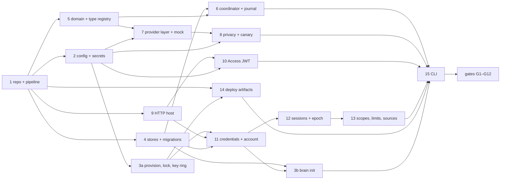

# M0 — Foundations: build plan

| | |
|---|---|
| **Spec** | `spec.md` v0.6, §19 row **M0 — Foundations** |
| **Duration** | Weeks 1–2 |
| **Goal** | A daemon that starts hardened, authenticates, authorizes, enforces privacy and limits, persists through crash-safe stores, and proves it with automated gates. No ingestion, retrieval, chat, or UI beyond a login page. |
| **Date** | 2026-10-08 |

---

## 1. Scope

### In scope (from §19 M0)

- Solution layout with central package management, a lock file, pinned SDK, NuGet source mapping.
- Provisioning step (`brain init --provision`), configuration, secrets, and the key ring.
- Data-root lock.
- State and index stores with migrations as a crash-safe state machine.
- `Document` with `type`, `props`, `props_original`, occurrence, revision; the type registry with `note`, `article`, `file`.
- Publication coordinator and mutation journal **skeletons**: tables, state transitions, recovery at startup, crash-injection hooks. No real projections yet.
- Provider interfaces over `Microsoft.Extensions.AI`, the OpenAI-compatible adapter, the policy-owned transport, capability resolution with config overrides, a mock OpenAI-compatible server for CI.
- Privacy policy: `local_only`, trusted services, the egress canary, the control-plane allowance.
- HTTP and HTTPS listeners; `Host` allowlist; `Origin` exact match; trusted proxies; problem+json; OpenAPI; `/health`; `/ready`.
- Cloudflare Access assertion validation with JWKS refresh.
- Browser sessions with lifetimes, rotation, logout, logout-all, step-up, per-credential generations, and the account epoch.
- API keys in `id.secret` form with HMAC verifiers and scopes; the account password with Argon2id; login rate limiting and lockout.
- Scope enforcement per REST endpoint.
- Allowed source roots and the incoming root: validation, deny list, `POST /sources` (admin) storing a source without watching it yet.
- Per-credential and global limits with reservation, `429`/`503`, disk low-water check.
- Hardened Docker image, Compose project, systemd units including a **stub** extractor service on a socket.
- CLI: `brain init`, `login`, `doctor`, `keys`, `providers`, `sessions`.

### Out of scope (lands in M1+)

Folder watching and staging, the real extractor, chunking, embeddings and vectors, FTS, search and query endpoints, the assistant, MCP, CLI pairing (`/auth/pair`), the Blazor UI beyond login, backups, retention jobs.

### Hooks M0 must leave for M1 and M2

- The extractor socket contract (request and response framing, descriptor passing) is defined and the stub service answers a `ping`.
- The scope matrix type used by REST is the same type the MCP dispatcher will use.
- Jobs, turns, and tool executions tables exist with `initiating_credential_id`, `credential_generation`, and `account_epoch` columns even though nothing populates turns yet.

---

## 2. Exit criteria and how each is tested

Every gate is an automated test in `tests/`. Live-provider qualification is a separate workflow and never gates a merge.

| # | Gate (§19 M0) | Test | Notes |
|---|---|---|---|
| G1 | `brain init --provision && brain serve` runs in Docker as a non-root user | `Deploy.ComposeSmoke` | Compose up in CI, assert process UID, `/health` 200 |
| G2 | `/ready` green against the mock provider in CI; against the vLLM binding in qualification | `Ready.MockProviderGreen`; `Qualification.VllmReady` | The mock serves `/v1/models`, `/v1/chat/completions`, `/v1/embeddings` |
| G3 | `local_only` with a hosted binding is refused at startup, at reload, and at request time | `Privacy.RefusesHostedAtStartup`, `...AtReload`, `...AtRequest` | Request-time case injects a binding change between policy evaluation and send |
| G4 | A redirect from a trusted service is not followed | `Transport.RedirectIsFailure` | Mock returns 307 to a public host; expect a typed failure, no second request |
| G5 | A successful canary blocks provider calls under `local_only` | `Privacy.CanaryBlocksProviderCalls` | Canary target is a test listener that accepts; expect `egress-unverified` |
| G6 | A `read` key cannot call a `write`, `infer`, or `admin` REST endpoint | `Authz.ScopeMatrix` | Table-driven over every endpoint registered in M0 |
| G7 | A source outside the allowed roots is rejected | `Sources.RejectsOutsideRoots`, `Sources.DeniesDataRoot` | Includes a symlink that resolves outside, `/proc`, and the data root itself |
| G8 | Limit tests return `429` before work is queued | `Limits.PerCredentialRate`, `Limits.GlobalCapacity503` | Assert no job row and no reservation after the rejection |
| G9 | A crash injected between the two stores' migration steps recovers on restart | `Migrations.CrashBetweenStoresRecovers` | Kill switch after state migration commits, before index migration |
| G10 | A journal entry left `applied` is finalized once on restart | `Journal.AppliedIsFinalizedOnce` | Also: `prepared` is discarded; a second restart changes nothing |
| G11 | Sessions: expiry, rotation, logout-all, step-up, generation and epoch rejection | `Sessions.*` | Epoch bump invalidates all; generation bump invalidates one |
| G12 | Access assertion required on the public hostname before login | `Access.NoAssertionNoLogin`, `Access.JwksRefresh` | Test JWKS served locally; unknown `kid` triggers a rate-limited refresh |

---

## 3. Solution layout

```
SecondBrain.sln
global.json                     # pinned SDK (10.0.1xx band, exact version)
nuget.config                    # source mapping: nuget.org only
Directory.Build.props           # nullable, warnings as errors, analyzers, deterministic builds
Directory.Packages.props        # central package management, exact versions
packages.lock.json per project  # RestorePackagesWithLockFile=true, locked mode in CI
src/
  SecondBrain.Core/             domain, type registry, policy, coordinator, journal, provider abstractions
  SecondBrain.Storage/          SQLite stores, pools, migrations, lock, journal persistence
  SecondBrain.Providers.OpenAICompatible/
  SecondBrain.Server/           ASP.NET Core daemon: listeners, auth, REST, /health, /ready, login page
  SecondBrain.Cli/              brain
  SecondBrain.Extractor/        stub service: socket, ping, framing (filled in M1)
tests/
  SecondBrain.Core.Tests/
  SecondBrain.Storage.Tests/    migrations, journal, crash injection
  SecondBrain.Server.Tests/     WebApplicationFactory integration tests, gates G2–G12
  SecondBrain.MockProvider/     OpenAI-compatible mock used by tests and CI
  SecondBrain.Deploy.Tests/     Compose smoke (G1), unit/compose linting
deploy/
  docker/Dockerfile, compose.yaml
  systemd/secondbrain.service, secondbrain-extractor.socket, secondbrain-extractor.service
  provision/                    files written by brain init --provision (templates)
```

> **Note (2026-10-08):** this layout is the original M0 plan and is kept as written. The clean-architecture refactor later added `src/SecondBrain.Infrastructure` (platform adapters: configuration loading, secrets, Unix helpers, the data-root lock, the key ring and Argon2), moved all SQL and the store handles into Storage, and added `tests/SecondBrain.Architecture.Tests`, `tests/SecondBrain.Infrastructure.Tests` and `tests/SecondBrain.Providers.OpenAICompatible.Tests`. See [clean-architecture-plan.md](clean-architecture-plan.md) for the current projects and allowed references.

Packages for M0 (exact versions pinned in `Directory.Packages.props`): `Microsoft.Data.Sqlite` (bundle `e_sqlite3`), `Dapper`, `Microsoft.Extensions.AI`, `Microsoft.Extensions.AI.OpenAI`, `Microsoft.AspNetCore.OpenApi`, `Microsoft.AspNetCore.DataProtection`, `Microsoft.AspNetCore.Authentication.JwtBearer`, an Argon2id implementation (`Isopoh.Cryptography.Argon2`), `YamlDotNet`, `JsonSchema.Net`, `System.CommandLine`, `xunit`, `Microsoft.AspNetCore.Mvc.Testing`.

---

## 4. Work items, in order

Each item lists its deliverable and its acceptance check. Item 1 blocks everything; after it, four lanes run in parallel (§4a); items 13 and 15 converge on the lanes, and the gates close the milestone.

### 4a. Dependencies and parallel lanes



| Lane | Items, in order | Independent of the other lanes until | Owns in the composition root |
|---|---|---|---|
| **A — Storage and durability** | 4 stores and migrations → 6 coordinator and journal → 3b `brain init` store creation | 3b needs lane D's key format and Argon2 for the admin credential and password | `AddStorage()` |
| **B — Domain and providers** | 5 domain and type registry → 7 provider layer and mock server → 8 privacy policy and canary | 8 needs the config sections from lane C (stubbed early) | `AddDomain()`, `AddProviders()`, `AddPrivacy()` |
| **C — Configuration, provisioning, deployment** | 2 config and secrets → 3a provisioning, lock, key ring → 14 Dockerfile, Compose, systemd, extractor stub | 14's final gate (G1) needs a serving daemon from lane D | `AddConfiguration()`, `AddKeyRing()` |
| **D — HTTP and authentication** | 9 host and request policy → 11 credentials and account → 12 sessions, step-up, generations, epoch → 10 Access validation → 13 scopes, limits, sources | 11 needs the key ring from lane C; 13's source validation needs lane C's `allowed_roots` and lane A's `sources` table | `AddHttpHost()`, `AddAuth()`, `AddLimits()` |

Rules that keep the lanes from colliding:

- Item 1 adds **every** M0 package to `Directory.Packages.props` up front, so no lane edits that file.
- Item 2 lands the configuration POCOs for every section on day 2, even where the consuming code is weeks away, so lanes B and D bind to stable types.
- `Program.cs` only calls one `Add*()` extension per lane; each lane owns its own `ServiceCollectionExtensions` file.
- Shared contracts that two lanes need are written first by the lane that owns them and consumed through interfaces: lane A's store handles, lane C's `IKeyRing`, lane B's `IPrivacyPolicy`, lane D's `IScopePolicy`.
- Lane D is the critical path (five items). Staff it first.
- Item 15 (CLI) starts as a skeleton in lane C on day 3 and fills commands as endpoints land. `brain doctor` is written last because it touches every lane.
- The five week-1 spikes (§6) are independent of all lanes and of each other: descriptor passing (anyone), Access JWT and Argon2 calibration (lane D), Tailscale certificate and systemd egress (lane C).
- The gates G1–G12 are the convergence point; `Qualification.VllmReady` runs once at the end against the real server.

### 1. Repository and build pipeline

- Solution, projects, CPM, lock files, `global.json`, `nuget.config`, `Directory.Build.props`.
- CI: restore in locked mode, build, test, publish self-contained `linux-x64` binaries, build the image with a digest-pinned base, run the Compose smoke.
- **Accept:** a clean clone builds offline from the lock file; CI fails if the lock file is stale.

### 2. Configuration and secrets

- `config.yaml` schema matching Appendix B for the M0 subset: `data_root`, `server.listeners`, `server.hosts`, `server.origins`, `server.trusted_proxies`, `server.cloudflare_access`, `auth`, `providers`, `models`, `privacy`, `sources.allowed_roots`, `limits`, `logging`.
- `${VAR}` references resolve from the environment or `/etc/secondbrain/secrets/<name>`; the config file never holds a secret value.
- Validation at load: every role binding resolves; `local_only` consistency; every allowed root is absolute, exists, and is not under the data root; listeners have certificates when HTTPS.
- Reload: file watch plus `SIGHUP`; a reload that fails validation keeps the old configuration and logs why.
- **Accept:** `Config.*` tests for each validation rule; an invalid reload leaves the running config unchanged.

### 3. Provisioning, `brain init`, the key ring, the lock

- `brain init --provision` (root): creates `secondbrain` and `secondbrain-extract` users, `/srv/secondbrain` (0700, daemon-owned), `/srv/secondbrain-incoming` (sync-user-owned, daemon group read), `/etc/secondbrain/{config.yaml,secrets}` (0600), `/run/secondbrain`, the key ring directory, and the systemd units or the Compose project.
- `brain init` (daemon user): creates both stores, the key ring (first Data Protection key, first HMAC `kid`), the admin API key printed once, and the account password (prompted, or from a bootstrap secret). `--reset-password` recovers the account.
- Data-root lock: `flock` on `<data_root>/.lock`, exclusive, non-blocking; a second instance exits with a clear error.
- Startup validation refuses to run when ownership or modes of either root are wrong.
- **Accept:** provisioning is idempotent; `brain doctor` reports every mode and ownership check; two instances cannot share a data root.

### 4. Stores and migrations

- Two SQLite files: `state/state.db` and `index/index.db`. Pragmas: `journal_mode=WAL`, `synchronous=FULL` for state and `NORMAL` for index, `busy_timeout=5000`, `foreign_keys=ON`, `trusted_schema=OFF`; extension loading never enabled.
- Connection management: a bounded read pool and one queued writer per store; statement timeouts; bounded transaction lifetimes.
- Schema for M0: the Appendix A tables that M0 touches (`meta`, `sources`, `documents`, `occurrences`, `revisions`, `overrides`, `suppressions`, `absences`, `mutations`, `jobs`, `credentials`, `account`, `passkeys`, `login_attempts`, `idempotency`, `usage`, `payloads`, `payload_refs`, `conversations`, `turns`, `tool_executions`, `pending_operations`, `batch_jobs`, `embedding_spaces`; index: `index_meta`, `indexed_documents`). Later tables arrive with their milestones.
- Migration runner as a state machine: a `migration_state` table in each store with `(version, phase, started_at, finished_at)`; phases `pending → applying → applied`; disk preflight; a pre-migration snapshot of `state.db` via the online backup API; startup finds any `applying` row and either re-runs an idempotent migration or restores the snapshot and reports.
- **Accept:** G9; each migration is idempotent under re-run; a corrupted snapshot is detected before use.

### 5. Domain model and type registry

- `Document` aggregate with identity, occurrence, revision, `type`, `type_origin`, `type_confidence`, `props`, `props_original`, `occurred_at` with basis and precision, status, `publish_state`.
- Type registry: `note`, `article`, `file` with the Appendix E schemas, reserved base fields, `x-` annotations parsed into engine metadata.
- Revision rules from §5.3, including that delete, restore, and purge advance the revision.
- **Accept:** schema validation tests; reclassification keeps `props_original`; reserved fields are rejected inside `props`.

### 6. Publication coordinator and mutation journal skeletons

- Per-document publication lock; the three-step order from §8 with `publish_state` transitions; the fence check `(revision, generation)` inside the index transaction; recovery that re-runs steps 2 and 3 for `publishing` documents.
- Mutation journal: `prepare`, `apply`, `finalize` over a temp-then-rename file write with `fsync`; conflict detection against the expected hash; recovery that finalizes `applied` rows whose destination hash matches and discards `prepared` temp files.
- Crash-injection hooks: a test-only `ICrashPoints` service that throws at named points (`after_state_publishing`, `after_index_commit`, `after_apply`, `before_finalize`).
- **Accept:** G10; crash at each named point leaves the previous state consistent and recovery is idempotent across two restarts.

### 7. Provider layer

- `IProviderBinding` with `resolve(model)` (capabilities and limits), `isLocal`, `listModels()`, `healthcheck()`; `IChatClient` and `IEmbeddingGenerator` from `Microsoft.Extensions.AI`.
- OpenAI-compatible adapter over `Microsoft.Extensions.AI.OpenAI` with a custom endpoint; capability catalog for known models; `models.<role>.limits` overrides; rejection of unresolved bindings.
- The policy-owned transport: one `SocketsHttpHandler` per daemon with `UseProxy=false`, `AllowAutoRedirect=false`, a `ConnectCallback` that resolves the host and compares against the pinned addresses for trusted services, and a policy check before every send that knows the role, the binding, and the current `local_only` state. Every adapter receives its `HttpClient` from this factory and nothing else.
- Mock OpenAI-compatible server for CI: `/v1/models`, `/v1/chat/completions` (streaming and not), `/v1/embeddings`, plus fault switches (redirect, timeout, 429, malformed).
- **Accept:** G2 (mock), G3, G4; `brain providers list` and `test` work against the mock.

### 8. Privacy policy and the egress canary

- Policy evaluation at startup, on reload, and inside the transport before every send; the request-time failure is `privacy-policy`.
- Locality: in-process adapters, or `trusted_services` with exact scheme, host, and port; hostnames resolved and pinned at configuration time.
- Canary: at startup and hourly, a TCP connect with a 2-second timeout to `privacy.canary_target` (default `1.1.1.1:443`); success means the host rule is absent; under `local_only` provider calls fail with `egress-unverified` until a later canary fails; `/ready` and `brain doctor` show the state.
- Control-plane allowance documented and reflected in the shipped units: DNS and the Access certificate endpoint.
- **Accept:** G3, G5; a canary failure clears `egress-unverified` on the next run.

### 9. HTTP host, listeners, and request policy

- Kestrel listeners from config: HTTP, or HTTPS with a certificate file (Tailscale, internal CA, or Cloudflare origin certificate). No public-bind option exists in the schema.
- `Host` allowlist; `Origin` exact match on browser-facing state-changing requests, reject when absent; forwarded headers honored only from `trusted_proxies`.
- Problem+json for every error with stable `type` URIs; OpenAPI generated from the endpoint schemas.
- `/health` (liveness) and `/ready` (stores open, migrations complete, lock held, canary state, each role's provider reachability within five minutes, extractor socket answering `ping`).
- **Accept:** `Http.HostRejected`, `Http.OriginRejected`, `Http.ForwardedIgnoredFromUntrusted`; `/ready` reflects each component.

### 10. Cloudflare Access assertion validation

- `JwtBearer` configured for the public hostname: issuer `https://<team>.cloudflareaccess.com`, audience from config, JWKS from the team domain's certificate endpoint over the control-plane allowance, cached, refreshed daily and on an unknown `kid` with rate limiting, last good set kept on refresh failure.
- Applied before any other authentication whenever `Host` equals the public hostname; a missing or invalid assertion is a `401` before the login page is served. Service-token requests carry an Access JWT as well and follow the same path.
- **Accept:** G12 with a local JWKS; a request on the private origin needs no assertion.

### 11. Credentials and the account

- API keys: public id (ULID) and a 32-byte CSPRNG secret, presented as `sb_<id>.<secret>`; verifier `HMAC-SHA-256(key_kid, secret)` with the `kid` stored; constant-time compare after a cheap lookup by id; scopes; optional expiry; `generation` starting at 1.
- Account password: Argon2id with parameters calibrated at `brain init` to about 250 ms on the host (starting point 64 MiB, 3 iterations, 1 lane), 16-byte salt, stored parameter version, rehash on login when parameters change, 1024-byte input limit.
- Login: per-source exponential delays and a lockout counter that a single source cannot keep renewing; `login_attempts` table; recovery through `brain init --reset-password`.
- **Accept:** key verification never runs Argon2; a flood of random bearer values costs one HMAC each; lockout tests.

### 12. Sessions, step-up, generations, and the epoch

- Opaque browser session: 32-byte CSPRNG id, HMAC verifier stored with device summary, idle expiry (12 h), absolute expiry (30 d); id rotated after login and after any privilege change; cookie `HttpOnly`, `SameSite=Strict`, `Secure` when the effective scheme is HTTPS.
- Endpoints: `/auth/login`, `/auth/logout`, `/auth/logout-all`, `/auth/sessions` list and revoke, `/auth/step-up` (10-minute validity).
- Per-credential `generation` and the account `epoch` in `meta`; every authenticated request carries both; a stale value is rejected. Logout-all bumps the epoch. Revoking a key bumps only that key.
- Antiforgery for cookie-authenticated state changes.
- A minimal Blazor login page and a "signed in" page so the cookie path is exercised end to end.
- **Accept:** G11.

### 13. Scopes, limits, and sources

- Scope matrix enforced per endpoint through one policy type shared with the future MCP dispatcher; `read`, `write`, `infer`, `admin`; sessions hold all four.
- Limits middleware: per-credential token bucket for requests per minute, per-credential concurrency semaphores for uploads, searches, turns, and streams, global counters for queued jobs and admitted bytes, a disk low-water check that pauses ingestion admission; reservation before work, release on completion; `429` and `503` with `Retry-After`, nothing queued on rejection.
- `POST /sources` (admin): validates the path against `allowed_roots` with real-path resolution and the deny list, stores the source, and schedules nothing yet.
- **Accept:** G6, G7, G8.

### 14. Deployment artifacts

- Dockerfile: digest-pinned base, non-root user, read-only root filesystem, no capabilities, `no-new-privileges`, secrets mounted read-only, memory and PID limits in Compose, egress-restricted network with the allowlist, port bound to the private address, `cloudflared` and the extractor stub as sidecars.
- systemd: `secondbrain.service` with `NoNewPrivileges`, `ProtectSystem=strict`, `ProtectHome`, `PrivateTmp`, empty capability bounding set, explicit `ReadWritePaths` for the data root and the incoming root, restricted address families, and the `IPAddressDeny=any` plus `IPAddressAllow` list; `secondbrain-extractor.socket` and `.service` running as `secondbrain-extract`.
- `brain doctor`: ownership and modes of both roots, listeners, actual host exposure (bind addresses versus interfaces), Access configuration and key refresh, trusted services, the canary, the key ring, the extractor socket.
- **Accept:** G1; the unit files pass `systemd-analyze verify`; the Compose file passes `docker compose config`.

### 15. CLI

- `brain init [--provision | --reset-password]`, `brain login <url> [--name --scopes]` storing the key in the OS credential store, `brain doctor`, `brain keys create --scopes|list|revoke`, `brain providers list|test`, `brain sessions list|revoke|revoke-all`.
- HTTP client with the policy of never printing secrets after creation.
- **Accept:** every command has a `--json` form and an exit code from the table in §12.

---

## 5. Implementation notes

- **Data Protection purposes.** `secondbrain.session`, `secondbrain.cursor`, `secondbrain.antiforgery`, `secondbrain.capability`; keys in `/srv/secondbrain/keyring/`; rotation adds versions and never revokes by itself.
- **HMAC key ring.** `kid` is a ULID; the active `kid` signs new verifiers; all `kid`s in the ring verify. `rotate-keys` adds a `kid`; `--revoke-all` also bumps the epoch.
- **Cross-store rule.** Never rely on `ATTACH` for atomicity. The coordinator's three steps are the only way a document's state and index change together.
- **Transport.** Adapters must not construct their own `HttpClient`; the DI container only exposes the policy factory. Treat any SDK that insists on its own client as unusable until it accepts an `HttpClient`.
- **Canary semantics.** A canary that cannot complete within the timeout counts as blocked; only a successful connect flips the state.
- **Secrets at rest.** The secrets directory is read-only to the daemon; the only writable key material is the key ring. Tests run with a temporary data root and a temporary secrets directory.
- **Problem types.** `https://secondbrain.dev/problems/<slug>`; slugs used in M0: `revision-mismatch`, `idempotency-key-reuse`, `limit-exceeded`, `capacity`, `privacy-policy`, `egress-unverified`, `scope-denied`, `origin-rejected`, `host-rejected`, `access-required`.
- **Time.** All timestamps UTC with offsets preserved where known; the instance zone from `time.zone` is not needed in M0 beyond config parsing.

---

## 6. Spikes to run in week 1

| Spike | Question | Done when |
|---|---|---|
| Descriptor passing | Can the daemon pass an open file descriptor to the extractor over a Unix socket from .NET without a native shim? | A tiny prototype sends an fd with `sendmsg`/`SCM_RIGHTS` through a small P/Invoke or a vetted package, and the receiver reads the file. This de-risks M1. |
| Cloudflare Access JWT | Does `JwtBearer` validate an Access assertion against the team JWKS with our refresh rules? | A test JWKS and a signed assertion pass; an unknown `kid` triggers one refresh. |
| Tailscale certificate | Does Kestrel load the `tailscale cert` output and serve HTTPS on the tailnet address? | `/health` over HTTPS from a tailnet peer. |
| Argon2 calibration | What parameters give ~250 ms on the reference server? | Numbers recorded in `brain init` defaults. |
| systemd egress allowlist | Does `IPAddressDeny=any` with the allowlist block the canary and still allow DNS and the Access endpoint? | Canary fails, Access key refresh succeeds, provider call to the vLLM host succeeds. |

---

## 7. Definition of done

- All gates G1–G12 pass in CI; the qualification workflow passes against the vLLM server once.
- `brain init --provision`, `brain init`, `brain serve`, `brain login`, `brain doctor`, `brain keys`, `brain providers`, and `brain sessions` work as documented.
- The Dockerfile, Compose project, and systemd units ship in `deploy/` and are exercised by G1.
- No `TODO` that affects a guarantee in §15 remains without a linked M1 or M2 work item.
- `docs/build/M1-ingest-and-search.md` is drafted from §19 M1 before M0 is closed.
