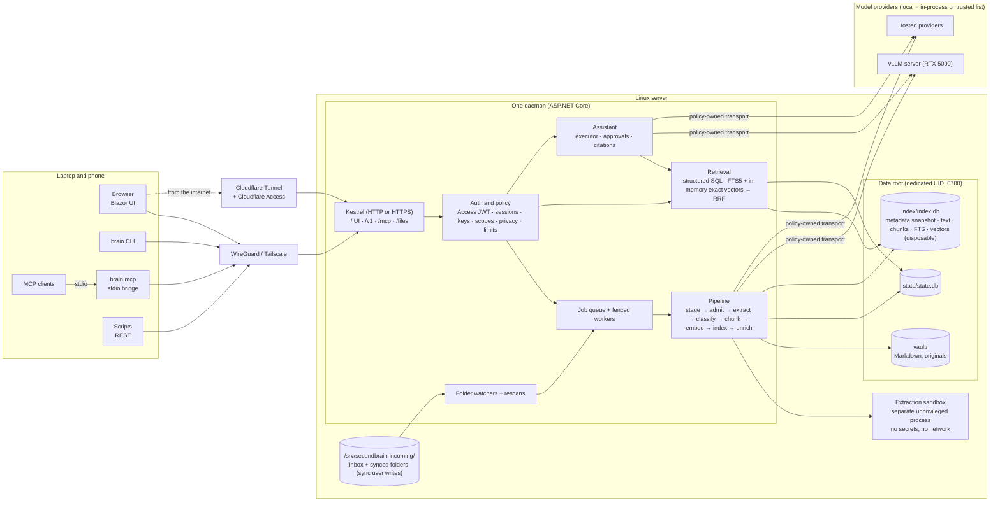

# SecondBrain — Product & Technical Specification

| | |
|---|---|
| **Status** | Draft v0.6 — contracts reconciled after the round-two review; ready for M0 |
| **Date** | 2026-10-08 |
| **Owner** | Justin Leahy |
| **Repo** | `secondbrain` |
| **Supersedes** | v0.5 (`docs/archive/spec-v0.5.md`; round-two review `reviews/2026-10-08-astra-ultra-spec-review-round-2.md`), v0.4 (`docs/archive/spec-v0.4.md`; security review `reviews/2026-10-08-daybreak-blue-ultra-security-review.md`), v0.3 (`docs/archive/spec-v0.3.md`; review `reviews/2026-10-08-astra-ultra-spec-review.md`) |
| **Stack research** | `docs/stack-research-dotnet-blazor.md` |

---

## 0. TL;DR

SecondBrain is a personal knowledge system that runs as one daemon on your own Linux server and is reached over a WireGuard-based private network from a laptop or a phone, and from anywhere else through a Cloudflare Tunnel that Cloudflare Access protects. Knowledge goes in through three doors — **watched folders** on the server, a **REST API**, and **MCP tools** — and every door feeds the same pipeline into a Markdown **vault**, a small durable **state store**, and a disposable **search index**. Knowledge comes out through a **chat assistant** that answers from your own material with verifiable citations, and through search endpoints and MCP tools that other agents can call.

Every item carries a **content type** with structured fields, so questions about who, when, and which kind are answered by query rather than by similarity. No model vendor is built in: four roles bind to any provider, including the vLLM server on your network, and an instance-wide switch can forbid anything that is not local.

### What changed since v0.5

A reconciliation pass, not a new layer. The round-two review found that the security revision contradicted several public contracts and that filesystem mutation, publication, purge, and backup still lacked mechanisms. v0.6 adds no new requirement classes; it defines the missing state transitions and makes every door obey the same rules.

- **One mutation-policy matrix** (§7.1) governs REST, MCP, the UI, the CLI, and folder reconciliation. `PATCH` and `DELETE` no longer execute directly; natural-key upserts are scoped to the container that was registered or re-imported.
- **A mutation journal and a publication coordinator** (§8) make filesystem effects exactly-once across crashes and keep the state store, the index metadata snapshot, and the vector array consistent without relying on cross-store atomicity.
- **Authorization reconciled:** per-credential generations plus one account epoch; query and index embeddings implicit in `read` and `write`; `infer` only for chat, ask, and enrichment; `read` required for resource listing and chat; conversation ownership; a browser-paired CLI session for approvals and step-up; a writable key ring separate from read-only secrets.
- **Purge lineage** (§15.9): redaction by reference across transcripts, tool results, citations, and summaries; payload retention precedence; retained classes named.
- **Deployment made workable:** an incoming root owned by the sync user outside the private data root; a pre-provisioned sandbox service with descriptor passing that also parses frontmatter, containers, and recurrences; control-plane egress for DNS and Cloudflare Access keys separated from provider egress, with a canary check that blocks provider calls under `local_only` when the host rule is missing.
- **Calendar occurrences** are now the records calendar queries return, with instance ids, required ends, all-day and floating normalization, and per-container identity. **Reclassification** keeps `props_original` and re-derives effective `props`. **Citation locators** are bound to generations and verified by excerpt. **Vectors** use a dense slot map in segmented arrays, and **space activation** has a state machine.
- **Backups** stream an authenticated archive, pin a manifest under a short barrier, verify hashes during copy, and include trash. **Rebuild** promises authored truth and deterministic projections; model-derived outputs are regenerated and marked.
- **Roadmap gates** test only what each milestone builds; deterministic CI is separated from live-provider qualification.

### What changed between v0.4 and v0.5

- **Security review answers applied** (`reviews/2026-10-08-daybreak-blue-ultra-security-review.md`, fourteen questions answered one at a time): no `sources` scope, sources are admin-only below configured allowed roots; opaque server-side sessions with lifetimes, logout, and an authorization epoch; configurable HTTP or HTTPS listeners plus a Cloudflare Tunnel behind Cloudflare Access for public reach; a policy-owned egress transport with a required firewall backstop under `local_only`; creates direct and changes proposed, with approvals by an interactive session only; revocation stops interactive work; a sandboxed extraction process; global and per-credential limits; logical purge with bodies stored once; encrypted backups with a snapshot manifest; vectors as BLOBs committed with their chunks; Data Protection envelopes and HMAC key verifiers; a pinned and scanned supply chain; host root outside the boundary.
- **Remaining findings folded in:** per-tool MCP authorization in the dispatcher, a read-only bridge default, per-turn read caps against a malicious provider, staged immutable bytes with descriptor-based containment, frontmatter that never carries identity or provenance, extracted-text PDF viewing with pdf.js deferred to a sandboxed origin, highlight ranges instead of HTML snippets, a retention and lineage matrix, deployment hardening, SQLite concurrency and migration rules, and the state and index directories moved out of the vault.

### What changed between v0.3 and v0.4

- **Decisions applied:** C# / .NET 10 with Blazor Server; three stores with a disposable index; v1 content scope of note, article, file, transcript, and calendar event; an instance-wide privacy switch with a strict definition of local; a server deployment reached over a private network; suppress-and-trash deletion; a fresh vault; reference hardware of a Linux server plus a vLLM server with an RTX 5090.
- **Review criticals resolved:** authored state now lives in a durable state store and the rebuild promise is "vault plus state" (§5); privacy is enforced centrally before every provider call with an explicit trusted-service list (§15); original files are served as downloads from a separate path under a strict content policy (§15); UI access uses a login and a session, never an injected key (§11, §15).
- **Review majors folded in:** document revisions and fenced jobs; suppression records; namespaced natural keys; versioned cache keys and named embedding spaces; a single type-precedence matrix; nullable occurrence time with basis and precision; calendar coverage windows; transcript segments; role-qualified person filters; one structured query contract with cursors; SQL prefilter plus exact vector scoring; an external-content text index with declared cosine distance; capabilities per model binding; a portable transcript with switches only between turns; turn and tool execution ids so retries never repeat writes; a citation contract with revisions and excerpts; approvals bound to exact arguments; scoped credentials for the stdio bridge; secrets outside the vault; redacted logs; resource bounds; qualified performance targets; a re-cut roadmap.
- **MCP transport** updated for the stateless 2026-07-28 protocol revision.
- **Deferred beyond v1** with their designs preserved in Appendix F: email, contact, task, entities, per-source privacy, container imports beyond calendar files, live connectors.

### Decisions

| # | Decision | Choice | Why |
|---|---|---|---|
| D1 | Users | Single user per instance | Removes tenancy complexity. Credentials identify *clients* (browser session, CLI, scripts, agents), not people. |
| D2 | Deployment | One daemon on a Linux server, reached over a WireGuard-based private network and, from outside it, through a Cloudflare Tunnel behind Cloudflare Access; Docker or systemd | Always on, reachable from anywhere, one place for watched folders and data, never a public bind. |
| D3 | Stores | Vault files (authored content) + durable state store (authored non-file state) + disposable index | Files stay portable, decisions survive, and the index can always be deleted and rebuilt. |
| D4 | Database | SQLite in WAL mode for both state and index; FTS5 for keywords; vectors stored as BLOBs in the index and held in memory for exact scoring | Zero operations; FTS5 ships in the .NET SQLite bundle; a vector commits atomically with its chunk; exact scoring avoids an alpha native extension. |
| D5 | Models | No built-in default. Roles `chat`, `enrich`, `embed`, `rerank` bind to any provider and model in config | No vendor lock-in; mix providers; run fully local on the vLLM server. |
| D6 | Provider integration | `Microsoft.Extensions.AI` abstractions as the adapter contract, with capabilities resolved per model binding | The provider-neutral layer exists and is GA; capabilities are layered on it. |
| D7 | Retrieval | Structured SQL queries for who, when, and which-type; hybrid keyword plus vector for topics, with filters applied before scoring | Each question type gets the mechanism that answers it correctly. |
| D8 | Language | C# on .NET 10; Blazor Web App with Interactive Server rendering | One language for daemon, API, MCP, CLI, and UI; first-class MCP and AI abstractions. |
| D9 | Network posture | Listener scheme configurable (HTTP, or HTTPS with a Tailscale, internal-CA, or Cloudflare origin certificate); binds only to loopback and the private-network interface; public reach only through the tunnel; every request authenticated, and public-origin requests must carry a valid Cloudflare Access assertion | No public bind, ever. Access is the outer gate and the daemon's own login is the inner one. |
| D10 | Writes | One mutation-policy matrix for every door (§7.1): creates and additive metadata are direct for write credentials; body, type, and property changes, tag removal, and deletion are proposals; only an interactive session, in the browser or a paired CLI, approves; folder reconciliation is automatic within its registered source | Capture stays frictionless; nothing an agent, a script, or a provider says can rewrite or delete without a human. |
| D11 | Content model | One document table with a registry-backed `type`, schema-validated `properties`, nullable `occurred_at` with basis and precision | Structured questions need fields; one table keeps one index and one pipeline. |
| D12 | Privacy | Instance-wide `local_only` switch; local means in-process or on an explicit trusted-service list; enforced before every provider call | A guarantee that can actually be kept. Per-source restrictions come with email. |
| D13 | Deletion | Suppress and trash: external files never touched, managed notes trashed for 30 days, purge redacts every live copy by reference (D18) | Deletions cannot resurrect, and the app never destroys a file it does not own. |
| D14 | Trust boundary | A root-equivalent host attacker is outside the boundary; backup readers are inside through encrypted backups; a configured model provider is trusted with the confidentiality of what it is sent | Guarantees are stated only where they can be enforced. |
| D15 | Isolation | Extraction runs in a separate unprivileged process with no secrets, no network, and resource limits | A crafted file reaches a parser, never the stores. |
| D16 | Egress | All provider traffic goes through one policy-owned transport; the shipped unit and Compose file carry the host egress allowlist; a canary check detects a missing rule, and under `local_only` that blocks provider calls, not capture or keyword search | The privacy switch controls where bytes go, and the daemon can tell when its backstop is gone. |
| D17 | Durability | Every filesystem-affecting operation runs through a prepare, apply, finalize journal; a publication coordinator serializes each document's changes across the state store, the index, and the vector array | Exactly-once effects across crashes, and readers never join new metadata to old chunks. |
| D18 | Purge | Logical purge redacts by reference: transcript blocks, tool results, citations, and summaries that reference the document are replaced with markers and their payloads deleted; the user's own messages and owned container originals are retained classes | Deterministic, because every copy carries the document id. |

---

## 1. Goals and non-goals

### Goals

1. **Capture with near-zero friction.** Drop a file into the synced inbox, POST to an endpoint, or have any MCP client call `brain_remember`.
2. **Find anything.** Keyword, semantic, and structured search by type, person, and time across everything ingested, in well under a second.
3. **Ask anything.** An assistant that answers from the vault with citations that resolve to a document revision and an excerpt, says plainly when nothing relevant exists, and distinguishes "nothing found" from "retrieval was degraded".
4. **Own everything.** Plain files plus one small state file are the whole truth; the index is disposable; export is complete.
5. **Be a good citizen in the agent ecosystem.** A well-described MCP server so other agents can read and write the brain.
6. **Never lock the user in.** Any chat, embedding, or rerank provider, hosted or local, behind one interface, changed in configuration.
7. **Keep promises that can be enforced.** Privacy, authorization, and deletion are enforced by the daemon, not by prompts or conventions.

### Non-goals for v1

- Multi-user accounts, sharing, or permissions between people
- Real-time collaborative editing
- Replacing a full note editor
- Email, contacts, tasks, and resolved entities (Appendix F)
- Per-source privacy tiers and a second embedding space (Appendix F)
- Live mail or calendar connectors (file exports only)
- A public bind; the only public path is the Cloudflare Tunnel behind Cloudflare Access
- Defending data against a root-equivalent attacker on the server (§15.1)
- Native mobile apps (the web UI must work well in a phone browser)

---

## 2. Guiding principles

1. **One pipeline, many doors.** Folders, REST, MCP, and the UI produce the same `Document` and run through the same stages.
2. **Files first, state small, index disposable.** Authored content is Markdown in the vault. Authored decisions live in a small state store. Everything derived can be deleted and rebuilt.
3. **Grounded or silent, and honest when degraded.** Every claim about the user's material carries a citation. "Nothing relevant" and "retrieval was partial" are different answers.
4. **Ingested content is data, not instructions.** Authority boundaries (scopes, allowed tools, approvals) are enforced outside the model; prompts are a mitigation, not the guarantee.
5. **Idempotent, revisioned, resumable.** Every document has a revision; every job is fenced on the revision it was created for; retries never repeat side effects.
6. **Cloud calls are explicit and policy-checked.** The privacy policy runs before every provider request, not only at startup.
7. **Boring infrastructure.** One daemon and one sandbox service, two SQLite files, no broker.
8. **Models are configuration, not architecture.** Nothing outside the provider layer knows the vendor; missing capabilities degrade gracefully.
9. **Types earn their place.** A content type is added only when a door produces it; `file` stays an honest fallback; reclassifying never destroys anything.
10. **Nothing fails silently.** Degraded, partial, truncated, withheld, and out-of-coverage states are explicit in every API and in the UI.

---

## 3. Users and use cases

**Primary user:** one technical person with a home server who reads, writes, codes, and talks to AI agents all day and wants one place where all of it accumulates and stays queryable from any device on their private network.

| ID | Story | Door |
|---|---|---|
| U1 | I drop a PDF into the inbox folder synced to the server and within 30 seconds I can ask questions about it. | Folder |
| U2 | A Markdown folder on the server is indexed in place; an edit shows up in search within seconds. | Folder |
| U3 | A nightly script POSTs meeting transcripts with their participants and start times. | REST |
| U4 | While coding in Claude Code I say "remember that we chose exact vector scoring because X" and it is saved with provenance from the bridge's credential. | MCP |
| U5 | In Claude Desktop I ask "what did I decide about auth last month?" and it answers from my notes. | MCP |
| U6 | In the web UI I ask for a summary of everything I have read about retrieval evaluation and get an answer with footnotes that open the exact passage. | Chat |
| U7 | I ask "what have I been working on this week?" and get a recency-aware summary. | Chat |
| U8 | I paste text into the chat and say "save this under #woodworking"; the assistant proposes a note, I approve it once, and exactly that note is written. | Chat |
| U9 | I rename or move a folder of documents and nothing is re-embedded. | Folder |
| U10 | I delete the index directory and rebuild it; search results and citations are identical afterwards. | CLI |
| U11 | The sources page shows which files failed and why, and I retry them. | UI |
| U12 | With local-only mode on and the vLLM server as the only trusted service, nothing leaves my network, and the daemon refuses to start if a role points anywhere else. | Config |
| U13 | I move the chat role to a different provider by editing one line; the next conversation turn uses it and older turns still read correctly. | Config |
| U14 | I ask "what meetings did I have last week?" and get calendar events ordered by start time, with a notice if the calendar's materialized window does not cover the question. | Chat |
| U15 | I import a meeting transcript and ask what a specific person said about pricing; the answer cites their segments with timestamps. | Chat |
| U16 | I open the UI on my phone over the VPN, or from anywhere through the Cloudflare Access login, sign in, and it works at phone width. | UI |
| U17 | I delete a document from a synced folder; it never reappears on rescan unless I un-suppress it. | UI |
| U18 | The daemon restarts in the middle of a large import and finishes without duplicates or stale chunks. | Ops |
| U19 | A chat turn fails after the assistant appended to a note; the retry does not append again. | Chat |
| U20 | I revoke a credential; its running turn stops at the next tool call, its queued searches are cancelled, and it can never approve a proposal. | Ops |
| U21 | A crafted PDF lands in a synced folder; the sandboxed extractor fails, the daemon keeps serving, and the file shows as failed with the reason. | Ops |

---

## 4. System overview



### Components

| Component | Responsibility |
|---|---|
| **Daemon** (`SecondBrain.Server`) | One ASP.NET Core process: the REST API, the Blazor UI, the MCP endpoint, the file download path, folder watchers, the job worker pool, the scheduler, and the policy layer. The only process that opens `state.db` and `index.db`. |
| **Engine** (`SecondBrain.Core`) | Domain model, pipeline, retrieval, assistant, policy. No vendor SDKs. |
| **Storage** (`SecondBrain.Storage`) | The two SQLite stores, the in-memory vector array, the publication coordinator, the mutation journal, migrations, backup and restore, the rebuild procedure. |
| **Providers** (`SecondBrain.Providers.*`) | Adapters behind `Microsoft.Extensions.AI`; the only place vendor SDKs appear. |
| **CLI** (`brain`) | An HTTP client that runs anywhere on the private network. `brain init` is the one command that runs on the server before the daemon starts. |
| **MCP stdio bridge** (`brain mcp`) | Runs on the laptop beside the MCP client, speaks stdio to it, and forwards to the daemon over HTTP with its own scoped credential. |
| **Web UI** | Blazor Web App served by the daemon with Interactive Server rendering; login with an opaque session. |
| **Extraction sandbox** (`SecondBrain.Extractor`) | A pre-provisioned service under a dedicated unprivileged UID: a socket-activated systemd unit, or a sidecar container sharing a Unix socket. The daemon passes each staged file as an open descriptor over the socket, so no UID switching and no shared directory traversal is needed. Scrubbed environment, no secrets, no network, no store access, resource limits, bounded output over the same socket, killed as a process group on timeout. All untrusted parsing happens here: frontmatter, container enumeration, recurrence expansion, text extraction. |
| **cloudflared** | Cloudflare's tunnel connector on the server. Connects to the daemon on loopback and is the only public path. Not part of the daemon; configured by `brain init`. |

**Process boundaries.** All writes go through the daemon, which takes an exclusive lock on the data root at startup so two instances can never share it. Maintenance operations (rebuild, backup, export, retention) are daemon endpoints so no second process ever opens the stores. All untrusted parsing leaves the daemon for the sandbox. Synced and inbox folders live under a separate incoming root owned by the sync user, outside the daemon's private data root; folder watchers run inside the daemon on those paths, below the admin-defined allowed roots.

---

## 5. Domain model

### 5.1 The three stores

| Store | Holds | Durability |
|---|---|---|
| **Vault** (files) | Notes the system or the user authored, imported originals, the trash folder | Authoritative. Backed up by the user's file backup. |
| **State store** `state.db` | Sources; document identities, revisions, and occurrences; original and effective properties; type, tag, and property overrides; suppression and absence records; calendar coverage; container membership; embedding space descriptors; the mutation journal; conversations, turns, tool executions, pending operations, payloads; credentials and sessions; usage ledger; processing generations | Authoritative. Small. Backed up with the vault. |
| **Index** `index.db` | A metadata snapshot per indexed document, extracted text, chunks with their vectors, segments, people projections, FTS table, extraction and embedding caches, retrieval traces | Disposable. Rebuilt from vault plus state with `POST /v1/maintenance/rebuild`, which keeps the caches unless asked to purge them. The active embedding space is also held in memory for scoring and reloaded from the index at startup. |

The daemon uses a bounded pool of read connections and a single queued writer per store. The index carries its own metadata snapshot per document, so a search never joins current state metadata to older chunks; cross-store reads are for administration only, because an attached WAL database gives no cross-store atomicity. A **publication coordinator** serializes every change to one document across the state store, the index, and the vector array (§8). A rebuild preserves every identity, override, suppression, conversation, and citation because none of those live in the index.

### 5.2 Entities

| Entity | Store | Description | Key fields |
|---|---|---|---|
| **Source** | state | An origin that produces documents: a folder on the server, the REST API, an MCP credential, the UI. | `id`, `kind`, `name`, `config`, `status`, `last_scan_at`, `last_full_scan_at` |
| **Document** | state (identity) + index (projection) | One logical item of any content type. | `id` (ULID), `source_id`, `type`, `type_origin`, `type_confidence`, `props` (effective, validated), `props_original` (as ingested or declared, never discarded), `occurred_at`, `occurred_basis`, `occurred_precision`, `natural_key`, `revision`, `title`, `mime`, `content_hash`, `status`, `error`, timestamps |
| **Occurrence** | state | Where a document's bytes live: a path in a source, optionally a member of a container file. A document has one occurrence in v1 except calendar members, which have a container plus a natural key. | `document_id`, `source_id`, `path`, `container_document_id`, `member_key`, `file_mtime`, `size_bytes` |
| **Revision** | state | Monotonic per-document counter incremented on any change to bytes, properties, type, or tags. Jobs, citations, approvals, and preconditions reference it. | `document_id`, `revision`, `cause`, `created_at` |
| **Override** | state | A user decision that must survive reprocessing: type, tags added or removed, property values. | `document_id`, `kind`, `value`, `created_at` |
| **Suppression** | state | "Never index this again": by occurrence path, by natural key, or by document id. Honored by scans and imports until removed. | `id`, `scope`, `key`, `reason`, `created_at` |
| **Content type** | code + config | Registry entry: schema version, extractor, chunker, indexed fields, renderer. | `key`, `schema_version`, `extends` |
| **Chunk** | index | A retrieval-sized slice with heading or speaker context, offsets into the lossless extracted text, the exact embedding input, and its vector. | `rowid`, `document_id`, `revision`, `ordinal`, `context`, `text`, `start`, `end`, `page`, `token_count`, `input_hash`; `vector` in `chunk_vectors` |
| **Segment** | index | A transcript unit: speaker, start and end time, offsets. Chunks map to segment ranges. | `document_id`, `ordinal`, `speaker`, `start_ms`, `end_ms`, `start`, `end` |
| **Embedding space** | state (descriptor) + index (vectors) | A named vector space: provider, model revision, dimensions, normalization, input template, chunk generation. One active space per instance; a second may be building. | `id`, `fingerprint`, `dimensions`, `chunk_generation`, `status`, `coverage` |
| **Person reference** | index (projection) + state (user assertions) | A role-qualified reference to a person on a document: author, organizer, attendee, participant, speaker. | `document_id`, `role`, `identifier`, `display_name` |
| **Tag assertion** | state (user) + index (parsed, llm) | Each origin asserts tags independently; the effective set is derived. | `document_id`, `tag`, `origin`, `asserted` |
| **Link** | index (parsed) + state (user) | Directed relation between documents; parsed links keep their raw target text so they survive the target's deletion. | `from`, `to`, `target_text`, `kind`, `origin` |
| **Conversation / Turn / Tool execution** | state | Portable transcript owned by the account or by one key; a per-turn execution record carrying the credential, its generation, the account epoch, and the fixed allowed-tool set; a per-tool-call commit record whose result is a payload. | `conversation_id`, `owner`, `turn_id`, `initiating_credential_id`, `credential_generation`, `account_epoch`, `allowed_tools`, `status`, `execution_id`, `result_payload_id` |
| **Pending operation** | state | A proposed write: one immutable payload, the creating credential, every referenced document and revision, the generated destination, and the policy generation, awaiting approval by an interactive session. | `id`, `turn_id`, `creator_credential_id`, `tool`, `payload_id`, `targets[]`, `destination`, `policy_generation`, `status` |
| **Payload** | state | A body stored once (a proposed note, a tool argument blob, a replayable tool result) and referenced by id and hash from events, executions, and proposals through `payload_refs`, so purge and retention have one place to look. | `id`, `sha256`, `bytes`, `document_refs[]`, `expires_at` |
| **Mutation** | state | A journal entry for every filesystem-affecting operation: prepare, apply, finalize, with the reserved destination, expected and resulting hashes, and the replayable result. | `id`, `kind`, `operation_id`, `destination`, `expected_hash`, `resulting_hash`, `payload_id`, `revision_before`, `revision_after`, `status`, `result_payload_id` |
| **Job** | state | Fenced background work with the identity that authorized it, or the daemon's internal identity for admitted ingestion. | `id`, `kind`, `document_id`, `revision`, `generation`, `initiating_credential_id`, `credential_generation`, `account_epoch`, `status`, `attempts`, `lease_until` |
| **Credential** | state | An API key in `id.secret` form with an HMAC verifier and scopes; an opaque browser session; or a browser-paired CLI session. Each credential has its own generation; the account has one epoch. | `id`, `name`, `kind` (`api_key` / `session` / `cli_session`), `verifier`, `kid`, `scopes`, `generation`, `idle_expires_at`, `absolute_expires_at`, `last_used_at`, `revoked_at` |
| **Usage** | state | Provider usage ledger with reservations and settlements. | `at`, `provider`, `model`, `role`, `reserved`, `settled`, `cost` |

### 5.3 Identity, occurrence, and revision rules

- **Logical identity** is the ULID assigned at admit. Managed notes also carry it in frontmatter; it survives moves and rebuilds.
- **An occurrence** is `(source_id, path)` plus an optional `(container, member_key)`. Two files with identical bytes at different paths are two documents. Content hashes are used only to skip recomputation, never to merge documents.
- **Natural keys** are namespaced, `type:key`, and in v1 scoped to one **container occurrence**: `calendar_event:<UID>` plus the recurrence id for an exception, within one `.ics` file. Re-importing that file updates its members; the same UID in a different file is a different document, and the UI shows such duplicates. Within one import the later `DTSTAMP` wins; a later import of the same file is authoritative for that file. Shared membership across containers is deferred (Appendix F).
- **Moves.** A document is moved, not deleted and recreated, when its old path disappears and its content hash appears at a new path within one reconciliation window (one rescan interval). If several candidates match, the ambiguity is resolved conservatively as delete plus create, and the UI shows the suspected move for the user to confirm.
- **Revisions.** Any change to bytes, type, properties, or tags increments the revision. Every job records the revision it serves; a job publishes only if that revision is still current. Preconditions on `PATCH`, `brain_update`, and approvals use the revision, never a timestamp.
- **Deletion, restore, and purge advance the revision** (causes `delete`, `restore`, `purge`), so a job created for an earlier revision fails its fence. Deletion creates a suppression and sets the document to `deleted`; identity, revisions, and citations persist (D13, §7.1).
- **Frontmatter is not identity.** A frontmatter `id` is honored only for an occurrence the state store already knows as system-managed. New external files get fresh ids; a claimed id is kept as inert metadata; two files claiming one id are rejected with an error. Provenance never comes from content (ING-3).

### 5.4 Content types in v1

| Type | Produced by | Properties (normative schemas in Appendix E) | `occurred_at` basis | Chunking |
|---|---|---|---|---|
| `note` | Chat, REST, MCP, Markdown in watched folders | none (`aliases` is a base field) | `created` | Structure-aware by heading |
| `article` | Saved HTML, PDFs of articles, REST with `type: article` | `author`, `published_at`, `url`, `site` | `published_at`, else none | Structure-aware by heading |
| `transcript` | `.vtt`, `.srt`, REST or MCP with `type: transcript`; audio transcription later | `participants[]`, `started_at`, `duration_ms`, `event_id`, `recording_url` | `started_at`, else none | By speaker turn into windows of about 400 tokens; speaker and timestamps kept on every chunk; segments recorded |
| `calendar_event` | `.ics` imports (containers) | `uid`, `recurrence_id`, `starts_at`, `ends_at`, `all_day`, `tz`, `attendees[]`, `organizer`, `location`, `status`, `master_id`, `sequence` | `starts_at` | Single chunk unless it exceeds the chunk limit |
| `file` | Anything else | none | none | Generic structure-aware |

Deferred types (`email`, `contact`, `task`) and resolved entities are specified in Appendix F so the registry can grow without redesign.

**Reserved base fields** in frontmatter and the API: `id`, `type`, `title`, `created`, `updated`, `tags`, `aliases`, `source`, `source_url`, `occurred_at`. Type properties live under `props`. Unknown keys are preserved verbatim. Each document keeps `props_original` exactly as ingested or declared and `props`, the effective set validated against the current type schema. Reclassification re-derives `props` from `props_original` under the new schema, moving unknown fields out of `props` but never out of `props_original`, and re-derives `occurred_at`, people, natural keys, indexed properties, and chunks under the publication contract (§8). A schema migration that changes `props` advances the document revision with cause `schema_migration`; a generation change that leaves `props` untouched does not.

**Custom types** are declared in config with a key, a JSON Schema, a built-in type to inherit chunking from, and the properties to index. Documents of a type that is later removed from config keep their `type` and `props` and are treated as `file` for processing.

### 5.5 Time

- `occurred_at` is nullable. It is set only from a real source value and carries `occurred_basis` (`created`, `published_at`, `started_at`, `starts_at`) and `occurred_precision` (`datetime`, `date`). Ingestion time is never substituted.
- Values are stored as UTC plus the original offset when known. All-day values keep `date` precision and are interpreted in the instance time zone; floating times are interpreted in the instance time zone and marked `tz: floating`; zoned values keep their zone.
- Every event has an end: `ends_at` is derived when the source omits it, from `duration`, else equal to the start for timed events and the next day for all-day events, and `ends_basis` records which.
- The **instance time zone** is configured (`time.zone`, default the server's zone); weeks start on `time.week_start` (default Monday). Relative phrases ("last week", "yesterday") and timeline grouping use it.
- Temporal filters are half-open intervals `[from, to)`. Documents without `occurred_at` are excluded from occurrence queries and included in "recently updated" queries, which use `updated_at`.
- Events overlap a window if `starts_at < to` and `ends_at > from`.

### 5.6 People in v1

A person reference is `(role, identifier, display_name)`. Identifiers are normalized: email addresses lower-cased, names trimmed and case-folded. Roles in v1: `author` (articles), `organizer` and `attendee` (events), `participant` and `speaker` (transcripts). Filters are role-qualified (`attendee: sarah@example.com`) or any-role (`person: sarah`), and match an identifier exactly or a display name case-insensitively. Document-level participation is separate from passage-level speaker attribution, which comes from segments.

### 5.7 Calendar recurrence and coverage

- A recurring event's master and its exceptions are stored as documents with `master_id` links; cancelled occurrences are stored with `status: cancelled`.
- Occurrences are **materialized** into the index for a coverage window of `calendar.past_months` to `calendar.future_months` (default 12 and 12) and advanced by a daily job. Coverage per calendar source is recorded in the state store.
- A query whose window extends beyond coverage returns `coverage: partial` with the covered range, and the assistant says so (principle 10).
- **Occurrences are the records a calendar query returns.** Each carries `instance_id = <document_id>@<starts_at>`, `document_id`, `recurrence_id`, the effective `starts_at` and `ends_at`, and `status`. An exception document overrides its master's occurrence; cancelled occurrences are excluded unless `include_cancelled` is set; sorting and cursors use `(starts_at, instance_id)`. Coverage is reported with its materialization generation, and after an index rebuild it reads as empty until re-materialized.
- A moved occurrence keeps the identity `(uid, recurrence_id)`; all-day events, floating times, and time zones follow iCalendar semantics with `tz` recorded on the event.
- Re-importing a calendar file reconciles that file's membership only after the whole file parses. Members missing from a complete, successful import get an **absence record** and status `removed_from_source`; the record clears if the member reappears, and it is distinct from a user suppression, which never clears on its own (§7.1).

### 5.8 Transcript segments

Segments carry `speaker` (nullable for unknown), `start_ms` and `end_ms` relative to the transcript start, and offsets into the lossless text. Chunks record the segment range they cover, so a citation can name the speaker and the time range even when a chunk spans several turns. Absolute times are derived only when `started_at` is known.

---

## 6. Vault, state, and index layout

```
/srv/secondbrain/                   # daemon data root: daemon UID, mode 0700, umask 0077; never an allowed source root
├── vault/                          # authored files only; safe to sync and back up as files
│   ├── notes/2026/10/why-exact-vectors.md
│   ├── sources/2026/10/eval-retrieval.pdf
│   └── sources/2026/10/calendar-2026.ics          # container: one document per event
├── state/state.db                  # durable; in every backup
├── index/index.db                  # disposable; chunks carry their vectors
├── keyring/                        # writable key ring: Data Protection keys, HMAC key versions by kid
├── cache/                          # disposable extraction cache
├── staging/                        # private copies of files being processed; claimed/ for inbox handoff
├── trash/                          # managed notes deleted in the last 30 days; in every backup
├── backups/                        # encrypted archives written by brain maintenance backup
└── logs/
/srv/secondbrain-incoming/          # incoming root: owned by the sync user, readable by the daemon's group
├── inbox/                          # drop zone: claimed by rename, imported into vault/sources/
└── papers/, meetings/, ...         # synced folders indexed in place
/etc/secondbrain/
├── config.yaml                     # Appendix B
└── secrets/                        # read-only: provider keys, backup key, bootstrap secrets; 0600; never under a data root
```

The vault directory holds nothing but authored files, so a vault sync or a plain file backup never carries state, index, logs, staging, or trash. The incoming root is a separate tree because the sync tool runs as its own user and cannot traverse the daemon's private data root; the daemon reads it through group permissions or an ACL and writes there only to claim inbox entries. Secrets are read-only and live outside both roots; the key ring the daemon must write lives inside the data root. Docker deployments mount the data root and the incoming root as volumes and `/etc/secondbrain/secrets` read-only, and prefer secret mounts over environment variables.

**Note file format**, written by the system for every managed note:

```markdown
---
id: 01K70Q3V8X2M4N6P8R0T2V4X6Y
type: note
title: Why exact vectors
created: 2026-10-08T15:04:05Z
updated: 2026-10-08T15:04:05Z
tags: [secondbrain, decision]
aliases: []
source: mcp:claude-code-bridge      # credential name, not a self-asserted client name
source_url:
occurred_at: 2026-10-08T15:04:05Z
props: {}
---

We score vectors exactly over SQL-filtered candidates because ...
```

A transcript authored through REST or MCP carries its typed fields under `props`:

```markdown
---
id: 01K70RA2Q7W9X1Y3Z5B7D9F1H3
type: transcript
title: "Pricing sync"
occurred_at: 2026-10-07T17:00:00Z
props:
  participants: ["sarah@example.com", "justin@example.com"]
  started_at: 2026-10-07T17:00:00Z
  duration_ms: 1800000
---
```

Path template for new notes is `notes/{yyyy}/{mm}/{slug}.md` (`notes.path_template`), with a numeric suffix on collision. Files are written as temp-then-rename so a crash never leaves a half-written note. Wikilinks resolve against titles, aliases, and filenames; unresolved links are kept with their raw target text.

**Trash.** Deleting a managed note moves it to `trash/<yyyy-mm-dd>/<original path>` with its revision recorded; `retention.trash_days` (default 30) later purges it. Restore is a UI and CLI action that moves it back and clears the suppression.

---

## 7. Ingestion

### 7.1 Common contract (all doors)

| ID | Requirement |
|---|---|
| ING-1 | Every door produces a `Document` with a source, a credential-derived provenance, and bytes or text, then enqueues the pipeline (§8). No door has its own parsing or indexing logic. |
| ING-2 | **Idempotency has three layers.** Unchanged bytes at an existing occurrence do nothing. A calendar record whose natural key already exists **within the same container occurrence** updates that document (§5.3). A REST `Idempotency-Key` returns the original response for 24 hours when the payload hash matches and `422 idempotency-key-reuse` when it does not. |
| ING-3 | **Provenance comes from the credential.** `source` is `<door>:<credential name>` (for example `mcp:claude-code-bridge`, `api:nightly-transcripts`, `folder:inbox`, `ui`). A name an MCP client asserts in its handshake is stored as `claimed_client` metadata and never used for authorization or provenance. `id` and `source` fields inside incoming files are never trusted (§5.3). |
| ING-4 | **Small text captures are searchable within a deadline.** REST JSON, `brain_remember`, and UI capture write the file, record the identity and revision, and build the keyword projection synchronously (target under 1 s). The embedding is attempted within `ingest.sync_embed_deadline_ms` (default 3000); if it misses or fails, the document is returned as `indexed_partial` with `vector: pending` and the embedding is queued. The response always states which projections are live. |
| ING-5 | Files and bulk work are asynchronous: the caller gets a document id and a job id and can poll or wait (§7.3 lifecycle table). |
| ING-6 | Failures are recorded per document with the failing stage and reason, visible in the UI, the CLI, and `GET /jobs`. Retries are automatic (3 attempts, exponential backoff) and manual. A document that fails permanently stays findable by title and path with status `failed`. |
| ING-7 | **Bounds apply to work, not only to input bytes, and are enforced while streaming.** Defaults: 50 MB per input file, 200 MB decoded, a 100:1 compression ratio, 10 levels of nesting, 1,000,000 XML or YAML nodes with aliases disabled, 10,000 PDF pages and 50 MB of decoded PDF filter output, 50,000 members per container, 100,000 recurrence steps and 100,000 materialized occurrences per container, 5,000 chunks per document, 120 s extraction time, 30 s per LLM classification call, and the same string and array bounds on every tool-call argument. Extraction runs in the sandbox (§15.7); exceeding a bound records `skipped` with the bound named, and a deterministic bound or structure failure is **not retried** until the bytes or the extractor generation change. Oversized or unsupported files are kept as metadata-only documents. |
| ING-8 | **One type-precedence matrix**, applied in this order, first match wins: (1) a user override; (2) a `type` declared by the door; (3) a `type` persisted in the file's frontmatter; (4) an unambiguous physical format (`.ics` → `calendar_event` members, `.vtt` and `.srt` → `transcript`); (5) the source's `type_map` glob, then its `default_type`, for ambiguous formats; (6) LLM classification with the `enrich` role when enabled and above `classification.min_confidence`; (7) the format default (`.md` and `.txt` → `note`, `.html` and `.pdf` → `article`, else `file`). Physical format detection also selects the extractor and is independent of the semantic type. The winning rule and confidence are stored as `type_origin` and `type_confidence`. Reclassification never overwrites an override and never discards `props`. |
| ING-9 | **Container files** (v1: `.ics` only) expand into one member document per record, addressed as `<container path>#<member key>`, with membership recorded in the state store. A REST upload creates a new container unless it names an existing `container_id` that the same credential created. Members are checkpointed individually, so an interrupted import resumes. Removals are reconciled only after a complete, successful parse; a member missing from such an import is marked `removed_from_source` and suppressed, never deleted. A partial parse marks the container `partial` with per-member errors. The REST response for a container is the container document plus a job that reports member counts. |
| ING-10 | **Processing generations.** Extractors, chunkers, type schemas, normalization, and the active embedding space each carry a version. Bumping one schedules background reprocessing of affected documents without changing their revisions, since only derived data changes. |
| ING-11 | **Bytes are staged before anything reads them.** Every input is copied into `staging/` through a descriptor opened relative to the source root without following symlinks, accepted only if it is a regular file, and hashed from the copy. Classification, extraction, chunking, and indexing operate on the staged copy only, so a file that changes or is swapped during processing cannot yield a hash, a text, and a revision that describe different bytes. An inbox entry is first **claimed** by an atomic rename into `inbox/.claimed/` on the same filesystem, which the watcher ignores; a sync tool that later rewrites the pathname creates a new entry instead of racing the import. The claimed file is then staged, imported, and deleted. A failure leaves the claimed file in place, visible in the UI, for retry. |
| ING-12 | **Mutation policy, every door.** The matrix below governs REST, MCP, the UI, the CLI, and folder reconciliation. *Direct* means executed immediately under the caller's scopes; *proposal* means a pending operation that only an interactive session may approve (§10.2); *automatic* means the daemon performs it because an admin registered the source. |

| Operation | Browser or paired CLI session | `write` key (REST, MCP, bridge) | Registered folder source |
|---|---|---|---|
| Create a document | direct | direct | automatic (admit) |
| Add a tag or a link | direct | direct | automatic (frontmatter, parsed links) |
| Append to or replace a body | direct in the editor; proposal from chat | proposal | automatic for the file's own content changes |
| Change type or properties; remove a tag | direct in the editor; proposal from chat | proposal | automatic from frontmatter; overrides win |
| Delete (suppress and trash) | direct | proposal | automatic absence on disappearance, never a suppression |
| Restore from trash; lift a suppression | direct | not available | not applicable |
| Natural-key upsert of a container member | not applicable | only within a container the same credential created, named by `container_id` | automatic within the file that was re-imported |
| Purge | direct with step-up (`admin`) | not available | not applicable |
| Enrichment write-back | enabled by an admin with step-up; executes as the daemon through the journal | not applicable | not applicable |


### 7.2 Folders

| ID | Requirement |
|---|---|
| FLD-1 | Folder sources are paths on the server **below one of the roots in `sources.allowed_roots`**, which only the configuration file defines. The data root, the secrets and config directories (the locations the daemon actually loads, including relocations through `SECONDBRAIN_CONFIG` or `SECONDBRAIN_SECRETS_DIRECTORY` and each directory a configuration symlink passes through, matched lexically and after symlink resolution, so neither a source inside them nor a source containing them is accepted), log directories, pseudo-filesystems such as `/proc` and `/sys`, and device nodes are denied even if listed. Sources are managed only by an interactive UI session or an `admin` key; there is no `sources` scope. Each source has `path`, `include` and `exclude` globs, `recursive`, `mode` (`index` in place, or `import` into `vault/sources/`), `enrich`, `default_type`, `type_map`, and `watch` (`events` or `poll`). |
| FLD-2 | Change detection has three tiers: filesystem events when available, a periodic shallow rescan comparing size and mtime (default every 10 minutes and at startup), and a deep rescan that hashes every file (default nightly, and on demand). Mounted or synced folders should use `watch: poll` because events on mounts are unreliable; polled sources have their own `poll_interval_s` (default 20 s for the inbox, 600 s for large index sources), so the capture story in U1 holds for the inbox. The deep rescan catches sync tools that change bytes without changing mtime. |
| FLD-3 | Per-path debounce (default 1.5 s). Temporary, hidden, and lock files are ignored; `.brainignore` (gitignore syntax) is honored at any level. |
| FLD-4 | A file is reprocessed when its stat tuple **or** its content hash changed, or when a processing generation it depends on changed. |
| FLD-5 | Moves preserve identity (§5.3). |
| FLD-6 | A file that disappears from a source is marked `missing` for one reconciliation window, then `removed_from_source` with an **absence record**: its index projections are dropped, its identity and revisions are kept, and if the file reappears at the same path within `retention.removed_days` the absence clears and the identity is reattached. An absence is never a suppression. A document deleted **in the app** from an external source gets a suppression record and the file is never touched (D13). |
| FLD-7 | Formats at v1: `.md` `.markdown` `.txt` `.pdf` `.html` `.htm` `.docx` `.vtt` `.srt` `.ics`. Indexed as plain text up to 1 MB: `.csv` `.json` `.yaml`. Later: images, audio, `.epub`, `.pptx`, `.xlsx`, `.eml`, `.mbox`, `.vcf` (Appendix F). |
| FLD-8 | Frontmatter is parsed inside the sandbox (§8 Extract) for the reserved base fields and `props`, before classification (ING-8 step 3), so a rebuild reproduces types, within bounds of 64 KB, 1,000 nodes, depth 8, and 200 tags or aliases. `id` and `source` are trusted only as §5.3 describes. Wikilinks and Markdown links become `links` with their raw target text. |
| FLD-9 | `<incoming root>/inbox/` is a built-in `import` source with enrichment on and a 20-second poll. Import claims the entry by rename (ING-11), stages and imports the claimed file into `vault/sources/`, then deletes it; a failure at any step leaves the claimed file in place for retry and the UI shows it. Nothing is silently lost. |
| FLD-10 | A large initial import runs as a resumable `scan` job that fans out fenced per-document jobs with bounded concurrency and shows progress. |
| FLD-11 | `default_type` and `type_map` apply only to ambiguous formats (ING-8 step 5). |

### 7.3 REST API

Base URL `<scheme>://<host>/v1`, where the listener scheme is configured (§15.2). Every request carries either `Authorization: Bearer <api key>` (`id.secret` form) or the UI session cookie plus an antiforgery token. Requests arriving from the public origin through the Cloudflare Tunnel must also carry a valid Cloudflare Access assertion (§15.2). Scopes are `read`, `write`, `infer`, and `admin` (§15.4). Query and index embeddings, classification, and search-time rerank are implicit services of `read` and `write`, charged to the caller's hourly cap; `infer` is required only for chat, ask, and enrichment.

**Conventions**

- JSON bodies and responses; uploads as `multipart/form-data`.
- ULID identifiers; ISO-8601 UTC timestamps with offsets preserved where known.
- Documents carry `ETag: "<revision>"`. `PATCH` and `DELETE` on a document require `If-Match`; a stale value returns `412 revision-mismatch` with the current revision.
- Cursors are opaque, signed, self-contained tokens; results are ordered deterministically with `(sort field, id)` tie-breaking.
- Credential listings (`GET /auth/sessions`, `GET /keys`) return a bare JSON array ordered by `(created_at, id)`. `?limit=` takes 1–500 (default 100). When more rows exist, the response carries `Link: <same path?after=<cursor>&limit=N>; rel="next"`. A bad limit or cursor returns `400 invalid-request`. Sessions are filtered to active rows (not revoked, current epoch, unexpired) before each page's limit; key listings keep the full history. The `after` cursor is a SEC-32 envelope under the cursor purpose with its own credential-listing subpurpose. It carries the version, the instance id, the logical listing operation (a route and its `/v1` alias are the same operation), the normalized query hash, the `(created_at, id)` sort and position, the processing generation (the empty set, because credential rows are not derived from processed content), the caller's credential id, generation, and account epoch, the issue time, and a 15-minute expiry. Every page is authenticated and authorized as usual. A cursor longer than 2,048 characters, malformed, altered, expired, or issued for another instance, listing, credential, generation, or epoch gets the same `400 invalid-request`. The page size is not part of the query, so `limit` may change between pages. `brain keys list` and `brain sessions list` follow `next` links only on the same origin and path. A repeated link, a rejected link, or more than 1,000 pages fails without a partial result.
- Errors are RFC 9457 `application/problem+json` with a stable `type` per condition.
- `Idempotency-Key` on `POST /documents` and `POST /chat` (ING-2).
- Request body limit 100 MB. `429` and `503` are returned before any resource is committed when a per-credential or global limit (§15.8) would be exceeded.
- `GET /v1/openapi.json` is generated from the same schemas that validate requests and define MCP tools.

**Endpoints**

| Method | Path | Scope | Purpose |
|---|---|---|---|
| `POST` | `/documents` | write | Create from JSON `{title?, content, type?, props?, tags?, source_url?}` or multipart `file` + `metadata`, with an optional `container_id` to re-import into a container this credential created. `props` are validated against the type schema. Returns `201 {document, job}`; `?wait=<seconds, max 30>` returns `200` when indexed, else `202` with the job. A container upload returns the container document and a job with member counts. |
| `GET` | `/documents/{id}` | read | Metadata; `?include=text,chunks,segments,links,people,revisions`. |
| `PATCH` | `/documents/{id}` | write | Additive metadata (tag additions, links) executes directly and returns the new revision. Everything else (`title`, `content`, `type`, `props`, tag removal) creates a **proposal** bound to `If-Match` and returns `202 {pending_id}` for a key; a browser or paired-CLI session executes it directly (ING-12). Stale `If-Match` → `412`. |
| `DELETE` | `/documents/{id}` | write | From a key: a proposal to suppress and trash, `202 {pending_id}`. From a session: direct (D13). Requires `If-Match`. `?purge=1` needs `admin` with step-up and performs the logical purge (§15.9). |
| `POST` | `/documents/{id}/restore` | session | Move back from trash and clear the suppression. |
| `GET` | `/files/{id}` | read | The original bytes as a download (`Content-Disposition: attachment`, `nosniff`, sandboxing policy). Never rendered inline from the UI origin. |
| `GET` | `/documents/{id}/related` | read | Linked documents plus nearest neighbors by embedding. |
| `POST` | `/query` | read | The structured query contract (§9.3): no embeddings, SQL only. |
| `POST` | `/search` | read | Hybrid search `{query, mode?, filters?, limit?, rerank?}` (§9.1). |
| `POST` | `/ask` | read + infer | One-shot grounded answer with citations, run by the read-only executor; `deep: true` allows up to five searches. |
| `POST` | `/chat` | read + write + infer | `{conversation_id?, message}` → Server-Sent Events. Retrieval is inherent to a turn, so `read` is required. A second `POST` while a turn is running returns `409 turn-in-progress`. |
| `GET` | `/conversations`, `/conversations/{id}` | read | List and fetch the portable transcript. A key sees only conversations it owns; sessions see the account's. |
| `GET` | `/conversations/{id}/turns/{turn_id}/events?after=<seq>` | read | Replay persisted turn events after a disconnect. |
| `DELETE` | `/conversations/{id}` | write | Delete a conversation. |
| `POST` | `/auth/login`, `/auth/logout`, `/auth/logout-all` | none / session | Password login issuing an opaque session (rate limited, source-aware delays, lockout, bounded body under SEC-7); logout; revoke every session (step-up, SEC-10). |
| `GET` `DELETE` | `/auth/sessions`, `/auth/sessions/{id}` | session | List active sessions with device and last-seen; revoke one (step-up unless it is the caller's own session). |
| `POST` | `/auth/step-up` | session | Re-authenticate for credential, privacy, source, purge, and key-rotation actions; valid for 10 minutes. |
| `GET` `POST` `DELETE` | `/keys`, `/keys/{id}` | admin | List API keys, including revoked and earlier-epoch keys; create one (its secret is shown once); revoke one. A session also needs step-up to create or revoke. |
| `POST` | `/auth/pair` | none (start) / session with step-up (approve) | Browser-paired CLI session: the CLI starts a pairing and shows a short code; the signed-in browser approves it; the daemon issues a `cli_session` (8 h idle, 24 h absolute) that can approve proposals and step up, listed and revocable like any session. |
| `GET` | `/pending` | read | Pending operations awaiting approval (a key sees only its own). |
| `POST` | `/pending/{id}/approve`, `/pending/{id}/discard` | UI session only (discard: also the creator) | Approve executes the stored immutable payload against the recorded targets and revisions with an atomic compare-and-set; a changed target returns `409 target-changed` with a rebased proposal to approve instead. API keys and the bridge can discard their own proposals but never approve. |
| `GET` `POST` | `/sources` | admin | List; add a folder source below an allowed root (FLD-1). |
| `GET` `PATCH` `DELETE` | `/sources/{id}` | admin | Inspect, change, remove. Removal marks its documents `removed_from_source`; `?purge=1` removes them. |
| `POST` | `/sources/{id}/scan` | admin | Shallow rescan; `?deep=1` hashes everything. |
| `GET` | `/jobs`, `/jobs/{id}` | read | Queue inspection with `status` filter. |
| `POST` | `/jobs/{id}/retry` | write | Re-queue a failed job. |
| `GET` `DELETE` | `/suppressions`, `/suppressions/{id}` | write | List and lift suppressions. |
| `POST` | `/maintenance/rebuild`, `/maintenance/reembed`, `/maintenance/backup`, `/maintenance/export`, `/maintenance/retention`, `/maintenance/rotate-keys` | admin | Rebuild the index from vault plus state; create a new embedding space; consistent backup of `state.db`; full export; run retention now; rotate the session signing key. |
| `GET` | `/types`, `/tags`, `/timeline` | read | Registry with counts; tag vocabulary; documents by `occurred_at` in `[from, to)` grouped by day with `coverage`. |
| `GET` | `/health`, `/ready`, `/stats` | none / read | Liveness; readiness per store and per role provider; counts, queue depth, coverage, usage today. |

**Lifecycle outcomes**

| Situation | Response |
|---|---|
| `?wait` elapsed before indexing finished | `202` with `{document, job}`; the document reports which projections are live |
| Same `Idempotency-Key`, same payload | The original response, replayed |
| Same `Idempotency-Key`, different payload | `422 idempotency-key-reuse` |
| Container parsed partially | `201`; container status `partial`; job lists member errors |
| Embedding provider down during capture | `201` with `indexed_partial`, `vector: pending`; job queued |
| `PATCH` with stale `If-Match` | `412 revision-mismatch` with `current_revision` |
| Approval of a pending operation whose target revision changed | `409 target-changed` with a rebased proposal to approve instead |
| Source removed while documents exist | Documents become `removed_from_source`; identities retained for `retention.removed_days` |
| A key sends `PATCH` (non-additive) or `DELETE` | `202` with the proposal id; nothing changes until a session approves |
| A per-credential or global limit would be exceeded | `429 limit-exceeded` (per credential) or `503 capacity` (global) with `Retry-After`; nothing is queued |
| Credential revoked while its turn is running | The turn ends `partial` with reason `revoked` at its next tool or provider call; queued work for that credential is cancelled |

**Chat events** (`POST /chat`): `turn.start {turn_id, conversation_id, seq}` · `text.delta` · `thinking.delta` (summaries only) · `tool.call {execution_id, name, input}` · `tool.result {execution_id, status}` · `pending {pending_id}` · `citation` · `turn.end {status: complete | partial | failed, usage, degraded?: [...]}` · `error`. Every event carries a sequence number and is persisted before it is sent, so a client that reconnects replays from `after=<seq>` and the turn keeps running server-side while the client is away.

### 7.4 MCP server

SecondBrain is an MCP **server**. Any MCP client can push knowledge in and pull knowledge out.

**Transports**

| Transport | How | Credential |
|---|---|---|
| stdio | `brain mcp` on the laptop, beside the client; forwards to the daemon over the VPN or the tunnel | Its own API key, **`read` only by default**. A separately named key with `write` (and `infer` for `brain_ask`) must be created deliberately for a client that should capture. Stored by `brain login` in the OS credential store; never the admin key. On the public origin the bridge also stores the Cloudflare Access service-token pair from `brain login --access-client-id --access-client-secret` and injects it on every request. The bridge replaces all authorization and destination headers and never forwards client-controlled HTTP metadata. |
| Stateless HTTP | `POST /mcp` on the daemon, per the MCP revision of 2026-07-28 | `Authorization: Bearer <api key>`; from the public origin also a Cloudflare Access service token; `Origin` exact-match when present; `Host` allowlisted |

The 2026-07-28 revision removed protocol-level sessions: there is no session header, no server-to-client stream to resume, and version and capability information travel in each request's `_meta`. Consequences here: pagination cursors are self-contained signed tokens, nothing depends on connection identity, and the stdio bridge forwards requests verbatim. The C# SDK runs `server/discover` first and falls back to the older handshake for down-level clients during the transition. The deprecated HTTP+SSE transport is not supported.

**Authorization is per tool, not per route.** All MCP methods share one endpoint, so the dispatcher enforces the matrix below after it has resolved the method, tool, resource, or prompt and before any handler runs, on the compatibility path for down-level clients too. Discovery filtering and tool annotations are courtesy hints for clients, never authorization.

| MCP operation | Scope |
|---|---|
| `initialize`, `server/discover`, `tools/list`, `resources/templates/list`, `prompts/list` | any valid credential |
| `resources/list` (it pages over documents) | `read` |
| `brain_search`, `brain_query`, `brain_get`, `brain_list_recent`, `brain_tags`, `resources/read`, `prompts/get`, `subscriptions/listen` | `read` |
| `brain_ask` | `read` + `infer` |
| `brain_remember` | `write` (creates directly) |
| `brain_update` | `write` (always creates a proposal; never executes directly) |

**Tools**

| Tool | Purpose | Annotations |
|---|---|---|
| `brain_search` | Hybrid search: ranked excerpts with document ids, types, titles, paths, context, scores, and `degraded` flags. Filters: `type`, `tags`, `person` or role-qualified people, `occurred_after`, `occurred_before`, `path_prefix`, `limit`, `cursor`. | read-only, idempotent |
| `brain_query` | The structured query contract (§9.3) with `cursor`, `coverage`, and `truncated`. For who, when, and which-type questions. | read-only, idempotent |
| `brain_ask` | A grounded, cited answer from the read-only executor. `deep: true` allows up to five searches. Says explicitly when nothing was found and when retrieval was degraded. | read-only |
| `brain_get` | Full lossless text of a document by id or vault path, with `offset` and `length`, plus `revision`. | read-only, idempotent |
| `brain_remember` | Save content as a new document: body, optional `title`, `type` (`note`, `article`, or `transcript`; default `note`), `props`, `tags`, `source_url`, `related_to`. Returns id, path, revision, and which projections are live. | write, non-destructive |
| `brain_update` | Propose an append to or replacement of a document's body. Always creates a pending operation bound to the `revision` the client last saw (stale → `409` with the current revision) and returns the proposal id; the change happens only when an interactive session approves it. | write, creates a proposal |
| `brain_list_recent` | Recently added or updated documents by `type` and `tag`, with a cursor. | read-only |
| `brain_tags` | Tag vocabulary with counts. | read-only |

Design rules: names are prefixed `brain_`; descriptions say when to use each tool; results are truncated explicitly with `next_cursor`; annotations are accurate; input schemas are strict and generated from the same C# types as the REST schemas. Full definitions in Appendix D.

**Resources:** `brain://document/{id}` and `brain://note/{path}` as `text/markdown`; `resources/list` pages over recently updated documents. **Prompts:** `brain_daily_review`, `brain_topic_brief`.

---

## 8. Processing pipeline

```
stage → admit → extract → classify → normalize → chunk → embed → index → enrich
```

| Stage | What happens | Fencing and caching |
|---|---|---|
| **Stage** | For inbox entries, claim by rename first. Copy the bytes into `staging/` through a non-following descriptor, accept only regular files, hash the copy (ING-11). | Everything downstream reads the stage; the original is never opened again. |
| **Admit** | Create or update the identity, occurrence, and revision in the state store from the staged hash; apply move detection, suppression, and absence checks. Enqueue a job for `(document, revision, generation)` carrying the initiating credential, its generation, and the account epoch, or the daemon's internal identity for folder sources. | Synchronous and cheap. A suppressed path or key is skipped and logged. |
| **Extract** | Runs in the extraction sandbox (§15.7) over the staged descriptor: detects the physical format, parses frontmatter within bounds, enumerates container members, expands recurrences for the coverage window, and produces **lossless** Markdown text plus declared `props`, with external XML entities, DOCX relationships, HTML resource fetching, PDF actions, and calendar attachments disabled; the daemon re-validates everything it returns against the output bounds. The extractor is chosen by physical format; the output is interpreted by the content type after classification. Markdown: frontmatter and links. PDF: text layer with page markers; scanned PDFs flagged `needs_ocr`. HTML: readability extraction, then Markdown. DOCX: structure-preserving conversion. WebVTT and SRT: segments with speakers and times. iCalendar: masters, exceptions, cancellations, recurrence materialization within coverage. | Cache key `(content_hash, extractor id, extractor version, schema version)`; calendar expansion is cached separately under `(content_hash, coverage window, materialization generation)`. |
| **Classify** | Assign the content type from the override, the door declaration, the sandbox's parsed frontmatter and physical format, the source defaults, and optional LLM classification, else `file` (ING-8); admit the member documents the sandbox enumerated for a container (ING-9). A classification call that fails or times out falls through to the next rule and never blocks. | Results are stored in the state store with origin and confidence. |
| **Normalize** | Derive a **search text** view (NFC, whitespace collapsed outside code blocks and tables, zero-width characters removed) with an offset map back to the lossless text. The lossless text is what `brain_get`, the viewer, and citations use. | Normalization has a version; a bump is a generation. |
| **Chunk** | Strategy by content type (§5.4). Default is structure-aware by heading and paragraph to `chunking.target_tokens` (512), maximum `chunking.max_tokens` (1024), overlap 64, never inside a fenced block or table when avoidable. Transcripts chunk by speaker turns into windows that keep speaker and times; single-record types get one chunk unless the record exceeds the maximum, in which case it is split with the record context repeated on every piece. Each chunk's embedding input is `context + text`, where context is `title > heading path` or `speaker @ time range`. | The exact embedding input is hashed as `input_hash`. Chunk size is validated against the embed model's `embed_max_input_tokens` capability. |
| **Embed** | Batch by the binding's `embed_batch_max` and token limits, with `intent: document`. Look up `(space id, input_hash)` in the cache first. Retry with backoff; respect rate limits. | Cache key includes the embedding space, so a model change never reuses incompatible vectors. |
| **Index** | Under the publication coordinator (below), **one transaction** replaces every projection for the document: the metadata snapshot (title, type, effective props, times, people, status, revision), text, chunks with their vectors as BLOBs, segments, FTS rows, and indexed properties, and records `indexed_revision` and `indexed_generation`. The transaction commits only if the job's revision and generation are still current; otherwise the job ends as `superseded`. The vector array is updated under its write lock before the commit and rolled back if the commit fails. | A crash leaves the previous projections intact and searchable; there is no sidecar file to desynchronize. |
| **Enrich** | *(async, optional)* The `enrich` role produces a short `summary`, up to five `tags` (origin `llm`, preferring the existing vocabulary), entity `mentions`, and `suggested_links`, using structured output when the binding supports it and a tolerant parser otherwise. Stored in the index. Frontmatter write-back is off by default and, when on for a managed file, creates a new revision with cause `enrichment`. | Fenced like Index; runs through the privacy policy; uses the batch capability for backfills when present. |

**Publication coordinator.** Every change to one document is serialized by a per-document publication lock, in a fixed order: (1) the state store records the new revision with `publish_state = publishing`; (2) the index transaction replaces the projections if the fence `(revision, generation)` is still current, with the vector array updated under its write lock before the commit and the previous slot contents retained until the commit succeeds; (3) the state store records `indexed_revision` and `publish_state = published`. Readers run each query under one SQL snapshot and one vector-array generation, and freed vector slots are reclaimed only after every reader that began before the free has finished. Deletion, suppression, restore, and purge go through the same coordinator and advance the revision (§5.3), so late jobs fail their fence. Recovery re-runs steps 2 and 3 for any document left `publishing`, which is safe because step 2 is a full replacement. Nothing relies on cross-store atomicity.

**Mutation journal.** Every filesystem-affecting operation (approved proposal execution, inbox import, trash, restore, purge, enrichment write-back) runs as prepare, apply, finalize with a journal row in the state store. *Prepare* records the operation id, the reserved destination, the expected hash, the payload, and the revision before. *Apply* writes a temp file, `fsync`s, renames, and records the resulting hash. *Finalize* commits in one state transaction the new revision, the proposal resolution, the execution result as a payload, and the idempotency response. Recovery after a crash finalizes `applied` rows whose destination hash equals the recorded result and discards `prepared` temp files. Prepare validates the revision, captures the current generation in a durable expected fence, and reserves the document in the same state transaction. Apply and finalize recheck both revision and generation; publication and `Reprocess` respect the reservation. Legacy journal recovery never regresses a newer revision or generation fence. A retry therefore never applies twice, and nothing is acknowledged that did not happen.

**Conflict-preserving writes.** Before *apply*, the current file hash is compared with the hash the revision was observed at. A mismatch means an editor or a sync tool changed the file since: the daemon writes the new content beside it as `<name>.conflict-<timestamp>.md`, marks the proposal `target_changed`, and admits the external change as a new revision. The daemon never overwrites an unseen edit, in the vault or in an index-mode source with external writes enabled. Symlinks, directories and other nonregular entries at managed mutation paths are conflicts. Entries displaced by an atomic exchange are restored or quarantined, never followed or deleted; no content revision is invented without a regular-file hash. Cleanup removes only owned regular staged files.

**Projection readiness per door.** Lexical projections (metadata snapshot, text, FTS) are published as soon as extraction succeeds, for every door; the vector projection follows when embeddings are available and is fenced like any other. Until then the document reports `indexed_partial` with `vector: pending` and keyword search finds it. A permanently failed extraction leaves the document findable by title and path with status `failed`.

**Startup.** The daemon takes the data-root lock, expires leases, finalizes or discards journal entries, requeues documents whose `revision` is newer than `indexed_revision` or whose generation is stale, rebuilds the in-memory vector array from the index, and cleans stale staging files.

---

## 9. Retrieval

### 9.1 Topical questions: hybrid search

```
filters (type, tags, source, path, people, occurred, updated, props) → SQL → candidate chunk set C

C → FTS5 BM25 restricted to C, ≤3 chunks per document → top 50
C → exact cosine over C's vectors (in-memory, SIMD), ≤3 per document → top 50

→ Reciprocal Rank Fusion (k = 60) → optional rerank of the top 20 → top k (8)
→ neighbor expansion within the token budget → context pack with stable passage ids
```

- **Filters are applied before scoring**, not after, so a filter whose matches fall outside an unfiltered top-k still returns them. The vector leg scores exactly every candidate's vector; there is no approximate index in v1.
- **Document diversity** is enforced inside each leg (a window per document) before fusion, so one long document cannot consume a leg's budget.
- Vectors are unit-normalized BLOBs in `chunk_vectors`, one row per embedding space, committed in the chunk's transaction. The active space is held in memory in **segmented arrays** (64k vectors per segment, so no reallocation and no single-array size limit) addressed by a **dense slot map** independent of SQLite row ids; slots freed by deletion or replacement return to a free list after readers drain, so memory tracks the live corpus, not historical row-id growth. Cosine similarity is a dot product over the candidate slots.
- When the candidate set exceeds `retrieval.max_exact_candidates` (default 1,000,000 chunks), the query returns `degraded: exact-cap` and scores a bounded sample ordered by recency. The approximate-index upgrade (§21) replaces this cap when measurements require it.

### 9.2 Requirements

| ID | Requirement |
|---|---|
| RET-1 | Modes: `hybrid` (default), `keyword`, `semantic`. Keyword uses FTS5 BM25 over an external-content table with phrase and prefix support and query sanitization; highlights are offset ranges into plain snippet text, computed from FTS5 match positions and never rendered as HTML. Semantic uses exact cosine similarity. |
| RET-2 | Hybrid fuses the two legs with RRF (k = 60) after per-leg document diversity. |
| RET-3 | Every filter is pushed into SQL before scoring: `type`, `tags`, `source`, `path_prefix`, role-qualified `people`, `occurred` and `updated` windows, `mime`, and indexed `props`. |
| RET-4 | Optional reranking: `none` (default), `llm` (the `enrich` role scores the top 20), or `provider` (a rerank model). Rerank failure degrades to the fused order with `degraded: rerank`. |
| RET-5 | Optional recency boost when requested: score × (1 + 0.1 · e^(−age in days / 30)). |
| RET-6 | Neighbor expansion adds adjacent chunks of selected passages within the token budget and never crosses a document boundary or a suppression. |
| RET-7 | Each result carries `chunk_id`, `document_id`, `revision`, `type`, `title`, `path`, `context`, `page`, `segment range` and `speaker` for transcripts, `snippet` with `highlight_ranges`, `score`, `occurred_at`, `updated_at`, `tags`. |
| RET-8 | Retrieval traces (candidates per leg, fused order, final selection, timings) for the last 200 queries when `logging.retrieval_trace` is on. |
| RET-9 | Latency targets are in §17 against the reference hardware. |
| RET-10 | Structured queries run entirely in SQL over indexed fields; no embedding call is made. |
| RET-11 | Temporal language resolves against `occurred_at` under the rules in §5.5; "recently updated" is a separate, explicit query on `updated_at`. |
| RET-12 | Structured filters and semantic ranking compose: the filter narrows the candidate set, the ranking orders it. |
| RET-13 | Every response reports `degraded` reasons (`vector-pending`, `embed-unavailable`, `rerank`, `exact-cap`, `coverage-partial`) so callers never mistake a partial result for a complete one. |

### 9.3 Structured query contract

One contract backs `POST /query`, `brain_query`, and the assistant's `query_records` tool:

```json
{
  "type": "calendar_event",
  "predicates": [{ "field": "props.location", "op": "eq", "value": "HQ" }],
  "people": [{ "role": "attendee", "value": "sarah@example.com" }],
  "occurred": { "from": "2026-09-28T00:00:00-04:00", "to": "2026-10-05T00:00:00-04:00" },
  "tags": ["planning"],
  "sort": "occurred_at", "direction": "asc", "limit": 50, "cursor": null
}
```

Rules: predicates may use only indexed fields (`400 unindexed-property` otherwise) with operators `eq`, `neq`, `in`, `lt`, `lte`, `gt`, `gte`, `exists`; `people` entries are role-qualified or any-role; windows are half-open; ordering is deterministic with `(sort, id)`; `limit` is at most 200; the response is `{records, next_cursor, truncated, coverage}` where `coverage` reports the materialized calendar window and its generation when the query touches events. For `calendar_event`, records are occurrences (§5.7) with `instance_id`; `sort: occurred_at` orders by the occurrence's `starts_at`, and `include_cancelled` defaults to false.

---

## 10. Chat assistant

### 10.1 Behavior requirements

| ID | Requirement |
|---|---|
| CHAT-1 | Answers about the user's material come from retrieval. Every claim drawn from a document carries a citation that resolves to a document revision and an excerpt (§10.2). |
| CHAT-2 | When nothing relevant is found the assistant says so. When retrieval was degraded or coverage was partial it says that instead, and never reports "not in your brain" for a failed search. General knowledge is labeled as not from the vault. |
| CHAT-3 | When the user states new information worth keeping, the assistant proposes a save as a pending operation. |
| CHAT-4 | Document content is treated as data; the system prompt says so and tool results are wrapped as untrusted. The guarantee comes from the executor: allowed tools per caller, approvals for writes, and recorded executions. |
| CHAT-5 | Tools available to the assistant: `search`, `query_records`, `read_document`, `list_recent`, `get_related`, `create_document`, `update_document`, `tag_document`, `link_documents`. The `ask` surfaces run with the read-only subset enforced by the executor. No shell, no network. Per turn, outbound exposure is capped (§10.2): at most `assistant.max_read_documents` newly retrieved documents and `assistant.max_read_bytes` of tool-result bytes, counting every component the provider receives, and `read_document` accepts only ids surfaced by this turn's searches or named by the user. |
| CHAT-6 | Every write the assistant wants is a pending operation: one immutable payload, every referenced document and revision, and the generated destination. Only an interactive UI session approves (Approve, Edit, Discard; the CLI prompts inside its interactive session); API keys and the bridge can never approve. `assistant.auto_approve_writes` applies only to a browser session, only to creates and appends into `notes/`, and only in a turn whose context contains no retrieved content at all (no search results, read documents, neighbors, or a compacted summary that drew on documents); the executor decides this from the turn's execution record, never from the model. Everything else waits. |
| CHAT-7 | At most `assistant.max_tool_calls_per_turn` (default 8) tool calls per turn. |
| CHAT-8 | Conversations persist as a portable transcript and resume on any provider between completed turns. Long conversations are compacted into a portable summary turn. |
| CHAT-9 | Text, tool activity, pending operations, and citations stream as they happen; every event is persisted before it is sent. |
| CHAT-10 | Recency questions use `list_recent` and the recency boost; structured questions use `query_records` first (CHAT-11). |
| CHAT-11 | Who, when, and which-type questions go to `query_records`; semantic search is added only when the question also has a topic. The system prompt carries the type registry and this rule. |
| CHAT-12 | A turn ends with status `complete`, `partial` (a budget stop, a cap, a revocation, or a withheld result), or `failed`, and lists the degraded reasons it encountered. |
| CHAT-13 | A turn records the credential, its generation, and the account epoch that started it. If that credential is revoked or narrowed, the turn ends `partial` with reason `revoked` at its next tool or provider call, and replay or delivery of its events re-checks authority. |

### 10.2 Mechanics

- **Harness.** `Microsoft.Extensions.AI`'s function-invoking client drives the loop; an executor middleware owned by the engine enforces the caller's allowed tool set, validates inputs against schemas, assigns an `execution_id` to every call, and records the committed result before the loop continues. The allowed-tool set is computed once at turn start from the caller's scopes and the surface, stored on the turn, and never widened mid-turn.
- **Read caps and provider trust.** The configured chat provider is trusted with the confidentiality of what it is sent (D14), so the engine bounds **total outbound exposure** per turn: at most `assistant.max_read_documents` (default 12) newly retrieved documents, counting the initial retrieval, neighbors, and every `read_document`; at most `assistant.max_read_bytes` (default 200 KB) of tool-result bytes; structured-query results count as metadata-only exposure, capped at 200 records, with bodies available only through `read_document`. History and compaction summaries are bounded separately by the context budget and are listed in the manifest. The provider may search further, but each document it reads counts against the cap; when a cap truncates, the turn ends `partial` with reason `cap` and offers continuation. The UI shows an egress manifest per turn listing which documents went to which provider.
- **Approvals.** A proposal stores one immutable payload (Appendix A, `payloads`), the creator credential, all referenced documents with their revisions, the generated destination path, and the policy generation. Approval is allowed only to an interactive session, re-checks that session's authority, and executes with an atomic compare-and-set on the proposal's status so two approvals cannot both run. Any edit creates a new proposal and supersedes the original. Execution runs through the mutation journal (§8), so a crash between the file write and the proposal's resolution is recovered rather than repeated. A browser session or a paired CLI session may approve; keys never may.
- **Turn lifecycle.** Each turn has a `turn_id`, a persisted event log with sequence numbers, and per-call execution records. A retry or a fallback model is permitted only while no write has been committed in the turn. After a committed write, a failed turn resumes from the recorded state: the committed result, a payload referenced by the execution, is replayed to the model, never re-executed; if a purge has redacted that payload, the turn resumes with the redaction marker. Client disconnects do not stop a turn; a second message while a turn runs is rejected. Revocation or narrowing of the initiating credential ends the turn at its next tool or provider call (CHAT-13).
- **Citations.** A citation is `{document_id, revision, locator, excerpt, excerpt_hash, granularity}` where the locator is a chunk ordinal, a segment range, or a page, and granularity is `passage` or `span`. Passages given to the model carry stable per-turn ids; `[n]` markers are validated against that map, invalid markers are removed and counted, and claims without a marker are not presented as sourced. When the binding has the `native_citations` capability, provider spans are used and granularity is `span`. A citation to a revision that no longer exists resolves to a `deleted` or `changed` state with the stored excerpt, never to whatever now occupies the same position.
- **Portability.** The canonical transcript holds user-visible messages, tool calls, and tool results in the engine's format. Provider-specific continuation metadata (reasoning blocks, cache markers) is stored per turn and discarded on a provider switch. Switches take effect at the next turn. Compaction produces a portable summary turn that records the document ids it drew on, so a later purge can redact it; provider-native compaction is not used in v1.
- **Model settings.** The `chat` role binding. `reasoning: low | medium | high` is a preference that each adapter maps to its provider's control or reports as ignored. Streaming is requested when the binding supports it and buffered otherwise. The output cap is configurable.
- **Context assembly.** Static system prompt → optional profile note → compacted history → the current message → tool results. Nothing volatile precedes the history, so prompt caching works where the provider offers it.
- **Budgets.** Each provider call reserves an estimate against the daily budget and settles with actual usage; concurrent calls cannot overshoot by more than the sum of their reservations. A hard stop ends the turn as `partial` with reason `budget`. Model spend requires the `infer` scope, and per-credential hourly caps apply before the instance budget (§15.8).
- **Privacy.** Every provider call, including query embeddings, rerank, enrichment, and classification, passes through the policy in §15 before leaving the process.

### 10.3 Slash commands

`/save` · `/new` · `/search <q>` · `/query <type> [filters]` · `/recent` · `/sources` · `/pending`

---

## 11. Web UI

A Blazor Web App served by the daemon with Interactive Server rendering. The browser is never on loopback, so the UI has a real login: a password (Argon2id, rate limited with lockout) issuing an **opaque server-side session** (§15.3) carried in an `HttpOnly`, `SameSite=Strict` cookie that is `Secure` on HTTPS listeners and on the public origin. Passkeys are offered only on a secure origin (an HTTPS listener or the Cloudflare hostname). Requests from the public origin are accepted only with a valid Cloudflare Access assertion. Antiforgery tokens, `Host` allowlisting, and an exact `Origin` check cover every browser-facing endpoint. The content security policy forbids inline scripts and remote images; Markdown is rendered through a sanitizer; search highlights are offset ranges rendered as text, never HTML; originals are only ever downloaded from `/files/{id}`. Sessions appear in Settings with device and last-seen, can be revoked one at a time or all at once, and sensitive actions require step-up re-authentication.

| Screen | Contents |
|---|---|
| **Chat** | Conversations; streamed messages with citation chips; a citations panel showing excerpts with revision state and "open passage"; tool activity as collapsible steps; pending operation cards with Approve, Edit, Discard; degraded-state banners; an egress manifest per turn showing which documents went to which provider; quick capture without the model. |
| **Search** | Query, mode, filters (type, tags, source, people, occurred and updated windows), type facets with counts, snippets, open in viewer. |
| **Document viewer** | A renderer per type: Markdown; PDFs as extracted text with page markers and the cited passage highlighted, plus a download link (an in-browser pdf.js viewer on a cookie-less sandboxed origin is deferred, Appendix F); transcript with speakers and clickable timestamps; event card with recurrence and coverage info. Properties, tags with origins, links, related, provenance, revision history, lossless text toggle, type override control. |
| **Note editor** | Monaco through interop, frontmatter form with reserved fields and `props`, tag and wikilink autocomplete; save creates a revision. |
| **Timeline** | Everything with `occurred_at` by day in the instance time zone, filterable by type and people, with calendar coverage shown. |
| **Sources and jobs** | Sources with counts, last shallow and deep scan, errors; the queue with failed jobs and retry; suppressions with un-suppress; trash with restore. |
| **Approvals** | All pending operations across conversations and MCP clients. |
| **Settings** | Providers and role bindings with capability readouts; privacy switch, trusted services, and the egress firewall check; credentials with scopes, including the bridge keys; active sessions; limits and budgets; retention; backup key status; chunking (applies on next generation). Changes here require step-up. |

The layout works at phone width; the reconnection UI from the .NET 10 template handles daemon restarts; all conversation state lives in the state store, not in the circuit; and a circuit is aborted when its session expires or is revoked (§15.3).

---

## 12. CLI

`brain` is an HTTP client for the daemon and runs on any machine on the private network. `brain init` runs once on the server.

```
brain init [data-root]                   on the server: create vault, state and index stores, config, admin credential, UI password
brain login <url> [--name <credential>] [--scopes read]   store an API key for this machine in the OS credential store (read-only by default)
brain login <url> --interactive            pair a short-lived CLI session through the signed-in browser (approve, step up)
brain login <url> --access-client-id <id> --access-client-secret <secret>   store the Cloudflare Access service token for the public origin
brain add <path|-> [--type --props --tags --title]
brain search <query> [--mode --type --tag --person --json]
brain query --type <t> [--from --to --person --where field=value --sort --json]
brain ask <question> [--deep]
brain chat [conversation-id]             interactive; approves pending writes at the prompt when a paired CLI session is active
brain get <id|path> [--raw]
brain sources add <path> [--mode --include --exclude --default-type --watch]   admin; below an allowed root
brain sources list|scan [--deep]|remove <id>
brain jobs [--failed] [--retry]
brain pending list|approve|discard <id>   approve needs a paired CLI session
brain suppressions list|lift <id>
brain trash list|restore <id>
brain maintenance rebuild|reembed|backup [--to] (encrypted)|restore <archive>|export [--to]|retention|rotate-keys
brain providers list|test [name]
brain types list
brain keys create --scopes <read,write,infer,admin>|list|revoke
brain sessions list|revoke <id>|revoke-all
brain mcp                                MCP stdio bridge for the client on this machine
brain stats
brain doctor                             config, stores, providers, capabilities, privacy policy, migrations
```

`--json` on every read command. Exit codes: 0 ok, 1 error, 2 usage, 3 daemon unreachable, 4 precondition failed.

---

## 13. Model provider layer

No vendor is built into the architecture. The engine talks to **roles**; configuration binds each role to a **provider** and a model id; adapters implement the `Microsoft.Extensions.AI` abstractions.

### 13.1 Roles

| Role | Used by | Notes |
|---|---|---|
| `chat` | Assistant turns, `/ask`, `brain_ask` | May name a `fallback` binding used only before any write is committed in a turn |
| `enrich` | Summaries, tags, mentions, link suggestions, classification, LLM rerank | Often the same provider as `chat` with a smaller model |
| `embed` | Chunk and query embeddings | Defines the active embedding space |
| `rerank` | Optional second-stage ranking | Unset by default |

### 13.2 Interfaces

```
IChatClient                                  (Microsoft.Extensions.AI) streaming chat with tool calls
IEmbeddingGenerator<string, Embedding<float>> (Microsoft.Extensions.AI) with an intent option: query | document
IRerankProvider                              rerank(query, candidates) → scored candidates
IBatchProvider (optional)                    submit(requests) → batch id; poll(id); cancel(id); collect(id); lifecycle persisted in state
IProviderBinding                             resolve(model) → capabilities and limits, isLocal, listModels(), healthcheck()
```

The engine's message and tool formats are the abstraction's; adapters are the only code that references a vendor SDK. Tool schemas are generated once from C# types and shared by the assistant, the MCP server, and the OpenAPI document.

### 13.3 Capabilities and limits per binding

Capabilities and limits are resolved for the concrete `(provider, model)` binding. Reviewed catalog registrations identify that exact pair; there are no unqualified model-name entries or built-in vendor defaults. A provider alias, familiar model name, endpoint, or `openai_compatible` adapter kind conveys no vendor capability trust.

| Capability or limit | Engine behavior when present | When absent |
|---|---|---|
| `streaming` | Tokens streamed | Buffered response |
| `tools` | Native tool calling | Binding cannot serve `chat`; `brain doctor` reports it |
| `native_citations` | Span-level citations from the provider | Passage-level `[n]` markers |
| `reasoning_control` with its mapping | `reasoning` mapped to the provider's control | Preference ignored and reported |
| `prompt_caching` | Breakpoint after the stable prefix; hit rate reported | Stable ordering kept anyway |
| `structured_output` | Enrichment requests JSON by schema | Prompted JSON with a tolerant parser |
| `batch` (an `IBatchProvider` implementation) | Enrichment backfills as batch jobs, with remote ids and lifecycle persisted in `batch_jobs` | Normal queue under concurrency limits |
| `context_tokens`, `max_output_tokens` | Context assembly and output cap sized to the model | Required; a binding without known limits is rejected |
| `embed_dimensions`, `embed_max_input_tokens`, `embed_batch_max` | Chunk validation, batching, and the embedding space fingerprint | Required for `embed` bindings |
| Capability resolution | A reviewed catalog registration for the exact `(provider, model)` pair first, then `models.<role>.limits` overrides; unregistered bindings require explicit limits | A binding whose limits cannot be resolved is rejected by `brain doctor` and at startup |
| Declared capabilities | `models.<role>.capabilities` declares `tools`, `streaming`, and `structured_output` (each an optional boolean) for the configured `(provider, model)` pair only; a fallback carries its own declaration. A declaration for a reviewed pair must agree with its catalog registration or validation rejects it | Undeclared capabilities of an unregistered pair are unsupported; aliases, adapter kinds, model names and endpoints imply no capabilities. Declarations never replace the required limits |

### 13.4 Adapters at v1

| Adapter | Covers |
|---|---|
| OpenAI-compatible | vLLM (the local server), Ollama, LM Studio, LiteLLM, OpenRouter, and most hosted vendors, for chat and embeddings |
| Anthropic | The official C# SDK's `IChatClient`; native citations, prompt caching, batch |
| OpenAI | Chat, embeddings, batch |
| Ollama (native) | Chat and embeddings through OllamaSharp |
| Later | Google, in-process ONNX embeddings, in-process llama.cpp |

Adding an adapter means implementing the interfaces, declaring capabilities truthfully, and passing the shared adapter contract test suite.

### 13.5 Locality

A binding is **local** only if its adapter runs in-process, or its endpoint appears in `privacy.trusted_services` with the exact scheme, host, and port. Address class is never used to infer locality. The vLLM server is the expected entry on that list. Locality is about where bytes go, so every adapter sends through the policy-owned transport (§15.6): one HTTP handler that disables automatic redirects and ambient proxies, checks each trusted host's DNS result against its pinned address, and carries every SDK request including model discovery, health checks, retries, fallbacks, and batch polling. Under `local_only`, telemetry exporters are disabled and the host egress firewall rule is required and checked.

### 13.6 Rules

- **No default vendor.** `brain init` asks which providers to use and offers presets as examples: a "local" preset pointing every role at the vLLM server, and a "hosted" preset asking for a vendor and a key.
- **Discoverable models.** `brain providers list` queries each provider; `brain doctor` validates every role binding, its limits, and the privacy policy. Discovery is bounded: at most 8 MiB of response body, 10,000 model entries, and 512-character model ids, with the timeout covering the body read. A response over any bound is a non-retryable `provider-malformed` failure.
- **Spend.** Query and index embeddings, classification, and search-time rerank are implicit services of `read` and `write`, charged to the calling credential's hourly cap, and to the daemon's internal budget for admitted folder work and for work that continues after a revocation. Chat, ask, and enrichment require `infer`. Every usage record carries the credential or the job that caused it.
- **Switching chat or enrich** takes effect on the next turn. **Switching embed** creates a new space in state `building`: from then on every new or changed chunk is embedded into both spaces, a catch-up job embeds the backlog, and activation happens atomically when the building space covers every live chunk of the current chunk generation; the old space is then retired and its vectors dropped. A restart resumes the catch-up. A binding whose `embed_max_input_tokens` is smaller than `chunking.max_tokens` is rejected until the chunk generation is bumped through a controlled reprocessing. Until activation search uses the old space, and if the old model is no longer reachable the vector leg reports `degraded: embed-unavailable` while keyword search continues.
- **Conversations survive switches** at turn boundaries (§10.2).
- **One client discipline.** Retries, timeouts, rate limits, and usage accounting live in one place; errors are typed as retryable or not, and refusals are a distinct type.
- **Neutrality is tested.** The assistant scenarios and the retrieval eval run in CI against the vLLM server and one hosted provider, and against two embedding bindings.
- **Nothing is truncated silently.** Inputs exceeding a limit are split or rejected with an explicit reason.

---

## 14. Configuration

`config.yaml` lives at `/etc/secondbrain/config.yaml` or the path in `SECONDBRAIN_CONFIG` (Appendix B). Secrets come from `/etc/secondbrain/secrets/`, Docker secrets, or environment variables, referenced as `${VAR}`; the config file never contains them.

Precedence: CLI flags → environment → config file → defaults. Custom types, budgets, limits, retention, and provider bindings reload without a restart; every reload re-runs the privacy policy and rejects the change if it violates `local_only`. Listeners, allowed source roots, the Cloudflare Access settings, and the sandbox configuration require a restart. Chunking and normalization changes are processing generations and apply through background reprocessing.

---

## 15. Security and privacy

### 15.1 Threat model and boundary

**Assets.** The vault and originals; conversations, citations, provenance, revisions, suppressions, and proposals; credentials (API keys, sessions, the password and passkeys, provider keys, Data Protection keys, the backup key); the privacy configuration; the host filesystem, the stores, and backups; provider budget; the authenticated browser origin; and the guarantee that model-bound data goes only where policy allows.

**Trust boundaries.** Private-network peer or Cloudflare Tunnel → listener. Browser session and Blazor circuit → server-side actions. MCP client → laptop bridge → `/mcp`. Synced folder or untrusted file → staging → sandbox → stores. Model output → executor → read tools, proposals, and writes. Daemon → providers, DNS, proxies. Container or service account → host volumes, secrets, backups.

**Attacker models defended against.** Malicious documents, PDFs, HTML, frontmatter, transcripts, and calendar files. A compromised sync tool that races or replaces watched files. A malicious MCP client, a stolen bridge credential, or a stolen browser session. Another device on the VPN, with or without a credential. A malicious or compromised model provider returning adversarial tool calls or content, within the bounds of D14. Compromised dependencies or parser binaries, within the sandbox. An attacker who reads backups without the backup key.

**Outside the boundary (D14).** A root-equivalent attacker on the server, who can read process memory, secrets, and stores. A configured provider is trusted with the confidentiality of what the engine sends it; the engine bounds what that is (§10.2) and shows it in the egress manifest. An authorized external client is trusted with what it may read; the daemon cannot control what a client does with returned data.

### 15.2 Network, listeners, and Cloudflare Access

| ID | Requirement |
|---|---|
| SEC-1 | The daemon binds only to loopback and the private-network interfaces listed in `server.listeners`. There is no public-bind option. Compose files bind the host port to the WireGuard or tailnet address, never `0.0.0.0`, and `brain doctor` checks the host's actual exposure. |
| SEC-2 | Each listener is HTTP or HTTPS. HTTPS uses a certificate from Tailscale, an internal CA, or a Cloudflare origin certificate. Cookies are `Secure` on HTTPS listeners and on the public origin; passkeys are offered only on secure origins. |
| SEC-3 | Public reach is only through `cloudflared` on the server, connecting to the loopback listener. Every request whose `Host` is the public hostname must carry a Cloudflare Access assertion (`Cf-Access-Jwt-Assertion`) that the daemon validates against the configured team domain, audience, and Access's published signing keys (fetched from the team domain's certificate endpoint over the control-plane egress allowance, refreshed on a schedule, with the last good set cached) before any other authentication runs; a missing or invalid assertion is rejected before the login page is served. API and MCP clients on the public origin present an Access service token in addition to their SecondBrain key. |
| SEC-4 | `Host` is validated against `server.hosts`. `Origin`, when present, must exactly match an entry in `server.origins`; browser-facing state-changing requests without an `Origin` are rejected. Only `cloudflared` on loopback and the proxies in `server.trusted_proxies` may set forwarded headers; from anyone else they are ignored. |
| SEC-5 | Inside the VPN, a plain HTTP listener is an accepted transport risk: a VPN peer can reach the service but cannot passively read another peer's traffic. A session issued on a secure origin is never accepted on a plain listener. |

### 15.3 Credentials, passwords, and sessions

| ID | Requirement |
|---|---|
| SEC-6 | API keys are `id.secret`: a public id for cheap lookup and a secret of at least 256 bits from a CSPRNG. The store keeps an HMAC-SHA-256 verifier under a key from the secrets directory; verification is constant-time and never memory-hard, so flooding endpoints with random keys cannot exhaust CPU. Keys carry scopes and an optional expiry and are revoked immediately. |
| SEC-7 | The single account's password is hashed with Argon2id using calibrated parameters (target 250 ms on the reference hardware), a 16-byte salt, a stored algorithm version for rehash on login, and a 1024-byte length limit. Login is rate limited per source with exponential delays and a lockout that one source cannot renew forever; recovery is `brain init --reset-password` on the server. Lockout state is rebuilt from a bounded tail: the source's attempts in the last hour since its latest success, in insertion order. A tail that reaches 1,000 attempts fails closed into a fixed 15-minute lock from the newest failure. Password-bearing requests (`/auth/login`, `/auth/step-up`, and their `/v1` aliases) are admitted before any body parsing, CSRF check, or authentication: at most 8 in flight globally and 4 per source, without queueing (`429` with `Retry-After`). The body is read under a 16 KiB bound, which a fully escaped 1,024-byte JSON password fits, whether or not `Content-Length` is declared or the body is chunked (`413`), and within 10 seconds (`408`). Login accepts only JSON or a form (`415`). The Host, Origin, and Access gates still run first. |
| SEC-8 | A browser session is an opaque 256-bit CSPRNG id whose HMAC verifier is stored server-side with device, created, last-seen, idle expiry (12 hours), and absolute expiry (30 days). The id is rotated after login and after any privilege change. A **paired CLI session** is issued through `/auth/pair` after the signed-in browser approves a device code with step-up; it has 8-hour idle and 24-hour absolute expiry and the same approval and step-up rights. Logout, logout-all, and per-session revocation exist in the UI, the CLI, and the API. |
| SEC-9 | Two levels of invalidation. Each credential has its own **generation**, bumped when that credential is revoked or its scopes are narrowed; it affects only that credential's sessions, cursors, turns, jobs, and circuits. The account has one **epoch**, bumped on password change, logout-all, restore from backup, and an explicit `rotate-keys --revoke-all`; it invalidates everything. Turns, jobs, cursors, and circuits carry both values; a stale value is rejected and a live circuit is aborted. Routine key rotation bumps neither. |
| SEC-10 | Sensitive actions require **step-up** re-authentication within the last 10 minutes: creating or revoking credentials, changing privacy or trusted services, changing sources, purge, key rotation, restore, and changing listeners. Revoking credentials includes revoking another session and logout-all. Ending the caller's own session, by logout or by revoking its own id, needs no step-up. Credential management validates the admitted actor's id, kind, generation, account epoch against the current epoch, revocation, every expiry, required scopes, and required session step-up inside the same writer transaction as issuance, revocation or logout-all. An invalid actor fails before target lookup. Admin API keys retain credential-management permission without session step-up; ordinary self-logout still requires a current session. |

### 15.4 Scopes and MCP authorization

| Scope | Grants |
|---|---|
| `read` | search, query, get, related, timeline, list recent, tags, types; resource listing; read one's own conversations and proposals; MCP read tools, resources, and prompts; the query and index embeddings, classification, and search-time rerank these imply |
| `write` | create documents and additive metadata directly; propose everything else (ING-12); start chat turns (with `read` and `infer`); discard one's own proposals |
| `infer` | chat, ask, and enrichment triggers, within the per-credential cap |
| `admin` | credentials, sources, maintenance, purge, settings, limits |

Only an interactive session, in the browser or a paired CLI, can **approve** a proposal; no scope grants that to a key. Sessions hold all four scopes plus approval. Conversations are owned by the account (for sessions) or by the key that created them; a key lists, resumes, replays, and deletes only its own. The stdio bridge key is `read` only by default. Scopes are enforced per REST endpoint and, for MCP, per method, tool, resource, and prompt inside the dispatcher (§7.4), including on the compatibility path for older clients. Every turn, job, and execution records its initiating credential, that credential's generation, and the account epoch (§5.2); background work re-checks authority before interactive tool calls, provider spend, replay, and delivery, while already-admitted ingestion continues under the daemon's internal identity.

### 15.5 Assistant and provider

| ID | Requirement |
|---|---|
| SEC-11 | The executor, not the prompt, decides which tools a turn may call: the caller's scopes intersected with the surface's tool set, fixed at turn start. `ask` surfaces are read-only. Every execution is recorded with its argument hash. |
| SEC-12 | Writes are proposals bound to one immutable payload, every referenced document and revision, the generated destination, and the policy generation; approval executes exactly that with an atomic compare-and-set, by an interactive session only, after re-checking its authority, through the mutation journal (§8). Proposals expire after `assistant.pending_ttl_hours` (default 72). Auto-approve is limited as CHAT-6 states. |
| SEC-13 | Reads per turn are capped and limited to documents surfaced for that turn (§10.2); the egress manifest shows what went to which provider. Tool-call arguments from the provider are validated against schemas with the same string and array bounds as ingestion. |
| SEC-14 | Prompt-injection resistance is tested as a mitigation (§20); it is never the boundary. |

### 15.6 Privacy enforcement and egress

**What leaves the process**

| Data | Sent to | When | Control |
|---|---|---|---|
| Chunk text and query text | `embed` binding | Index time; every search and assistant search | Bind `embed` to a local binding |
| Candidate passages | `rerank` binding | When rerank is enabled | Unset `rerank` or bind locally |
| Passages, conversation, tool results | `chat` binding | Every assistant turn | Bind `chat` locally |
| Document text (bounded) | `enrich` binding | Enrichment and LLM classification | Disable enrichment and classification, or bind locally |

| ID | Requirement |
|---|---|
| SEC-15 | **One policy-owned transport.** Every provider adapter sends through one HTTP handler the policy owns: automatic redirects disabled (a redirect from a trusted service is a failed request), ambient proxy settings ignored, DNS results for trusted hosts checked against the address pinned at configuration time, the connected address re-checked against the current pins after connect and before each write. Final validation and socket-write initiation share an atomic boundary with policy publication; asynchronous completion is awaited outside that boundary. A write admitted before publication may finish, while subsequent writes must satisfy the new policy. Every SDK request uses this transport, including model discovery, health checks, retries, fallbacks, batch submission, and batch polling. An adapter that cannot use the shared handler cannot be loaded. The current OpenAI-compatible adapter's handler sends every request as exactly HTTP/1.1 so that each request traverses its checked connection; this is a property of the current design, not of the protocols. HTTP/3 would bypass the connect hook that performs the checks, and HTTP/2 multiplexing does not fit the per-request policy context that the connection checks read. Enabling either needs its own reviewed checks. |
| SEC-16 | `privacy.local_only: true` requires every role binding, including `fallback`, to be local as §13.5 defines. The policy runs at startup, on every configuration reload, and **before every provider request**, including query embeddings, rerank, enrichment, classification, and fallback. A violation at startup or reload is rejected; at request time it is a failed request with reason `privacy-policy`, never a silent fallback. Telemetry exporters are disabled under `local_only`. |
| SEC-17 | **The host egress rule is shipped and checked.** The systemd unit carries `IPAddressDeny=any` plus `IPAddressAllow` for loopback, the trusted services, the DNS resolver, and the Cloudflare Access certificate endpoint; the Compose file uses an egress-restricted network with the same allowlist. Provider-data egress and control-plane egress are separate allowances: the control plane is DNS and Access key refresh only, and a failed refresh keeps using the cached key set. At startup and hourly the daemon runs a **canary**: a connection attempt to a public address that the rule must block. If the canary succeeds under `local_only`, provider calls (chat, embeddings, enrichment, rerank, classification) are refused with reason `egress-unverified` until the rule is restored, while capture, keyword search, and browsing continue; `/ready`, `brain doctor`, and Settings show the state. When `local_only` is off, the allowlist additionally includes the configured hosted provider endpoints and the canary only informs. The browser's own traffic through Cloudflare is outside this guarantee by design. |
| SEC-18 | Derived content inherits the instance policy; there are no per-source exceptions in v1 (Appendix F). |

### 15.7 File handling and the extraction sandbox

| ID | Requirement |
|---|---|
| SEC-19 | **Staging and containment.** Files are opened relative to a retained root descriptor without following symlinks, accepted only as regular files, and copied to `staging/` before anything parses them (ING-11). Containment is checked at the moment of each open, never against a path computed earlier. The daemon's user owns nothing outside the data root that needs protecting, and the sync tool runs as a different user, so hard links cannot cross the boundary. Generated note paths and names are sanitized. |
| SEC-20 | **The sandbox.** All untrusted parsing (physical format detection, frontmatter, container enumeration, recurrence expansion, text extraction) runs in `SecondBrain.Extractor`, a pre-provisioned service under a dedicated unprivileged UID: a socket-activated systemd unit, or a sidecar container sharing a Unix socket volume. The daemon, which runs without capabilities and cannot switch UIDs, passes each staged file as an open descriptor over the socket, so the sandbox needs no access to the data root. It has a scrubbed environment, no secrets, no network, no store access, a private scratch directory, rlimits on CPU, memory, PIDs, and file size, bounded output over the same socket, and kill-the-process-group on timeout. seccomp or AppArmor profiles apply where the host supports them. External XML entities, DOCX relationships, HTML resource fetching, PDF actions and JavaScript, and calendar attachments are disabled. The daemon re-validates all output against the bounds in ING-7. |
| SEC-21 | **Frontmatter is untrusted** (§5.3): it never supplies identity or provenance, and it is parsed within the bounds in FLD-8. |
| SEC-22 | **Downloads and rendering.** Originals are served only from `/files/{id}` with `Content-Disposition: attachment`, `nosniff`, and a sandboxing policy, never inline from the UI origin. Rendered Markdown is sanitized; titles, paths, snippets, speakers, tool output, and provider output are rendered as text; highlights are offset ranges, never HTML. PDFs are shown as extracted text in v1. |

### 15.8 Resource limits

Defaults, all configurable under `limits`:

| Scope | Limit |
|---|---|
| Per credential | 60 requests/min; 4 concurrent uploads; 4 concurrent searches; 2 concurrent turns; 4 open SSE streams; 4 Blazor circuits; 200k model tokens/hour |
| Global | 500k files per source; 2M files; 50 GB admitted bytes; 10k queued jobs; 100k occurrences per calendar materialization; 10 GB free-disk low-water mark (ingestion pauses, chat continues); 2M model tokens/day |
| Per request or file | ING-7 |

Capacity is reserved before work is accepted and released on completion; a request that cannot reserve gets `429` or `503` with `Retry-After`, and nothing is queued. Idle circuits and streams expire. Model spend requires the `infer` scope.

### 15.9 Secrets, logging, retention, and purge

| ID | Requirement |
|---|---|
| SEC-23 | Externally supplied secrets (provider keys, the backup key, the bootstrap password) live read-only in `/etc/secondbrain/secrets` (0600) or in secret mounts, never under a data root or in the config file; environment variables are accepted but discouraged. The daemon's own **key ring** (Data Protection keys and HMAC key versions, each with a `kid`) lives in `/srv/secondbrain/keyring/` (0700), the one place the daemon writes key material. Provisioning is a separate root-run step, `brain init --provision`, that creates the users, directories, and modes; the daemon never writes to the secrets directory. HMAC rotation adds a new `kid`, keeps old keys for verification until every credential issued under them has expired or been reissued, and never invalidates credentials by itself. Child processes get a scrubbed environment; core dumps are disabled. |
| SEC-24 | Logs record ids and redacted metadata by default. Request and document bodies are logged only with `logging.debug_bodies: true` and are purged after `retention.debug_log_days` (default 1). |
| SEC-25 | **Bodies are stored once, with lineage.** Proposed notes, tool arguments, and tool results live in `payloads`; event logs, tool executions, proposals, idempotency records, and traces reference them through `payload_refs` and keep at most a bounded redacted summary. Every payload, transcript block, citation, and compaction summary records the document ids it draws on, so purge can find every copy by reference. Retention precedence: a payload lives as long as any referrer, so a conversation's lifetime wins over the 30-day rule; purge wins over everything and replaces content with a redaction marker. |
| SEC-26 | **Logical purge redacts by reference** (D18). It removes the trashed file, index projections, caches, traces, and the linked payloads, and replaces with a redaction marker every transcript block, tool result, citation excerpt, and compaction summary that references the document; a redacted summary is regenerated from the redacted transcript. The identity row remains as a tombstone with its content fields scrubbed. **Retained classes**, named so the promise is exact: the user's own typed messages; owned container originals (an imported `.ics` still contains a purged member until the container itself is purged); unowned external originals; backups; SQLite free pages until the next vacuum. Debug-body logs expire on their own schedule. Forensic erasure is deferred (Appendix F). |

**Retention matrix**

| Data | Where | Default retention |
|---|---|---|
| Trashed managed notes | `trash/` | 30 days, then purge |
| `removed_from_source` identities | state | 90 days |
| Pending proposals | state | 72 hours open; 30 days after resolution |
| Payloads | state | Deleted with their last referrer; the 30-day rule applies only to proposals with no surviving referrer |
| Idempotency records | state | 24 hours |
| Turn events and executions | state | Lifetime of the conversation; bodies by reference only |
| Retrieval traces | index | 7 days |
| Debug logs | logs | 1 day |
| Backups | `backups/` | `backup.keep` (default 14) |

### 15.10 Backups

`POST /maintenance/backup` pins a **version set** under a short publication barrier: it snapshots `state.db` with SQLite's online backup and records a manifest of every authoritative file with its revision and content hash (vault, trash, and the state snapshot), plus schema versions, processing generations, embedding space descriptors, the external source roots the index depends on, and the account epoch; then it releases the barrier. Files are copied and hashed during the copy; a file whose hash no longer matches the manifest is re-read, and after three attempts the backup is marked `partial` for that file rather than silently inconsistent. The archive is a **streaming authenticated format**: 1 MiB segments, each encrypted with AES-256-GCM under a per-backup key that is wrapped by the backup key from the secrets directory, with the segment index in the associated data so segments cannot be reordered or truncated; written to `backups/` with mode `0600` and created atomically; memory use is bounded regardless of corpus size. The recovery copy of the backup key is stored off the server (open question 7). Restore verifies the manifest before the daemon serves, increments the account epoch, and prompts for API and provider key rotation. External source roots are part of the backup set and must be restored alongside. Pre-migration snapshots of `state.db` use the same format and retention.

### 15.11 Deployment hardening and storage

| ID | Requirement |
|---|---|
| SEC-27 | The daemon runs as a dedicated non-root UID; the data root is `0700`, files `0600`, umask `0077`; startup validates ownership and modes and refuses to run otherwise. |
| SEC-28 | Docker: read-only root filesystem, all capabilities dropped, `no-new-privileges`, no Docker socket, read-only secret mounts, memory and PID limits, and egress restricted per SEC-17. systemd: `NoNewPrivileges`, `ProtectSystem=strict`, `ProtectHome`, `PrivateTmp`, an empty capability bounding set, explicit `ReadWritePaths`, restricted address families, and the `IPAddressDeny`/`IPAddressAllow` egress allowlist from SEC-17. |
| SEC-29 | SQLite: an exclusive data-root lock; a bounded read pool and one queued writer per store; busy and statement timeouts; bounded transaction lifetimes; a WAL checkpoint and journal-size policy; extension loading disabled; defensive and trusted-schema settings on; disk low-water behavior as in §15.8. |
| SEC-30 | Migrations run under the exclusive lock with a disk preflight that measures the filesystem actually mounted at the data root (after symlink resolution) and fails closed when that capacity cannot be determined, as a durable idempotent state machine covering both stores, with crash tests at each boundary. |

### 15.12 Supply chain and cryptography

| ID | Requirement |
|---|---|
| SEC-31 | Central package management with exact versions and a lock file; NuGet source mapping to nuget.org only; a pinned SDK; a digest-pinned base image; an SBOM covering NuGet, the native SQLite bundle, and browser assets; vulnerability scanning on every build; signed releases with provenance. Advisories affecting the bundled runtime, SQLite, or a parser trigger a rebuild within seven days, since self-contained binaries are not patched by the OS. Parser boundaries are fuzzed in CI. |
| SEC-32 | Cursors, sessions, antiforgery, and per-turn capabilities use ASP.NET Core Data Protection envelopes (encrypted and authenticated) under distinct purposes, with keys in the secrets directory and scheduled rotation. A cursor carries version, instance id, operation, normalized query hash, sort and tie-break tuple, processing generation, credential id, credential generation, account epoch, issued-at, and a 15-minute expiry; every page is re-authorized and a cursor never conveys authority. Approvals execute the exact stored proposal bytes. ULIDs are identifiers, never secrets; all secrets and session ids come from a CSPRNG. |

---

## 16. Operations and observability

- **Deployment.** Provisioning is `brain init --provision`, run as root once: the daemon and sandbox users, the data root, the incoming root, the key ring, modes, and either the systemd units (daemon, socket-activated extractor) or the Compose project. A hardened Docker image with a Compose file (volumes for the data root, the incoming root, and a read-only `/etc/secondbrain/secrets`; the port bound to the private address; the extractor sidecar on a shared socket; `cloudflared`), and hardened systemd units for bare-metal installs (SEC-28). `brain doctor` validates ownership and modes of both roots, listeners, actual host exposure, the Cloudflare Access configuration and key refresh, the trusted services, the egress allowlist by canary, the key ring, and the sandbox socket.
- **Health.** `GET /health` is liveness. `GET /ready` reports the stores, migrations, the data-root lock, the sandbox, the egress canary, and each role's provider reachability in the last five minutes, so a slow provider shows as not ready rather than as a failing daemon.
- **Logs.** Structured JSON lines in `logs/` with rotation, redacted by default (SEC-24); correlation ids for jobs, turns, executions, and provider calls; OpenTelemetry optional and disabled under `local_only`.
- **Backups and restore.** §15.10. Restore is: `brain maintenance restore <archive>`, manifest verification, daemon start, rebuild.
- **Rebuild.** `POST /maintenance/rebuild` deletes the index, re-derives everything from the vault and the state store, preserving identities, overrides, suppressions, conversations, and citation resolution; keeps the extraction and embedding caches unless `--purge-caches`; regenerates model-derived tags and summaries and marks them `regenerated`; and reloads the vector array. **Rebuild equivalence** means identical authored state, identical deterministic projections (text, chunks, FTS, people, times), and identical citation resolution; model-derived outputs may differ and are reported as such.
- **Migrations.** SEC-30.
- **Retention jobs.** Trash purge, `removed_from_source` expiry, proposal and payload expiry, idempotency expiry, trace and debug-log expiry, backup rotation, calendar coverage advancement.
- **Key rotation.** `brain maintenance rotate-keys` adds a new key version to the key ring with a grace period during which old versions still verify; by itself it invalidates nothing. `--revoke-all` additionally bumps the account epoch and invalidates every credential.

---

## 17. Non-functional requirements

Reference hardware: a Linux x64 server with at least 32 GB RAM and NVMe storage, running the daemon in Docker, plus a separate vLLM server with an RTX 5090 on the same private network serving the chat and embedding models. Targets are measured warm, with one concurrent user, unless stated.

| Area | Target |
|---|---|
| Scale | 100k documents / 1M chunks; 1024-dimension embeddings (400 MB of vectors in memory at 100k chunks, 4 GB at 1M) |
| Structured query | p95 < 50 ms at 100k documents |
| Hybrid search, local processing | p95 < 150 ms at 100k documents with a filter selecting ≤ 100k chunks; p95 < 400 ms unfiltered at 1M chunks. Provider time for the query embedding is reported separately. |
| Assistant | First streamed token < 2 s after retrieval on the vLLM server; brain tool round trip < 500 ms |
| Ingestion | ≥ 100 Markdown files/min; ≥ 20 PDFs/min on the reference PDF fixture set (median 12 pages, 95th percentile 80 pages, text layer present) with 4 workers and sandbox round trips included; embedding provider latency excluded |
| Capture | Keyword-searchable < 1 s; vector-searchable < 3 s when the embed binding is healthy |
| Edit-to-searchable | < 10 s for a Markdown edit in a watched folder with events; one poll interval on polled sources (20 s for the inbox) |
| Durability | A crash at any point leaves both stores consistent and the previous projections searchable |
| Rebuild | Identical search results and citation resolution after `rebuild`; 100k documents rebuilt in under one hour excluding embedding calls (cache hits are free) |
| Memory | Daemon heap < 1 GB plus the in-memory vector array sized to the live corpus; peak measured as the daemon plus the sandbox service |
| Limits | The per-credential and global limits in §15.8 are enforced before work is accepted |
| Startup | Serving within 3 s plus the vector array load (seconds at the scale target); reconciliation and rescans in the background |
| Mobile | Every screen usable at 390 px width |

---

## 18. Reference implementation stack

| Project | Role | Key packages |
|---|---|---|
| `SecondBrain.Core` | Domain, pipeline, retrieval, assistant, policy | `Microsoft.Extensions.AI.Abstractions`, `Markdig`, `YamlDotNet`, `JsonSchema.Net`, `Microsoft.ML.Tokenizers`, `System.Numerics.Tensors` |
| `SecondBrain.Storage` | State and index stores, the in-memory vector array, migrations, rebuild, backup and restore | `Microsoft.Data.Sqlite` (bundle `e_sqlite3` with FTS5), `Dapper`, .NET `AesGcm` for backup encryption |
| `SecondBrain.Extractors` | Format extractors, referenced only by the sandbox executable | `UglyToad.PdfPig`, `DocumentFormat.OpenXml`, `SmartReader`, `ReverseMarkdown`, `Ical.Net`, a WebVTT/SRT parser |
| `SecondBrain.Extractor` | The sandboxed extraction executable: scrubbed environment, no network, bounded IPC | `SecondBrain.Extractors` only |
| `SecondBrain.Providers.*` | One project per adapter; the only vendor SDK references | `Microsoft.Extensions.AI.OpenAI`, `Anthropic`, `OllamaSharp` |
| `SecondBrain.Server` | ASP.NET Core daemon: REST, Blazor UI, MCP, files, watchers, workers, scheduler, auth | `ModelContextProtocol.AspNetCore`, `Microsoft.AspNetCore.OpenApi`, `Microsoft.AspNetCore.DataProtection`, `Microsoft.AspNetCore.Authentication.JwtBearer` (Cloudflare Access assertions), an Argon2id implementation such as `Isopoh.Cryptography.Argon2`, `HtmlSanitizer`, a Blazor component library |
| `SecondBrain.Cli` | `brain` | `System.CommandLine` |
| `SecondBrain.McpBridge` | `brain mcp` stdio bridge (packaged with the CLI) | `ModelContextProtocol` |
| `tests/*` | Unit, contract, integration, UI | xUnit, bUnit, Playwright |

Publish as self-contained single-file binaries for `linux-x64` (server and extractor) and `osx-arm64` plus `linux-x64` and `win-x64` (CLI and bridge), and as a Docker image. Native AOT is not used. Builds use central package management with exact versions, a lock file, NuGet source mapping, a pinned SDK, and a digest-pinned base image (SEC-31).

---

## 19. Roadmap

| Milestone | Scope | Exit criteria (all automated unless noted) |
|---|---|---|
| **M0 — Foundations** (weeks 1–2) | Solution layout with central package management and a lock file; provisioning step, config, secrets, and key ring; data-root lock; state and index stores with migrations as a crash-safe state machine; `Document` with type, `props`, `props_original`, occurrence, revision; publication coordinator and mutation journal skeletons; type registry with `note`, `article`, `file`; provider interfaces with the OpenAI-compatible adapter through the policy-owned transport, bound to a mock OpenAI-compatible server in CI and to the vLLM server in qualification; privacy policy with trusted services and the egress canary; HTTP and HTTPS listeners; Cloudflare Access assertion validation with key refresh; browser sessions with lifetimes, logout, step-up, generations, and the account epoch; API keys in `id.secret` form with scopes; allowed source roots and the incoming root; per-credential and global limits; `/health`, `/ready`; hardened Docker image and systemd units including the extractor service; `brain init`, `login`, `doctor` | `brain init --provision && brain serve` in Docker as a non-root user; `/ready` green against the mock provider in CI and the vLLM binding in qualification; `local_only` with a hosted binding is refused at startup, reload, and request time; a redirect from a trusted service is not followed; a successful canary blocks provider calls under `local_only`; a `read` key cannot call a `write`, `infer`, or `admin` REST endpoint; a source outside the allowed roots is rejected; limit tests return `429` before work is queued; a crash injected between the two stores' migration steps recovers on restart; a journal entry left `applied` is finalized once on restart |
| **M1 — Ingest and search** (weeks 3–4) | Folder sources on the incoming root with events, shallow and deep rescans, and per-source polling; inbox claim-by-rename; staging and the sandboxed extractor service with descriptor passing; extractors for `.md` `.txt` `.pdf` `.html` `.docx`; lossless text and search text; chunker; embedding spaces with cache and the dual-write cutover; FTS5 external-content index with range highlights; vectors as BLOBs with the segmented slot-mapped array; hybrid and structured queries; `POST /documents`, `/query`, `/search`; the metadata snapshot; lexical-first publication; suppression, absence, trash, and logical purge with payload lineage; the full coordinator and journal; conflict-preserving writes; `brain add` / `search` / `query` | U1, U2, U9, U17, U18, U21 pass; rebuild yields identical authored state, deterministic projections, and citation resolution; crash injection at each coordinator step leaves the previous projections searchable; a symlink swap and a hard link during staging never escape the source root; the sandbox cannot reach the network, the stores, or the secrets; a decompression bomb is rejected within bounds and not retried; sustained delete-and-replace churn holds vector memory at the live corpus size; an edit saved during debounce produces a conflict file, never an overwrite; adversarial filtered search returns matches outside the unfiltered top-50; retrieval eval recall@8 ≥ 0.85 on the seed set |
| **M2 — Ask and MCP** (weeks 5–6) | Assistant loop with the executor, outbound-exposure caps and the egress manifest, proposals with immutable payloads, journaled execution, and compare-and-set approval, the deterministic auto-approve rule, the citation contract with generation-bound locators and excerpt verification, turn event log, retry and revocation rules, conversation ownership; `/chat` SSE with replay, `/ask`; portable transcript and provider switch; the browser-paired CLI session; MCP over stateless HTTP with the per-tool scope matrix, `read`-gated resource listing, and the read-only-by-default stdio bridge with Access service tokens; `brain ask` / `chat` / `mcp` | U4, U5, U8, U13, U19, U20 pass; the read-only executor rejects a write tool from `ask`; an injected instruction in a document does not trigger a write; a malicious-provider simulation cannot read documents outside the turn's surfaced set or exceed the byte cap; two concurrent approvals execute once, and a crash between the file write and the resolution does not repeat it; a bridge key cannot approve and a paired CLI session can; revoking one key stops its turn and leaves other sessions valid; a `write`-only key cannot list resources; the claim-support eval and the irrelevant-corpus abstention eval pass their thresholds; a provider switch mid-conversation reads the transcript correctly |
| **M3 — Web UI** (weeks 7–8) | Blazor UI: login, sessions, step-up, and CLI pairing approval, chat with citations, approvals, and the egress manifest, search with facets and range-based highlights, viewer with extracted-text PDF rendering, editor, timeline, sources and jobs, suppressions and trash, settings; mobile layout | U6, U7, U11, U16 pass in Playwright at desktop and 390 px through both the VPN origin and the Cloudflare origin; CSP blocks an inline script in a rendered document; a revoked session's circuit drops within seconds |
| **M4 — Meetings, enrichment, operations** (weeks 9–11) | `transcript` and `calendar_event` types; `.vtt` and `.srt` extractors with segments; `.ics` containers with per-container identity, membership, absence records, recurrence, exceptions, coverage, and occurrence records in the query contract; people references and role-qualified filters; reclassification with `props_original`; enrichment through `enrich` with the optional batch provider; remaining v1 adapters and the adapter contract tests; frontmatter write-back option; budgets and usage attribution; streaming encrypted backup with manifest, restore, export, retention; SBOM, vulnerability scanning, and signed releases in CI | U3, U14, U15 pass on real export fixtures (required before closing); a changed `.ics` re-import updates, adds, and marks absent members correctly, and a reappearing member clears its absence; two files sharing a UID yield two documents shown as duplicates; a weekly master returns one occurrence per week with instance ids and correct exception precedence; a query beyond coverage reports `coverage: partial`; a day-boundary query in the instance time zone is exact; a recurrence bomb is rejected within bounds and not retried; reclassifying an article to a note keeps `author` in `props_original`; a backup taken under sustained edits restores to a manifest-verified consistent state with trash included |
| **Later** | Email, contact, task; resolved entities; per-source privacy and a second embedding space; approximate vector index; URL clipper; OCR and transcription (Whisper on the vLLM box or through the provider layer); live connectors; an in-browser PDF viewer on a sandboxed origin; forensic purge through per-document encryption; graph view; digests | — |

---

## 20. Testing and evaluation

| Layer | Approach |
|---|---|
| Chunker and normalization | Golden files for Markdown, PDF, WebVTT; offsets round-trip between search text and lossless text. |
| Extractors | One fixture per format and per type; nested lists, multi-column PDFs, HTML boilerplate, overlapping speakers, recurring events with exceptions and time zones. Real exports replace synthetic fixtures before M4 closes. |
| Classification | A labeled set; the precedence matrix is table-driven and exhaustive; LLM classification measured and never applied below the threshold. |
| Ingestion and durability | Temporary vault: create, edit, rename, move, delete, restore, suppress; crash injection at each publication boundary; lease expiry; generation bumps; rebuild equivalence. |
| Retrieval | `eval/questions.jsonl` with expected documents; recall@5, recall@8, MRR per mode; the adversarial filtered case; per-leg diversity; FTS maintenance under replace and delete. |
| Structured queries | Operators, role-qualified people, half-open windows, day boundaries in the instance zone, cursors with tie-breaking, coverage reporting. |
| Assistant | Recorded-provider scenarios: cites when it should; says "not found" on an empty vault and "degraded" on a failed search; refuses injected instructions; proposes rather than performs writes; approval binds arguments and revision; retry after a committed write does not repeat it; provider switch between turns; auto-approve eligibility is decided from the execution record. A **claim-support eval** with labeled supported and unsupported claims (thresholds: ≥ 0.9 of supported claims cited correctly, ≤ 0.05 of unsupported claims presented as sourced) and an **abstention eval** on a nonempty but irrelevant corpus. |
| Durability | Crash injection at every coordinator and journal step; recovery finalizes applied mutations once and discards prepared ones; slot reclamation under sustained churn; dual-write space cutover with concurrent edits and a restart during catch-up; conflict-preserving writes against an editor racing the watcher. |
| CI and qualification | Deterministic CI uses recorded providers and a mock OpenAI-compatible server. Live qualification against the vLLM server and one hosted provider runs separately and never gates a merge. |
| Provider adapters | The shared contract suite: streaming, tool calls, error typing, usage, capability truthfulness, embedding intent. CI runs against the vLLM server and one hosted provider. |
| Security | `local_only` with a hosted binding is rejected at startup, at reload, and at request time; a redirect from a trusted service is not followed; scopes are enforced per REST endpoint and per MCP tool, including the compatibility path; session expiry, rotation, logout-all, and circuit abort on revocation; step-up required for sensitive actions; approval compare-and-set under concurrency; bridge keys cannot approve; a symlink swap and a hard link during staging never escape the source root; the sandbox cannot reach the network, the stores, or the secrets; decompression, XML, PDF, and recurrence bombs fail within bounds and are not retried; limits return `429` before queuing; purge leaves no live copy in payloads, events, executions, idempotency records, or traces; backup restore verifies the manifest; frontmatter `id` and `source` are not honored for new external files; a public-origin request without an Access assertion never reaches the login page; revoking one credential leaves every other credential valid; a successful canary blocks provider calls under `local_only`; the sandbox service receives only a descriptor and nothing else. |
| API and MCP | Contract tests from the OpenAPI document; lifecycle outcomes table; MCP Inspector conformance; stdio bridge round trip from Claude Code. |
| UI | bUnit for components; Playwright for login, chat, approvals, viewer highlight, mobile width; CSP enforcement. |
| Performance | The 100k-document corpus and a synthetic 1M-chunk index on the reference hardware; targets in §17. |

---

## 21. Risks and mitigations

| Risk | Mitigation |
|---|---|
| Exact vector scoring stops being fast enough past the target | The candidate cap reports `degraded: exact-cap`; an approximate index slots in behind the same interface; the spec names the trigger (measured p95 over target at the reference hardware). |
| The sqlite-vec .NET packaging stays alpha | Not on the v1 path. |
| A provider's API drifts | Adapters are isolated and contract-tested; a broken adapter fails `brain doctor`, not the daemon. |
| Embedding model deprecation | Named spaces, coverage-tracked re-embedding, atomic activation, keyword fallback. |
| Synced folders deliver partial or temp files | Debounce, ignore rules, shallow and deep rescans, hash verification on import. |
| Filesystem events are lost on mounts | `watch: poll` plus deep rescans. |
| Prompt injection through ingested content | Executor boundary, approvals, read-only `ask`, per-turn read caps and the egress manifest, recorded executions, tests. |
| Blazor circuit loss on restart | Reconnection UI; no state in the circuit. |
| Cloudflare Access misconfiguration exposes the login | The daemon refuses public-origin requests without a valid Access assertion regardless of Cloudflare's own configuration; `brain doctor` verifies the team domain and audience. |
| The sandbox adds deployment variation | One service, one UID, one socket, one set of limits, shipped in the image and the units; a sandbox failure fails the document, never the daemon. |
| Proposal friction for scripts | Additive metadata stays direct; a script that must rewrite content runs under a paired CLI session or queues proposals for a daily approval pass in the UI. |
| Approval fatigue leads to auto-approve | Auto-approve is session-only and off by default; approvals still bind arguments and revision. |
| Cost spikes on first import | Enrichment off for large sources by default; batch where supported; reservations against the daily budget. |
| Scope creep into a personal information manager | The brain indexes and answers; connectors are read-only and deferred. |

---

## 22. Open questions

None of these gate M0.

1. **Cloudflare Access policy:** which identity provider and which identities may reach the public hostname, and whether passkeys are enabled from day one on the HTTPS origin.
2. **Sync tool** for laptop folders to the server (Syncthing, rsync on a schedule, a mounted share): this sets the default `watch` mode for the inbox.
3. **vLLM models:** which chat and embedding models will the 5090 box serve? The embedding model fixes the first space's dimensions.
4. **Week start and time zone** for the instance (defaults: Monday, server zone).
5. **Retention defaults:** trash 30 days, removed-from-source identities 90 days, pending operations 72 hours, resolved proposals and payloads 30 days, idempotency records 24 hours, retrieval traces 7 days, debug logs 1 day, backups 14.
6. **Write-back:** should enrichment ever write tags or summaries into managed notes (default off)?
7. **Backup key custody:** where the off-box recovery copy of the backup key lives.

---

## Appendix A — Schema sketch

### A.1 `state.db` (authoritative)

```sql
PRAGMA journal_mode = WAL;
PRAGMA foreign_keys = ON;

CREATE TABLE meta (key TEXT PRIMARY KEY, value TEXT NOT NULL);
-- schema_version, instance_id, time_zone, generations_json, active_embedding_space, account_epoch

CREATE TABLE sources (
  id               TEXT PRIMARY KEY,
  kind             TEXT NOT NULL,                 -- folder | api | mcp | ui
  name             TEXT NOT NULL,
  config_json      TEXT NOT NULL DEFAULT '{}',
  status           TEXT NOT NULL DEFAULT 'active',
  last_scan_at     TEXT,
  last_full_scan_at TEXT,
  created_at       TEXT NOT NULL
);

CREATE TABLE documents (                          -- identity and authored metadata only
  id               TEXT PRIMARY KEY,              -- ULID
  source_id        TEXT NOT NULL REFERENCES sources(id),
  type             TEXT NOT NULL DEFAULT 'file',  -- registry key
  type_origin      TEXT NOT NULL,                 -- override | door | frontmatter | format | source_default | llm | format_default
  type_confidence  REAL,
  schema_version   INTEGER NOT NULL DEFAULT 1,
  props_json       TEXT NOT NULL DEFAULT '{}',    -- effective properties, validated against the current type schema
  props_original_json TEXT NOT NULL DEFAULT '{}', -- as ingested or declared; never discarded
  title            TEXT NOT NULL,
  mime             TEXT,
  source_url       TEXT,
  provenance       TEXT NOT NULL,                 -- <door>:<credential name>
  claimed_client   TEXT,                          -- self-asserted MCP client name; informational only
  occurred_at      TEXT,                          -- UTC; NULL when the source has no real value
  occurred_offset  TEXT,                          -- original UTC offset when known
  occurred_basis   TEXT,                          -- created | published_at | started_at | starts_at
  occurred_precision TEXT,                        -- datetime | date
  natural_key      TEXT,                          -- namespaced: calendar_event:<UID>[/<recurrence-id>]
  content_hash     TEXT NOT NULL,
  size_bytes       INTEGER,
  revision         INTEGER NOT NULL DEFAULT 1,
  publish_state    TEXT NOT NULL DEFAULT 'published', -- publishing | published (publication coordinator)
  indexed_revision INTEGER,
  status           TEXT NOT NULL,                 -- pending | indexed | indexed_partial | failed | skipped | missing | removed_from_source | deleted | purged
  error            TEXT,
  created_at       TEXT NOT NULL,
  updated_at       TEXT NOT NULL,
  deleted_at       TEXT
);
CREATE INDEX documents_type_occurred ON documents(type, occurred_at);
CREATE INDEX documents_updated       ON documents(updated_at);
CREATE INDEX documents_status        ON documents(status);
CREATE UNIQUE INDEX documents_natural_key ON documents(source_id, natural_key) WHERE natural_key IS NOT NULL;

CREATE TABLE occurrences (                        -- where the bytes live
  document_id      TEXT NOT NULL REFERENCES documents(id),
  source_id        TEXT NOT NULL REFERENCES sources(id),
  path             TEXT NOT NULL,                 -- absolute (index mode) or vault-relative (managed)
  container_document_id TEXT REFERENCES documents(id),
  member_key       TEXT NOT NULL DEFAULT '',      -- '' for ordinary files
  file_mtime       TEXT,
  size_bytes       INTEGER,
  last_seen_at     TEXT,
  PRIMARY KEY (source_id, path, member_key)
);
CREATE INDEX occurrences_document ON occurrences(document_id);

CREATE TABLE revisions (
  document_id  TEXT NOT NULL REFERENCES documents(id),
  revision     INTEGER NOT NULL,
  cause        TEXT NOT NULL,                     -- ingest | edit | patch | type_change | enrichment | restore
  content_hash TEXT NOT NULL,
  created_at   TEXT NOT NULL,
  PRIMARY KEY (document_id, revision)
);

CREATE TABLE overrides (                          -- user decisions that survive reprocessing
  document_id TEXT NOT NULL REFERENCES documents(id),
  kind        TEXT NOT NULL,                      -- type | tag_add | tag_remove | prop
  key         TEXT NOT NULL DEFAULT '',
  value_json  TEXT NOT NULL,
  created_at  TEXT NOT NULL,
  PRIMARY KEY (document_id, kind, key)
);

CREATE TABLE suppressions (
  id         TEXT PRIMARY KEY,
  scope      TEXT NOT NULL,                       -- path | natural_key | document
  source_id  TEXT REFERENCES sources(id),
  key        TEXT NOT NULL,
  reason     TEXT NOT NULL,                       -- user_delete (automatic absences are recorded separately)
  created_at TEXT NOT NULL,
  UNIQUE (scope, source_id, key)
);

CREATE TABLE absences (                           -- a file or member vanished from its source; clears when it returns
  document_id TEXT NOT NULL REFERENCES documents(id),
  source_id   TEXT NOT NULL REFERENCES sources(id),
  path        TEXT NOT NULL,
  member_key  TEXT NOT NULL DEFAULT '',
  since       TEXT NOT NULL,
  cleared_at  TEXT,
  PRIMARY KEY (document_id, source_id, path, member_key)
);

CREATE TABLE container_members (
  container_document_id TEXT NOT NULL REFERENCES documents(id),
  member_document_id    TEXT NOT NULL REFERENCES documents(id),
  member_key            TEXT NOT NULL,
  last_import_id        TEXT NOT NULL,
  status                TEXT NOT NULL,            -- present | removed_from_source | error
  PRIMARY KEY (container_document_id, member_key)
);

CREATE TABLE calendar_coverage (
  source_id       TEXT PRIMARY KEY REFERENCES sources(id),
  covered_from    TEXT NOT NULL,
  covered_to      TEXT NOT NULL,
  materialization_generation INTEGER NOT NULL,   -- coverage reads as empty after an index rebuild until re-materialized
  materialized_at TEXT NOT NULL
);

CREATE TABLE embedding_spaces (                   -- descriptors are authoritative; vectors live in the index
  id               TEXT PRIMARY KEY,
  fingerprint      TEXT NOT NULL UNIQUE,          -- provider, model revision, dimensions, normalization, input template version, chunk generation
  provider         TEXT NOT NULL, model TEXT NOT NULL, model_revision TEXT,
  dimensions       INTEGER NOT NULL,
  chunk_generation INTEGER NOT NULL,
  status           TEXT NOT NULL,                 -- building | active | retired
  created_at       TEXT NOT NULL, activated_at TEXT, retired_at TEXT
);

CREATE TABLE user_tags (                          -- user assertions; parsed and llm tags live in the index
  document_id TEXT NOT NULL REFERENCES documents(id),
  tag         TEXT NOT NULL,
  asserted    INTEGER NOT NULL,                   -- 1 add, 0 remove (wins over other origins)
  created_at  TEXT NOT NULL,
  PRIMARY KEY (document_id, tag)
);

CREATE TABLE user_people (                        -- user corrections to people references
  document_id TEXT NOT NULL REFERENCES documents(id),
  role        TEXT NOT NULL,
  identifier  TEXT NOT NULL,
  display_name TEXT,
  asserted    INTEGER NOT NULL,
  PRIMARY KEY (document_id, role, identifier)
);

CREATE TABLE user_links (
  from_document_id TEXT NOT NULL REFERENCES documents(id),
  to_document_id   TEXT NOT NULL REFERENCES documents(id),
  kind             TEXT NOT NULL,                 -- related | derived_from | cites
  created_at       TEXT NOT NULL,
  PRIMARY KEY (from_document_id, to_document_id, kind)
);

CREATE TABLE conversations (
  id                  TEXT PRIMARY KEY,
  title               TEXT,
  owner_kind          TEXT NOT NULL,              -- account | key
  owner_credential_id TEXT REFERENCES credentials(id),   -- the key, for key-owned conversations
  pinned              INTEGER NOT NULL DEFAULT 0,
  created_at          TEXT NOT NULL, updated_at TEXT NOT NULL
);

CREATE TABLE turns (
  id              TEXT PRIMARY KEY,
  conversation_id TEXT NOT NULL REFERENCES conversations(id) ON DELETE CASCADE,
  ordinal         INTEGER NOT NULL,
  status          TEXT NOT NULL,                  -- running | complete | partial | failed
  initiating_credential_id TEXT NOT NULL REFERENCES credentials(id),
  credential_generation INTEGER NOT NULL,
  account_epoch   INTEGER NOT NULL,
  allowed_tools_json TEXT NOT NULL,               -- fixed at turn start; never widened
  retrieved_content INTEGER NOT NULL DEFAULT 0,   -- set once any retrieved content enters context; disables auto-approve
  provider        TEXT, model TEXT,
  degraded_json   TEXT,
  usage_json      TEXT,
  started_at      TEXT NOT NULL, ended_at TEXT,
  UNIQUE (conversation_id, ordinal)
);

CREATE TABLE messages (                           -- the portable transcript
  id              TEXT PRIMARY KEY,
  conversation_id TEXT NOT NULL REFERENCES conversations(id) ON DELETE CASCADE,
  turn_id         TEXT REFERENCES turns(id),
  role            TEXT NOT NULL,                  -- user | assistant | tool | summary
  content_json    TEXT NOT NULL,                  -- engine format: text, tool calls, tool results (by payload id), citations, redaction markers
  document_refs_json TEXT NOT NULL DEFAULT '[]',  -- lineage for purge; a summary lists the ids it drew on
  created_at      TEXT NOT NULL
);

CREATE TABLE turn_events (                        -- persisted before sending; replayable
  turn_id      TEXT NOT NULL REFERENCES turns(id) ON DELETE CASCADE,
  seq          INTEGER NOT NULL,
  type         TEXT NOT NULL,
  payload_json TEXT NOT NULL,
  created_at   TEXT NOT NULL,
  PRIMARY KEY (turn_id, seq)
);

CREATE TABLE turn_provider_state (                -- discarded on a provider switch
  turn_id    TEXT PRIMARY KEY REFERENCES turns(id) ON DELETE CASCADE,
  provider   TEXT NOT NULL, model TEXT NOT NULL,
  state_json TEXT NOT NULL
);

CREATE TABLE payloads (                           -- bodies stored once; everything else references them
  id                 TEXT PRIMARY KEY,
  sha256             TEXT NOT NULL,
  bytes              BLOB NOT NULL,
  document_refs_json TEXT NOT NULL DEFAULT '[]',  -- document ids this body draws on (lineage)
  redacted_at        TEXT,
  created_at         TEXT NOT NULL,
  expires_at         TEXT
);

CREATE TABLE payload_refs (                       -- a payload lives while any referrer does
  payload_id    TEXT NOT NULL REFERENCES payloads(id),
  referrer_kind TEXT NOT NULL,                    -- message | turn_event | tool_execution | pending_operation | idempotency | trace | mutation | batch_job
  referrer_id   TEXT NOT NULL,
  PRIMARY KEY (payload_id, referrer_kind, referrer_id)
);

CREATE TABLE tool_executions (
  id            TEXT PRIMARY KEY,                 -- execution_id
  turn_id       TEXT NOT NULL REFERENCES turns(id) ON DELETE CASCADE,
  tool          TEXT NOT NULL,
  payload_id    TEXT REFERENCES payloads(id),     -- the arguments, stored once
  args_hash     TEXT NOT NULL,
  args_summary  TEXT,                             -- bounded, redacted
  status        TEXT NOT NULL,                    -- running | committed | failed | pending_approval
  result_payload_id TEXT REFERENCES payloads(id), -- the replayable result, stored once
  result_summary TEXT,                            -- bounded, redacted
  committed_at  TEXT
);

CREATE TABLE pending_operations (
  id                    TEXT PRIMARY KEY,
  turn_id               TEXT REFERENCES turns(id),
  creator_credential_id TEXT NOT NULL REFERENCES credentials(id),
  tool                  TEXT NOT NULL,
  tool_schema_version   INTEGER NOT NULL,
  payload_id            TEXT NOT NULL REFERENCES payloads(id),  -- immutable canonical bytes; executed as stored
  payload_hash          TEXT NOT NULL,
  targets_json          TEXT NOT NULL,            -- [{document_id, revision}] for every referenced document
  destination           TEXT,                     -- generated path for creates
  policy_generation     INTEGER NOT NULL,
  status                TEXT NOT NULL,            -- pending | executed | discarded | expired | superseded | target_changed
  approved_by           TEXT REFERENCES credentials(id),   -- always a session, never an api_key
  execution_id          TEXT REFERENCES tool_executions(id),
  created_at            TEXT NOT NULL, expires_at TEXT NOT NULL, resolved_at TEXT
);

CREATE TABLE mutations (                          -- the journal for every filesystem-affecting operation
  id                TEXT PRIMARY KEY,
  kind              TEXT NOT NULL,                -- proposal | import | trash | restore | purge | write_back
  operation_id      TEXT NOT NULL,                -- pending_operation, job, or execution id
  destination       TEXT NOT NULL,                -- reserved path
  expected_hash     TEXT,                         -- hash the revision was observed at; NULL for creates
  resulting_hash    TEXT,
  payload_id        TEXT REFERENCES payloads(id),
  revision_before   INTEGER, revision_after INTEGER,
  status            TEXT NOT NULL,                -- prepared | applied | finalized | failed | conflict
  result_payload_id TEXT REFERENCES payloads(id),
  created_at        TEXT NOT NULL, updated_at TEXT NOT NULL
);
CREATE INDEX mutations_status ON mutations(status);

CREATE TABLE jobs (
  id              TEXT PRIMARY KEY,
  kind            TEXT NOT NULL,                  -- ingest | scan | reembed | enrich | materialize | retention | rebuild
  document_id     TEXT REFERENCES documents(id),
  revision        INTEGER,                        -- the revision this job serves (fence)
  generation_json TEXT NOT NULL,                  -- processing generations at creation (fence)
  initiating_credential_id TEXT REFERENCES credentials(id),  -- NULL for the daemon's internal identity
  credential_generation INTEGER,
  account_epoch   INTEGER NOT NULL,
  payload_json    TEXT NOT NULL DEFAULT '{}',     -- never a document body
  status          TEXT NOT NULL,                  -- queued | running | done | failed | superseded | cancelled
  attempts        INTEGER NOT NULL DEFAULT 0,
  run_after       TEXT,
  lease_until     TEXT,
  error           TEXT,
  created_at      TEXT NOT NULL, updated_at TEXT NOT NULL
);
CREATE INDEX jobs_status ON jobs(status, run_after);

CREATE TABLE batch_jobs (                         -- lifecycle of the optional IBatchProvider
  id TEXT PRIMARY KEY, provider TEXT NOT NULL, remote_id TEXT NOT NULL, kind TEXT NOT NULL,
  status TEXT NOT NULL,                           -- submitted | running | collecting | done | failed | cancelled
  request_payload_id TEXT REFERENCES payloads(id), result_payload_id TEXT REFERENCES payloads(id),
  created_at TEXT NOT NULL, updated_at TEXT NOT NULL
);

CREATE TABLE credentials (
  id               TEXT PRIMARY KEY,              -- public id: the "id" half of id.secret, or the session's public id
  name             TEXT NOT NULL,
  kind             TEXT NOT NULL,                 -- api_key | session | cli_session
  verifier         TEXT NOT NULL,                 -- HMAC-SHA-256 of the secret under a key from the secrets directory
  scopes           TEXT NOT NULL,                 -- comma list: read,write,infer,admin
  generation       INTEGER NOT NULL DEFAULT 1,    -- bumped on revoke or narrow; this credential only
  kid              TEXT NOT NULL,                 -- key-ring version used by the verifier
  account_epoch    INTEGER NOT NULL,              -- epoch at issue; stale → rejected
  device           TEXT,                          -- sessions: user-agent summary
  idle_expires_at  TEXT, absolute_expires_at TEXT, -- sessions
  stepped_up_at    TEXT,                          -- sessions: last re-authentication
  created_at       TEXT NOT NULL, last_used_at TEXT, expires_at TEXT, revoked_at TEXT
);

CREATE TABLE account (                            -- the single user
  id               INTEGER PRIMARY KEY CHECK (id = 1),
  password_hash    TEXT NOT NULL,                 -- Argon2id with stored parameters
  password_version INTEGER NOT NULL,
  updated_at       TEXT NOT NULL
);
CREATE TABLE passkeys (id TEXT PRIMARY KEY, public_key BLOB NOT NULL, sign_count INTEGER NOT NULL, name TEXT, created_at TEXT NOT NULL);
CREATE TABLE login_attempts (source TEXT NOT NULL, at TEXT NOT NULL, success INTEGER NOT NULL);
CREATE INDEX login_attempts_source ON login_attempts(source, at);

CREATE TABLE idempotency (
  key           TEXT NOT NULL,
  credential_id TEXT NOT NULL,
  payload_hash  TEXT NOT NULL,
  response_json TEXT NOT NULL,                   -- metadata only; never a document body
  created_at    TEXT NOT NULL,
  PRIMARY KEY (key, credential_id)
);

CREATE TABLE usage (
  id INTEGER PRIMARY KEY, at TEXT NOT NULL, provider TEXT, model TEXT, role TEXT, turn_id TEXT, credential_id TEXT, job_id TEXT,
  reserved_tokens INTEGER, input_tokens INTEGER, output_tokens INTEGER, cached_input_tokens INTEGER,
  cost_usd REAL, settled INTEGER NOT NULL DEFAULT 0
);
```

### A.2 `index.db` (disposable)

```sql
CREATE TABLE index_meta (key TEXT PRIMARY KEY, value TEXT NOT NULL);
-- built_from_schema_version, generations_json

CREATE TABLE indexed_documents (                  -- metadata snapshot published with the projections
  document_id  TEXT PRIMARY KEY,
  revision     INTEGER NOT NULL,
  type         TEXT NOT NULL,
  title        TEXT NOT NULL,
  props_json   TEXT NOT NULL,
  occurred_at  TEXT, occurred_precision TEXT, ends_at TEXT,
  status       TEXT NOT NULL,
  updated_at   TEXT NOT NULL
);
CREATE INDEX indexed_documents_type_occurred ON indexed_documents(type, occurred_at);

CREATE TABLE document_text (
  document_id     TEXT PRIMARY KEY,
  revision        INTEGER NOT NULL,               -- indexed_revision
  generation_json TEXT NOT NULL,                  -- indexed_generation
  lossless_text   TEXT,                           -- what brain_get, the viewer, and citations use
  search_text     TEXT,                           -- normalized view
  offset_map      BLOB,                           -- search offsets → lossless offsets
  summary         TEXT,
  language        TEXT,
  indexed_at      TEXT NOT NULL
);

CREATE TABLE chunks (
  rowid        INTEGER PRIMARY KEY,               -- shared with chunks_fts and the vector slot table
  id           TEXT NOT NULL UNIQUE,
  document_id  TEXT NOT NULL,
  revision     INTEGER NOT NULL,
  ordinal      INTEGER NOT NULL,
  context      TEXT NOT NULL,                     -- "Title > H1 > H2" or "Speaker @ 00:12:04–00:13:10"
  text         TEXT NOT NULL,                     -- lossless slice
  start_offset INTEGER NOT NULL, end_offset INTEGER NOT NULL,
  page         INTEGER,
  segment_from INTEGER, segment_to INTEGER,
  token_count  INTEGER NOT NULL,
  input_hash   TEXT NOT NULL,                     -- sha256(context + "\n" + text): the exact embedding input
  UNIQUE (document_id, ordinal)
);

-- External-content FTS over chunks; rows are inserted and deleted explicitly inside the index transaction.
CREATE VIRTUAL TABLE chunks_fts USING fts5(
  text, context, title,
  content = 'chunks_fts_source', content_rowid = 'rowid',
  tokenize = 'unicode61 remove_diacritics 2'
);
CREATE TABLE chunks_fts_source (rowid INTEGER PRIMARY KEY, text TEXT, context TEXT, title TEXT);

CREATE TABLE segments (
  document_id  TEXT NOT NULL,
  ordinal      INTEGER NOT NULL,
  speaker      TEXT,                              -- NULL when unknown
  start_ms     INTEGER, end_ms INTEGER,
  start_offset INTEGER NOT NULL, end_offset INTEGER NOT NULL,
  PRIMARY KEY (document_id, ordinal)
);

CREATE TABLE space_coverage (                     -- descriptors live in state.embedding_spaces
  space_id         TEXT PRIMARY KEY,
  chunk_generation INTEGER NOT NULL,
  coverage_total   INTEGER NOT NULL DEFAULT 0,    -- live chunks of the current generation
  coverage_done    INTEGER NOT NULL DEFAULT 0,
  updated_at       TEXT NOT NULL
);

CREATE TABLE chunk_vectors (                      -- one row per space; committed in the chunk's transaction
  space_id    TEXT NOT NULL,                      -- descriptor in state.embedding_spaces
  chunk_rowid INTEGER NOT NULL REFERENCES chunks(rowid) ON DELETE CASCADE,
  vector      BLOB NOT NULL,                      -- unit-normalized float32
  PRIMARY KEY (space_id, chunk_rowid)
);

CREATE TABLE embedding_cache (
  space_id   TEXT NOT NULL,
  input_hash TEXT NOT NULL,
  vector     BLOB NOT NULL,
  created_at TEXT NOT NULL,
  PRIMARY KEY (space_id, input_hash)
);

CREATE TABLE event_occurrences (                  -- materialized within the coverage window; the records calendar queries return
  instance_id   TEXT PRIMARY KEY,                 -- <document_id>@<starts_at>
  document_id   TEXT NOT NULL,                    -- master or exception document
  recurrence_id TEXT NOT NULL DEFAULT '',
  starts_at     TEXT NOT NULL, ends_at TEXT NOT NULL,
  all_day       INTEGER NOT NULL DEFAULT 0,
  status        TEXT NOT NULL,                    -- confirmed | tentative | cancelled
  materialization_generation INTEGER NOT NULL
);
CREATE INDEX event_occurrences_time ON event_occurrences(starts_at, ends_at);

CREATE TABLE people (                             -- projection of props plus user_people
  document_id  TEXT NOT NULL,
  role         TEXT NOT NULL,                     -- author | organizer | attendee | participant | speaker
  identifier   TEXT NOT NULL,                     -- normalized
  display_name TEXT,
  PRIMARY KEY (document_id, role, identifier)
);
CREATE INDEX people_identifier ON people(identifier);

CREATE TABLE tag_assertions (                     -- frontmatter and llm origins; user_tags live in state
  document_id TEXT NOT NULL, tag TEXT NOT NULL, origin TEXT NOT NULL,
  PRIMARY KEY (document_id, tag, origin)
);
CREATE TABLE effective_tags (document_id TEXT NOT NULL, tag TEXT NOT NULL, PRIMARY KEY (document_id, tag));

CREATE TABLE links (                              -- parsed; user_links live in state
  from_document_id TEXT NOT NULL,
  to_document_id   TEXT,                          -- NULL while dangling
  target_text      TEXT NOT NULL,
  kind             TEXT NOT NULL,                 -- wikilink | markdown
  PRIMARY KEY (from_document_id, kind, target_text)
);

CREATE TABLE mentions (document_id TEXT NOT NULL, kind TEXT NOT NULL, text TEXT NOT NULL, PRIMARY KEY (document_id, kind, text));

CREATE TABLE indexed_props (                      -- hot typed fields for structured predicates
  document_id TEXT NOT NULL, field TEXT NOT NULL,
  value_text TEXT, value_num REAL,
  PRIMARY KEY (document_id, field)
);
CREATE INDEX indexed_props_text ON indexed_props(field, value_text);
CREATE INDEX indexed_props_num  ON indexed_props(field, value_num);

CREATE TABLE extraction_cache (
  content_hash TEXT NOT NULL, extractor TEXT NOT NULL, extractor_version INTEGER NOT NULL,
  type TEXT NOT NULL, schema_version INTEGER NOT NULL,
  path TEXT NOT NULL, created_at TEXT NOT NULL,
  PRIMARY KEY (content_hash, extractor, extractor_version, type, schema_version)
);

CREATE TABLE retrieval_traces (id INTEGER PRIMARY KEY, at TEXT NOT NULL, query_json TEXT NOT NULL, trace_json TEXT NOT NULL);
```

Vectors live in `chunk_vectors` and `embedding_cache` as unit-normalized float32 BLOBs, committed in the same transaction as their chunks. At startup the daemon loads the active space into segmented float arrays through a dense slot map that is rebuilt at startup and never persisted, and keeps it current on every index commit; scoring is a SIMD dot product over the candidate slots.

---

## Appendix B — Example `config.yaml`

```yaml
data_root: /srv/secondbrain              # vault at <data_root>/vault

server:
  listeners:
    - { scheme: http,  bind: 127.0.0.1, port: 7171 }                          # for cloudflared on this host
    - { scheme: https, bind: 100.64.0.2, port: 7443, certificate: tailscale }  # tailnet; or a file from an internal CA / Cloudflare origin cert
  hosts: ["brain.tailnet-name.ts.net", "brain.example.com"]
  origins: ["https://brain.tailnet-name.ts.net:7443", "https://brain.example.com"]
  trusted_proxies: ["127.0.0.1"]        # cloudflared only
  cloudflare_access:
    public_hostname: brain.example.com
    team_domain: example.cloudflareaccess.com
    audience: <access application audience tag>

auth:
  session_idle_hours: 12
  session_absolute_days: 30
  cli_session_idle_hours: 8
  cli_session_absolute_hours: 24
  step_up_minutes: 10
  passkeys: true                        # offered only on secure origins

time:
  zone: America/New_York
  week_start: monday

# Providers are named connections. Keys come from the secrets directory or env vars.
providers:
  vllm:
    adapter: openai_compatible
    base_url: http://10.8.0.5:8000/v1    # the RTX 5090 vLLM server
  hosted-a:
    adapter: anthropic
    api_key: ${HOSTED_A_API_KEY}

# Roles bind to a provider and a model id. Values are examples; any model the provider serves works.
models:
  chat:   { provider: vllm, model: <chat model id>, reasoning: medium, fallback: null }
  # limits: { context_tokens: 128000, max_output_tokens: 8192 } is required without a reviewed registration for this exact (provider, model) pair
  # capabilities: { tools: true, streaming: true, structured_output: false } declares this pair; chat requires tools; aliases and adapter kinds confer no vendor trust
  enrich: { provider: vllm, model: <small model id>, reasoning: low }
  embed:  { provider: vllm, model: <embedding model id>, dimensions: 1024 }
  rerank: null

privacy:
  local_only: true
  trusted_services: ["http://10.8.0.5:8000"]   # exact scheme, host, and port; hostnames are resolved and pinned at startup
  egress_canary: true                          # startup and hourly; under local_only a missing host rule blocks provider calls
  control_plane_egress: ["dns", "https://example.cloudflareaccess.com/cdn-cgi/access/certs"]

sources:
  allowed_roots: ["/srv/secondbrain-incoming"]   # admin-defined, outside the daemon's data root; the data root is always denied
  folders:
    - id: inbox                          # built-in; shown for clarity
      kind: folder
      path: /srv/secondbrain-incoming/inbox
      mode: import
      enrich: true
      watch: poll
      poll_interval_s: 20
    - id: papers
      kind: folder
      path: /srv/secondbrain-incoming/papers   # synced from the laptop by a tool running as the sync user
      mode: index
      include: ["**/*.pdf"]
      watch: poll
      poll_interval_s: 600
    - id: meetings
      kind: folder
      path: /srv/secondbrain-incoming/meetings
      mode: index
      default_type: transcript           # applies to ambiguous formats only
      watch: poll
      poll_interval_s: 600

ingest:
  concurrency: 4
  max_file_mb: 50
  max_decoded_mb: 200
  max_container_members: 50000
  max_chunks_per_document: 5000
  extract_timeout_s: 120
  rescan_interval_min: 10
  deep_rescan_at: "03:00"
  debounce_ms: 1500
  sync_embed_deadline_ms: 3000

chunking:
  target_tokens: 512
  max_tokens: 1024
  overlap_tokens: 64

classification:
  llm: true
  min_confidence: 0.8

types:                                   # custom types; built-ins: note, article, transcript, calendar_event, file
  recipe:
    extends: note
    schema: { type: object, properties: { servings: { type: integer }, cuisine: { type: string } } }
    index: [cuisine]

calendar:
  past_months: 12
  future_months: 12

retrieval:
  candidates_per_leg: 50
  top_k: 8
  max_chunks_per_doc: 3
  rerank: none                           # none | llm | provider
  neighbor_expansion: true
  max_exact_candidates: 1000000

assistant:
  auto_approve_writes: false             # UI session only; creates and appends into notes/ at most
  max_tool_calls_per_turn: 8
  max_read_documents: 12
  max_read_bytes: 200000
  allow_external_writes: false
  pending_ttl_hours: 72

enrichment:
  enabled: true
  write_back_frontmatter: false
  batch_backfill: true

budgets:
  daily_tokens: 2000000

limits:
  per_credential: { requests_per_min: 60, concurrent_uploads: 4, concurrent_searches: 4, concurrent_turns: 2, sse_streams: 4, circuits: 4, model_tokens_per_hour: 200000 }
  global: { files_per_source: 500000, files: 2000000, admitted_gb: 50, queued_jobs: 10000, calendar_occurrences: 100000, disk_low_water_gb: 10 }

sandbox:
  uid: secondbrain-extract
  socket: /run/secondbrain/extractor.sock
  cpu_seconds: 120
  memory_mb: 1024
  pids: 64
  file_size_mb: 512

retention:
  trash_days: 30
  removed_days: 90
  resolved_proposal_days: 30
  payload_days: 30
  idempotency_hours: 24
  trace_days: 7
  debug_log_days: 1

backup:
  keep: 14
  key_file: /etc/secondbrain/secrets/backup.key
  segment_mib: 1
  include_trash: true
  external_roots: []                     # index-mode source roots to include alongside the vault

logging:
  level: info
  retrieval_trace: false
  debug_bodies: false
```

---

## Appendix C — REST examples

Save a note and wait for indexing:

```bash
curl -s -X POST "https://brain.tailnet-name.ts.net:7443/v1/documents?wait=5" \
  -H "Authorization: Bearer $BRAIN_KEY" \
  -H "Idempotency-Key: 9d2c1e4a-note-exact-vectors" \
  -H "Content-Type: application/json" \
  -d '{"title":"Why exact vectors","content":"We score vectors exactly over SQL-filtered candidates because ...","tags":["secondbrain","decision"]}'
```

```json
{
  "document": {
    "id": "01K70Q3V8X2M4N6P8R0T2V4X6Y",
    "type": "note",
    "title": "Why exact vectors",
    "path": "notes/2026/10/why-exact-vectors.md",
    "revision": 1,
    "status": "indexed",
    "projections": { "keyword": "live", "vector": "live" },
    "occurred_at": "2026-10-08T15:04:05Z",
    "tags": ["secondbrain", "decision"],
    "created_at": "2026-10-08T15:04:05Z"
  },
  "job": null
}
```

Upload a transcript with typed properties:

```bash
curl -s -X POST "https://brain.tailnet-name.ts.net:7443/v1/documents" \
  -H "Authorization: Bearer $BRAIN_KEY" \
  -F "file=@pricing-sync.vtt" \
  -F 'metadata={"type":"transcript","props":{"participants":["sarah@example.com","justin@example.com"],"started_at":"2026-10-07T17:00:00Z"}}'
```

Structured query: meetings last week with Sarah, in the instance time zone:

```bash
curl -s -X POST https://brain.tailnet-name.ts.net:7443/v1/query \
  -H "Authorization: Bearer $BRAIN_KEY" -H "Content-Type: application/json" \
  -d '{"type":"calendar_event","people":[{"role":"attendee","value":"sarah@example.com"}],
       "occurred":{"from":"2026-09-28T00:00:00-04:00","to":"2026-10-05T00:00:00-04:00"},
       "sort":"occurred_at","direction":"asc","limit":50}'
```

```json
{
  "records": [ { "instance_id": "01K70...@2026-10-01T21:00:00Z", "document_id": "01K70...", "recurrence_id": "", "type": "calendar_event", "title": "Pricing sync", "starts_at": "2026-10-01T17:00:00-04:00", "ends_at": "2026-10-01T17:30:00-04:00", "status": "confirmed" } ],
  "next_cursor": null,
  "truncated": false,
  "coverage": { "calendar": "complete", "covered_from": "2025-10-08", "covered_to": "2027-10-08", "generation": 3 }
}
```

Hybrid search with a filter:

```bash
curl -s -X POST https://brain.tailnet-name.ts.net:7443/v1/search \
  -H "Authorization: Bearer $BRAIN_KEY" -H "Content-Type: application/json" \
  -d '{"query":"retrieval evaluation recall","filters":{"type":"article"},"limit":5}'
```

```json
{
  "mode": "hybrid",
  "took_ms": 61,
  "degraded": [],
  "results": [
    {
      "chunk_id": "01K70QD1...", "document_id": "01K70Q9Z...", "revision": 2, "type": "article",
      "title": "Evaluating Retrieval Systems", "path": "/srv/secondbrain-incoming/papers/eval-retrieval.pdf",
      "context": "Evaluating Retrieval Systems > 4. Metrics > Recall@k", "page": 7,
      "snippet": "... recall at k measures the fraction of relevant passages ...", "highlight_ranges": [[4, 10]],
      "score": 0.0321, "occurred_at": null, "updated_at": "2026-09-30T11:20:00Z", "tags": ["papers"]
    }
  ]
}
```

A key proposes a content change (a session would execute it directly):

```bash
curl -s -X PATCH https://brain.tailnet-name.ts.net:7443/v1/documents/01K70Q3V8X2M4N6P8R0T2V4X6Y \
  -H "Authorization: Bearer $BRAIN_KEY" -H "If-Match: \"3\"" -H "Content-Type: application/json" \
  -d '{"content":"We score vectors exactly over SQL-filtered candidates because ... (revised)"}'
```

```json
{ "pending_id": "01K70S...", "status": "pending", "targets": [{ "document_id": "01K70Q3V...", "revision": 3 }], "expires_at": "2026-10-11T15:04:05Z" }
```

Chat with streaming:

```bash
curl -N -X POST https://brain.tailnet-name.ts.net:7443/v1/chat \
  -H "Authorization: Bearer $BRAIN_KEY" -H "Content-Type: application/json" \
  -d '{"message":"What did I decide about auth?"}'
```

```
event: turn.start
data: {"seq":1,"turn_id":"01K70R...","conversation_id":"01K70R..."}

event: tool.call
data: {"seq":2,"execution_id":"01K70RX...","name":"query_records","input":{"type":"note","tags":["decision"],"updated":{"from":"2026-09-08"}}}

event: tool.result
data: {"seq":3,"execution_id":"01K70RX...","status":"committed","summary":"3 records"}

event: text.delta
data: {"seq":4,"text":"You decided on scoped API keys per client rather than user accounts"}

event: citation
data: {"seq":5,"document_id":"01K70Q3V...","revision":1,"locator":{"chunk":0},"granularity":"passage","excerpt":"Credentials identify clients (browser session, CLI, scripts, agents), not people."}

event: turn.end
data: {"seq":6,"status":"complete","usage":{"input_tokens":4210,"output_tokens":188,"cached_input_tokens":3900},"degraded":[]}
```

Stale precondition:

```json
{
  "type": "https://secondbrain.dev/problems/revision-mismatch",
  "title": "Document revision has changed",
  "status": 412,
  "detail": "If-Match was 3; the current revision is 4.",
  "instance": "/v1/documents/01K70Q3V...",
  "current_revision": 4
}
```

---

## Appendix D — MCP tool definitions (excerpt)

```json
{
  "name": "brain_search",
  "description": "Search the user's personal knowledge base (notes, articles, transcripts, calendar events, files) by topic. Returns ranked excerpts with document ids and a 'degraded' list that is empty when retrieval was complete. Use before answering questions about the user's own notes, projects, decisions, or reading. For who, when, and which-type questions use brain_query; for a synthesized answer use brain_ask.",
  "inputSchema": {
    "type": "object",
    "properties": {
      "query": { "type": "string" },
      "mode": { "type": "string", "enum": ["hybrid", "keyword", "semantic"], "default": "hybrid" },
      "type": { "type": "string", "description": "note, article, transcript, calendar_event, file, or a custom type." },
      "tags": { "type": "array", "items": { "type": "string" } },
      "people": { "type": "array", "items": { "type": "object", "properties": { "role": { "type": "string", "enum": ["author", "organizer", "attendee", "participant", "speaker"] }, "value": { "type": "string" } }, "required": ["value"], "additionalProperties": false } },
      "occurred_after": { "type": "string", "description": "ISO date-time, inclusive." },
      "occurred_before": { "type": "string", "description": "ISO date-time, exclusive." },
      "path_prefix": { "type": "string" },
      "limit": { "type": "integer", "minimum": 1, "maximum": 50, "default": 10 },
      "cursor": { "type": "string" }
    },
    "required": ["query"],
    "additionalProperties": false
  },
  "annotations": { "readOnlyHint": true, "idempotentHint": true, "openWorldHint": false }
}
```

```json
{
  "name": "brain_query",
  "description": "Query the user's records by structure with no semantic search: content type, people by role, time window, tags, and indexed properties, sorted by when things happened. Use for who, when, and which-type questions such as 'meetings last week' or 'transcripts with Sarah in September'. Results include next_cursor, truncated, and calendar coverage; if coverage is partial, say so to the user.",
  "inputSchema": {
    "type": "object",
    "properties": {
      "type": { "type": "string" },
      "predicates": { "type": "array", "items": { "type": "object", "properties": { "field": { "type": "string" }, "op": { "type": "string", "enum": ["eq", "neq", "in", "lt", "lte", "gt", "gte", "exists"] }, "value": {} }, "required": ["field", "op"], "additionalProperties": false } },
      "people": { "type": "array", "items": { "type": "object", "properties": { "role": { "type": "string" }, "value": { "type": "string" } }, "required": ["value"], "additionalProperties": false } },
      "occurred": { "type": "object", "properties": { "from": { "type": "string" }, "to": { "type": "string" } }, "additionalProperties": false },
      "updated": { "type": "object", "properties": { "from": { "type": "string" }, "to": { "type": "string" } }, "additionalProperties": false },
      "tags": { "type": "array", "items": { "type": "string" } },
      "sort": { "type": "string", "enum": ["occurred_at", "updated_at", "title"], "default": "occurred_at" },
      "direction": { "type": "string", "enum": ["asc", "desc"], "default": "asc" },
      "limit": { "type": "integer", "minimum": 1, "maximum": 200, "default": 50 },
      "cursor": { "type": "string" }
    },
    "additionalProperties": false
  },
  "annotations": { "readOnlyHint": true, "idempotentHint": true, "openWorldHint": false }
}
```

```json
{
  "name": "brain_remember",
  "description": "Save knowledge to the user's second brain as a typed document, a note by default. Use when the user asks to remember, save, or note something, or when a decision, fact, or summary from this conversation is worth keeping. Write it so it makes sense months later: include the context and the reasoning, not only the conclusion. Returns id, path, revision, and which search projections are live.",
  "inputSchema": {
    "type": "object",
    "properties": {
      "content": { "type": "string", "description": "Markdown body." },
      "title": { "type": "string" },
      "type": { "type": "string", "enum": ["note", "article", "transcript"], "default": "note" },
      "props": { "type": "object", "description": "Typed fields for the chosen type, validated against its schema." },
      "tags": { "type": "array", "items": { "type": "string" }, "description": "Lowercase, no #. Prefer existing tags from brain_tags." },
      "source_url": { "type": "string" },
      "related_to": { "type": "array", "items": { "type": "string" } }
    },
    "required": ["content"],
    "additionalProperties": false
  },
  "annotations": { "readOnlyHint": false, "destructiveHint": false, "idempotentHint": false, "openWorldHint": false }
}
```

```json
{
  "name": "brain_ask",
  "description": "Ask the user's second brain a question and get an answer grounded in their material with citations, run with read-only tools. Set deep=true for questions that need several searches. The answer states explicitly when nothing relevant was found and when retrieval was degraded or calendar coverage was partial.",
  "inputSchema": {
    "type": "object",
    "properties": {
      "question": { "type": "string" },
      "deep": { "type": "boolean", "default": false },
      "type": { "type": "string" },
      "tags": { "type": "array", "items": { "type": "string" } },
      "occurred_after": { "type": "string" },
      "occurred_before": { "type": "string" }
    },
    "required": ["question"],
    "additionalProperties": false
  },
  "annotations": { "readOnlyHint": true, "idempotentHint": false, "openWorldHint": false }
}
```

MCP client configuration on the laptop (Claude Desktop, Claude Code, Cursor, and others use this shape). The bridge uses the read-only key stored by `brain login`; for a client that should capture, create a separate key with `write` (and `infer` for `brain_ask`) and pass `--credential <name>`:

```json
{
  "mcpServers": {
    "secondbrain": { "command": "brain", "args": ["mcp"] }
  }
}
```

---

## Appendix E — Type property schemas (v1)

All schemas are `additionalProperties: false` at the top level, versioned, and apply to the `props` object. Base fields (`id`, `type`, `title`, `created`, `updated`, `tags`, `aliases`, `source`, `source_url`, `occurred_at`) are reserved and never appear in `props`.

```json
{ "$id": "brain:type/note/1", "type": "object", "properties": {}, "additionalProperties": false }
```

```json
{ "$id": "brain:type/article/1", "type": "object",
  "properties": {
    "author": { "type": "string" },
    "published_at": { "type": "string", "format": "date-time" },
    "url": { "type": "string", "format": "uri" },
    "site": { "type": "string" }
  },
  "additionalProperties": false,
  "x-occurred-basis": "published_at", "x-index": ["author", "site"], "x-people": { "author": "author" } }
```

```json
{ "$id": "brain:type/transcript/1", "type": "object",
  "properties": {
    "participants": { "type": "array", "items": { "type": "string" } },
    "started_at": { "type": "string", "format": "date-time" },
    "duration_ms": { "type": "integer", "minimum": 0 },
    "event_id": { "type": "string" },
    "recording_url": { "type": "string", "format": "uri" }
  },
  "additionalProperties": false,
  "x-occurred-basis": "started_at", "x-index": ["event_id"], "x-people": { "participants": "participant" } }
```

```json
{ "$id": "brain:type/calendar_event/1", "type": "object",
  "properties": {
    "uid": { "type": "string" },
    "recurrence_id": { "type": "string" },
    "master_id": { "type": "string" },
    "sequence": { "type": "integer" },
    "starts_at": { "type": "string", "format": "date-time" },
    "ends_at": { "type": "string", "format": "date-time" },
    "all_day": { "type": "boolean" },
    "tz": { "type": "string" },
    "attendees": { "type": "array", "items": { "type": "string" } },
    "organizer": { "type": "string" },
    "location": { "type": "string" },
    "status": { "type": "string", "enum": ["confirmed", "tentative", "cancelled"] },
    "rrule": { "type": "string" }
  },
  "required": ["uid", "starts_at"],
  "additionalProperties": false,
  "x-occurred-basis": "starts_at", "x-natural-key": "uid+recurrence_id",
  "x-index": ["location", "status", "master_id"], "x-people": { "attendees": "attendee", "organizer": "organizer" } }
```

```json
{ "$id": "brain:type/file/1", "type": "object", "properties": {}, "additionalProperties": false }
```

The `x-` annotations drive the engine: which property feeds `occurred_at`, which fields are indexed for predicates, which arrays become people references and with what role, and which fields form the natural key.

---

## Appendix F — Deferred designs

These are out of the v1 contract. They are recorded so the registry, the stores, and the policy layer can grow without redesign.

- **Email** (`email`). Properties: `message_id`, `thread_id`, `from`, `to`, `cc`, `subject`, `sent_at`, `in_reply_to`, `references`, `has_attachments`. Natural key `email:<Message-ID>`, namespaced per source account. `.eml` files and `.mbox` containers under the ING-9 contract, extended with additive versus snapshot import modes and per-record checkpoints. Threading by `Message-ID` and `References`. Chunking one chunk per message with quoted replies and signatures kept in the lossless text and only excluded from the search text, so nothing is lost. Attachments become child documents with `parent_id`. Sender, recipient, and copied roles join the people model. This type brings per-source privacy with it (below) and raises the scale target to 500k documents.
- **Contact** (`contact`) from vCard: `emails`, `phones`, `organization`, `role`; natural key `contact:<UID>`; single chunk; feeds entity resolution.
- **Task** (`task`): `status`, `due_at`, `completed_at`, `project`; needs identities and edit semantics for checklist-derived tasks before harvesting from Markdown; `occurred_at` is ambiguous for tasks and is left null in favor of `due_at` predicates.
- **Entities**: people, organizations, projects, places resolved across documents. Strong keys (email addresses, attendee ids) resolve automatically with a namespace per key kind; name matches are always proposals; mentions from enrichment link at low confidence; merges record history and are reversible including links created after the merge; resolution evidence is kept; entity pages, `GET /entities`, and `brain_entity` arrive with it.
- **Per-source privacy** (`no_cloud`): a restriction attached to a source that propagates to every derived artifact (chunks, query text built from them, summaries, conversation history that quoted them) and is checked by the same policy gate before every provider call, plus a second embedding space for restricted content with query-time fusion, and withheld-result reporting in the assistant.
- **Generalized containers**: the ING-9 contract applied to `.mbox`, chat exports, and archives, with explicit additive versus snapshot semantics and shared-membership handling when the same record appears in several exports.
- **Live connectors**: IMAP and CalDAV as read-only doors feeding the same pipeline.
- **Approximate vector index**: sqlite-vec or an HNSW index behind the storage interface when exact scoring exceeds the targets at the measured scale; coverage and activation follow the embedding-space rules.
- **OCR and transcription**: image and audio extractors through local bindings on the GPU server or through a vision model via the provider layer; transcription produces `transcript` documents with segments.
- **In-browser PDF viewer**: pdf.js on a cookie-less, sandboxed origin with a short-lived file-specific capability, PDF scripting and actions disabled, and page and pixel caps; until then PDFs render as extracted text.
- **Forensic purge**: per-document encryption keys so purge becomes crypto-erasure, with handling for SQLite free pages, caches, and backups.

---

## Appendix G — Glossary

| Term | Meaning |
|---|---|
| **Vault** | The folder of Markdown notes, imported originals, and trash: authored content. |
| **State store** | The small durable database of authored non-file state: identities, revisions, overrides, suppressions, conversations, credentials. |
| **Index** | The disposable database, vectors included, derived from the vault and the state store. |
| **Door** | An ingestion or query entry point: folder, REST, MCP, UI, CLI. |
| **Document** | One logical item of any content type. |
| **Occurrence** | Where a document's bytes live: a path in a source, optionally inside a container. |
| **Revision** | A per-document counter incremented on any change; the unit of fencing, preconditions, approvals, and citations. |
| **Content type** | The registry key that gives a document its meaning and schema. |
| **Properties (`props`)** | The typed fields of a document, validated against its type's schema. |
| **Natural key** | A type's own identifier used for dedupe within a source, namespaced by type. |
| **`occurred_at`** | When the thing a document describes happened, with a basis and a precision; null when the source has no real value. |
| **Container** | A file holding many records, each its own document (v1: `.ics`). |
| **Suppression** | A durable "never index this again" record for a path, natural key, or document. |
| **Processing generation** | The version set of extractors, chunkers, schemas, normalization, and the embedding space; a bump schedules reprocessing. |
| **Embedding space** | A named vector space fixed by provider, model revision, dimensions, normalization, and input template. |
| **Segment** | A transcript unit with speaker and times. |
| **Person reference** | A role-qualified reference to a person on a document. |
| **Hybrid search** | Keyword and exact vector results, both over a filtered candidate set, merged by rank. |
| **Structured query** | A SQL-only query over types, people, time, tags, and indexed properties. |
| **Pending operation** | A proposed write with exact arguments and a target revision, awaiting approval. |
| **Executor** | The engine component that enforces allowed tools, validates inputs, and records executions. |
| **Trusted service** | A network endpoint explicitly listed as local for the privacy policy. |
| **Degraded** | A result that is complete in form but reduced in substance, with the reason stated. |
| **Account epoch** | A counter incremented on password change, logout-all, restore, or an explicit revoke-all; anything issued under an older epoch is rejected. |
| **Generation (credential)** | A per-credential counter bumped on revocation or narrowing; affects only that credential. |
| **Step-up** | A fresh re-authentication, valid for ten minutes, required before sensitive actions. |
| **Staging** | The private copy of an input file that every processing stage reads instead of the original. |
| **Payload** | A body stored once in the state store and referenced by id and hash from events, executions, and proposals. |
| **Access assertion** | The Cloudflare Access token that must accompany every request from the public hostname. |
| **Egress manifest** | The per-turn record, shown in the UI, of which documents were sent to which provider. |
| **Occurrence (calendar)** | One materialized instance of an event within the coverage window; the record a calendar query returns. |
| **Absence record** | The daemon's note that a file or container member vanished from its source; clears when it returns; never a suppression. |
| **Mutation journal** | The prepare, apply, finalize record of every filesystem-affecting operation. |
| **Publication coordinator** | The per-document ordering of state, index, and vector-array changes. |
| **Paired CLI session** | A short-lived interactive session issued to a terminal after the signed-in browser approves a device code. |
| **MCP** | Model Context Protocol, the standard by which AI clients discover and call tools on servers like this one. |
